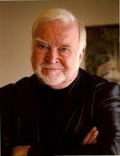

```{r,echo = FALSE, eval = FALSE, fig.alt="Petr Slováček on Unsplash", fig.align='center'}
knitr::include_graphics("featured.jpg")
```


```{r include=FALSE}
library(blogdown)
```

## Introduction
There is some stuff lying on the floor of the classroom. 

Play!! Yes, you. 


## What is Flow?



`r blogdown::shortcode("tweet", user = "avantgame", id = "1451016130999455750")`


We will understand **Flow** from:

1. The book **Flow and the Psychology of Happiness**, pp; 72-76; by **Mihaly Csikszentmihalyi** `r embedr::embed_audio("https://upload.wikimedia.org/wikipedia/commons/5/59/Mih%C3%A1ly_Cs%C3%ADkszentmih%C3%A1lyi.ogg")`   
<br><br>

1. This video:
<br>
`r blogdown::shortcode("youtube", "8h6IMYRoCZw")`  
<br><br>

1. This TED Talk : [**Flow, the Secret to Happiness**]("https://www.ted.com/talks/mihaly_csikszentmihalyi_flow_the_secret_to_happiness?utm_campaign=tedspread&utm_medium=referral&utm_source=tedcomshare")
`r blogdown::shortcode("youtube", "fXIeFJCqsPs")`  
<br><br>

1. This is Water: David Foster Wallace's famous Talk:
`r blogdown::shortcode("youtube", "eC7xzavzEKY")`  <br><br>
1. Let us quickly read and discuss this extract from the **Play and Playground Encyclopedia** <https://www.pgpedia.com/m/man-play-and-games>

## Pop Quix: Want still more Flow? 

No, that is not a bad spelling....why not?

Go find me in this picture !!


## References

1. Scott Eberle, "The Aspects of Play" <https://www.journalofplay.org/sites/www.journalofplay.org/files/pdf-articles/6-2-article-elements-of-play.pdf>

1. "Platform Creativity: Domain, Field, and Person", https://medium.com/call4/domain-8a22b6b486f4


1. **8 Ways To Create Flow According to Mihaly Csikszentmihalyi** <https://positivepsychology.com/mihaly-csikszentmihalyi-father-of-flow/>  

1. Ian Bogost, "Play at Anything"

