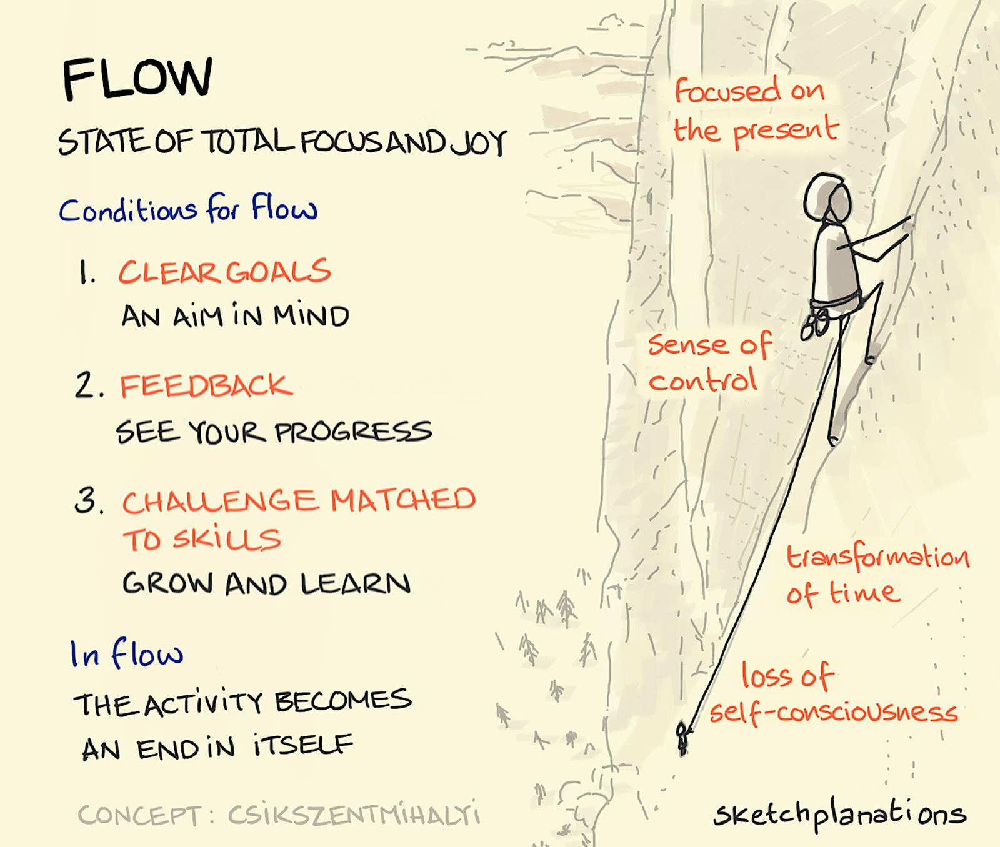
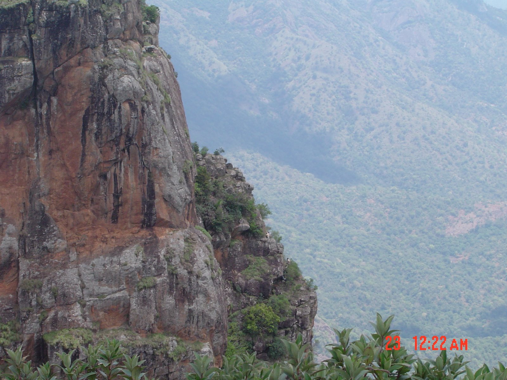

```{r include=FALSE}
library(blogdown)
```

`r blogdown::shortcode("tweet", "1451016130999455750")`




We will understand **Flow** from:

1) The book **Flow and the Psychology of Happiness**, pp; 72-76; by **Mihaly Csikszentmihalyi** `r embedr::embed_audio("https://upload.wikimedia.org/wikipedia/commons/5/59/Mih%C3%A1ly_Cs%C3%ADkszentmih%C3%A1lyi.ogg")` 

2) This video:
<br>
`r blogdown::shortcode("youtube", "8h6IMYRoCZw")`
<br>

3) This TED Talk : [**Flow, the Secret to Happiness**]("https://www.ted.com/talks/mihaly_csikszentmihalyi_flow_the_secret_to_happiness?utm_campaign=tedspread&utm_medium=referral&utm_source=tedcomshare")
`r blogdown::shortcode("youtube", "fXIeFJCqsPs")`

<br>

1) This is Water: David Foster Wallace's famous Talk:
`r blogdown::shortcode("youtube", "eC7xzavzEKY")`

<br>

4) This Article: **8 Ways To Create Flow According to Mihaly Csikszentmihalyi** <https://positivepsychology.com/mihaly-csikszentmihalyi-father-of-flow/>  

5) Ian Bogost, "Play at Anything"

5) Want still more Flow? Find me in this picture !!


## References
1. Scott Eberle, "The Aspects of Play" <https://www.journalofplay.org/sites/www.journalofplay.org/files/pdf-articles/6-2-article-elements-of-play.pdf>

1. "Platform Creativity: Domain, Field, and Person", https://medium.com/call4/domain-8a22b6b486f4

