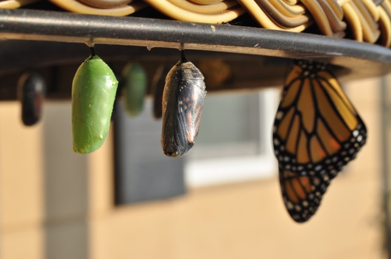

```{r,echo=FALSE, fig.align='center',fig.alt="Photo by Suzanne D. Williams on unsplash"}


```


# Introduction
- Laws of Product Evolution
- 8 directions
- Radar Chart in R
- Find Opportunities based on Radar Chart

## References

1. Project TETRIS: Chapter 2: Laws of System Evolution [(PDF)](https://innovazionesistematica.it/wp-content/uploads/2020/10/EN_02.pdf)


1. Project TETRIS: Chapter 5: Techniques  to  Resolve  Contradictions / Resources / Effects [(PDF)](https://innovazionesistematica.it/wp-content/uploads/2020/10/EN_05.pdf)

1. Project TETRIS: Examples of inventive problems: Example 1-5 [(RAR Archive File)](https://innovazionesistematica.it/wp-content/uploads/2020/10/ExamplesEN.rar)
