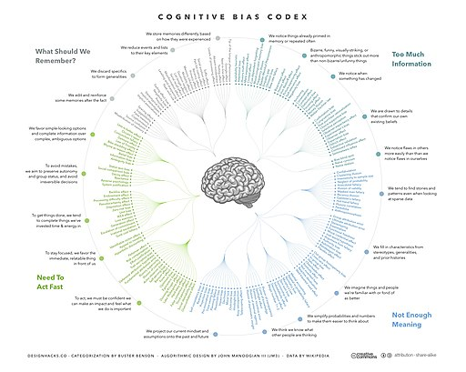

```{r, echo=FALSE, out.height= "150%", out.width= "150%", fig.align='center', fig.alt="andreas N on pixabay"}


```

## Introduction

Often times we swiftly come to conclusions or decisions, without being aware that a) we are making a big mistake based on the information that is available , b) we are looking for our fondest beliefs to be true, or worse c) we are being manipulated !!

Hence, one of the important points of view we need to retain is to be aware of our Cognitive Biases. Being aware of this may be the first step to check ourselves and therefore arrive a more nuanced "appreciation of the situation", that would then allow us to formulate our Innovative Problems better. 

Let us now engage in some simple activities that show off! to us, our Cognitive Biases!


## References


1. Kahneman, Daniel. “Thinking Fast and Slow”

1. Benson, Nigel C.; Ginsburg, Joannah; Grand, Voula;  Lazyan, Merrin & Weeks, Marcus; Collin, Catherine, “The Psychology Handbook: Big Ideas Simply Explained”

1. Pashler, Harold. “Encyclopedia of the Mind”

1. Holyoak, Keith J.& Morrison, Robert G., “The Cambridge Handbook of Thinking and Reasoning” 


1. Quality Enhancement Program (**QEP cafe**) <https://sites.google.com/site/qepcafe/#training-modules>

