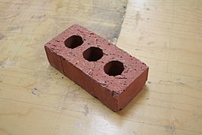

```{r, echo=FALSE, fig.align='center', fig.alt="Marc Pascual on pixabay"}
knitr::include_graphics("featured.jpg")

```


```{r include=FALSE}
library(blogdown)
#devtools::install_github("mccarthy-m-g/embedr")
library(embedr) # Embed multimedia in HTML files
```

## Introduction

>*The Year of Magical Thinking* is Joan Didion’s account of the year following the death of her husband, writer John Gregory Dunne, and her attempts to make sense of her grief while tending to the severe illness of her adopted daughter, Quintana. As she tries to make sense of John’s death and her own changed identity, Didion discovers that grief is not what she expected it to be. Consumed by memories of the years they lived in Los Angeles, shortly after they married and adopted Quintana, Didion feels that she has entered a state of temporary insanity. Though cool and collected on the surface, she begins to believe that her wishes might have the power to bring John back. To this end, she refuses to give away his clothes and shoes, believing that her husband will need them when he returns to her. She calls this childlike belief that her thoughts and wishes can alter reality “magical thinking.”

Of course we are not embarked on anything like this, but we do want to generate some “magic” in our thoughts! So taking some inspiration from her “childlike belief” that can “alter reality”, let us hark back to our childhoods and see what we can do with these objects below:

## Activities

### Activity-1: Guilford Test

How many different uses can you imagine for each of these objects? Can you briefly describe and quickly sketch a few ideas?

```{r echo=FALSE, fig.alt="Images by rawpixel.com", fig.dim=c(4,3)}

knitr::include_graphics("images/yellow-bucket-image-22.jpg")
```

### Activity-2: Wallas-Kogan Test

Where do you reckon you can "see" these shapes ? Can you briefly describe and quickly sketch a few ideas?

```{r echo=FALSE, out.height="40%", out.width="40%"}

knitr::include_graphics("images/star.jpg")
```

#### **Scoring your Ideas**
Your ideas for the bucket might have just been:

- As a helmet, with the handle as the strap
- As a pot for a plant when the bucket has a hole in it
- As a basket for an impromptu basketball game

etc. 

Scoring is comprised of four components:

-   **Fluency** - Total. Just add up all the responses. In the example above it is 3.
-   **Flexibility** - or different categories of ideas or, as Csikszentmihalyi would have us say, DOMAINS. Is your brick a Toy? Can it be used as...a Horticultural support thing? That is two domains, so two points. (3 domains in the example above; which ones?)
-   **Elaboration** - Amount of detail (for Example: "in a bonsai" = 0, whereas "in a bonsai to create a root-over-rock structure as an island" = 2 (one for root-over-rock, two for further detail about the island structure). ( 3 above. Find them!)
-   **Originality** - Each response is compared will all responses from the people you gave the test to. Responses that were given by only 5% of your group are unusual (1 point), responses that were given by only 1% of your group are unique - 2 points). 
-   Total all the points. Higher scores indicate creativity.

You might have noticed that the higher fluency the higher the originality (if you did "good for you!") This is a contamination problem and can be corrected by using a (~ per capita) corrective calculation for originality. $(originality = originality/fluency)$.

### Discussion-1

Both these activities are examples of exercises in divergent thinking. See the references for more information.

-   Did you use the words "as" and "like" to describe your ideas? (These were ideas expressed as similes)
-   Did you *not use* these words to describe your ideas? (These are the metaphors. These are generally viewed as more powerful than similes)
-   Were there, in your opinion, any *outrageous* ideas presented? Why were they outrageous?
-   Are metaphors more interesting when they are surprising?
-   How did the **attributes of the objects** (colour, shape , texture, size, weight, orientation...) get embedded in the ideas presented?
-   Were these "embeddings" meaningful? How and why so? (Ask Bourdieu !!)

### Activity-3: Gangs of Wasseypur

We will divide into two groups (four if necessary) and contemplate a brief written description of the city of Wasseypur. There are 4 short questions / problems for you to consider at the end of that short para which you will answer as a group.

### Activity-4: Seymour Papert <u>[Constructionism](http://www.papert.org/articles/SituatingConstructionism.html)</u> Game

```{r, echo=FALSE}
knitr::include_url("/slides/PlayAndInvent/Constructionism/index.html")

```

### Activity-5: <u>[C'est ne une Pipe](https://www.fusionmagazine.org/why-this-is-not-a-pipe/)</u>

{width=200px}

<br>
Let us see if we can find a (piece of) a Rene Magritte gene/meme within ourselves. 

> Magritte’s art has something in common with the rest of the surrealist artists: his art is the juxtaposition of elements that together won’t make a rational sense, but the value of its interpretation lies in the reaction of each spectator’s mind toward the relation of those elements. Magritte’s approach is more conceptual. He exposes how we define things by the word we use to name them creating a word-image ***series of conflicts***. For instance, we think we know what a shoe is because of the definition we give to the word. But what if we replace the name shoe for “moon”? That is what Magritte does in his painting *“La Clef des Sognes II” (1930)*. We see six simple objects and below them it is written a word apparently unrelated to the picture above it, forcing the viewer to think about this relation we have with what we see and what we know. Just like in his painting of “The Treason of Images”, Magritte is trying to show how it doesn’t matter how we name the object, the word will never be one with the object’s physical reality. 
>
>In general, not only (did he make) this observation through these types of images, but also he usually gives a title for his paintings that has nothing to do with the literal things you see in the image.(*emphasis mine*)

1. We will break up into groups of 4-5. 
1. Each group will be given a household object, perhaps an unusual one. 
1. You need to imagine a use for it that is *not* what is the common known one.
1. Market it as a product that serves this new purpose. Make an ad. 
1. Use **only** Gen Z language in your ad. 
1. Ad = Performance/Jingle + Poster

(Articles: Book End made of Wood; Aristo Slide Rule; 80-year-old brass mortar and pestle; Node from Elephant Bamboo stem)

### Activity-6: Metaphorical Story re(Writing)

1. Read the story in Ref. 7 below.
2. Understand the metaphors in the story:
    - What is the story about?
    - What "metaphorical language" has Joshua Ferris used to describe the characters, their actions, and the results of their actions?
    - What is the *domain* of these metaphors in the story?
3. Now, choose a (short!) story that you know really well, something that you may have encountered in school.
4. Re-write this story using language, metaphors, and images from any *domain* (other than what may be in the original story). 
    - For example, in Primo Levi's lyrical story <u>[**Carbon**](https://www.arvindguptatoys.com/arvindgupta/periodic-primo.pdf)</u>, a lot of metaphors from Chemistry and atomic physics are used to describe life, and connections with people.

### Activity-7: Podcast on Metaphors
Listen to this discussion between Michael Rosen and author James Geary, on the former's BBC Podcast <u>[*Words of Mouth*.](https://www.bbc.co.uk/programmes/m000d1z9)</u>

```{r, echo = FALSE}
embedr::embed_audio("WordOfMouth-20200107-Metaphors.mp3")  

```

## Discussion-2

- Metaphors shape our thinking and even our perception of Reality
- The way we expressed the situation in the *Gangs of Wasseypur* activity was based on the metaphors used to describe it. It was also a sample case in <u>[Priming](../37-what-am-i-thinking-of/#priming-aka-i-know-what-to-make-you-think-1)</u>.
  - Proof, if you ever wanted it, that your first idea is just that, a first idea. Keep going!
- Metaphors involve a transference of a property or attribute from one object to another. (Gr. *metapherein*: to carry over or transfer). 
- We are comparing two objects, or situations, using attributes that transfer from one to another. 
  - (The distinction we make between *objects* and *situations* is important! More on this when we learn TRIZ.)
- Based on the *domains* that you carry in your CC, a metaphor may or may not make sense to you. So yes, working in (diversely constructed) teams to make multiple metaphors may enhance how you <u>[appreciate of the situation](https://movie-sounds.org/famous-movie-samples/quotes-with-sound-clips-from-lawrence-of-arabia/well-it-s-rather-vague-sir-i-m-to-appreciate-the-situation-well-that-won-t-be-difficult-the-situation-s-bloody-awful)</u>.
- The outrageous-ness of the metaphor can often add value to Problem Solving. 

## References

1.  <u>[Guilford Test for Divergent Thinking](https://curtbonk.com/bobweb/d1.html)</u>

2.  <u>[Wallas-Kogan Test for Divergent Thinking](https://curtbonk.com/bobweb/d2.html)</u>

3.  Thibodeau, Paul & Boroditsky, Lera. (2011). **Metaphors We Think With: The Role of Metaphor in Reasoning**. PloS one. <u>[(PDF)](Thibodeau-Boroditsky-Role-of-Metaphor.pdf)</u>

4.  Bobo Hjort. (2003) **Drawing, Knowledge, and Intuitive Thinking: Drawing as a Way to Understand and Solve Complex Problems in Art and Complexity**. J. Casti and A. Karlqvist (editors) © 2003 Published by Elsevier Science B.V.<u>[(PDF)](Hjort.pdf)</u>

5.  David Chen, **Creative Paradoxical Thinking and Its Implications for Teaching and Learning Motor Skills** <u>[(PDF)](CreativeParadoxicalThinking2011.pdf)</u>

6.  Holyoak and Thagard, **The Analogical Mind**, <u>[(PDF)](Holyoak-%20Thagard%20-%20Analogical%20Mind.1997pdf.pdf)</u>

7.  Joshua Ferris, <u>[The Market Value of my Father](https://www.wealthsimple.com/en-ca/magazine/joshua-ferris)</u>. A metaphorical Short Story.

8.  Martin Weller. "Dangers of tech metaphors in nature – The Ed Techie." N.p., n.d. Web. 5 Apr. 2024. <u><https://blog.edtechie.net/books/dangers-of-tech-metaphors-in-nature></u>.

9. Edith Ackermann(2001). <u>[*Piaget’s Constructivism, Papert’s Constructionism: What’s the difference?*](https://learning.media.mit.edu/content/publications/EA.Piaget%20_%20Papert.pdf)</u>

10. Dubnick, R. (1980). Visible Poetry: Metaphor and Metonymy in the Paintings of Rene Magritte. Contemporary Literature, 21(3), 407. doi:10.2307/1208249. <u>[(PDF)](dubnick1980.pdf)</u>


