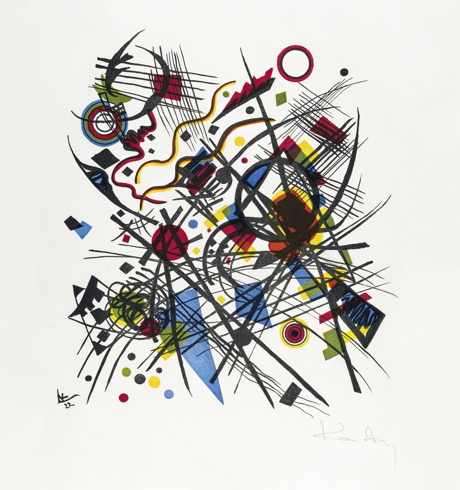

## Srishti Manipal Institute of Art, Design and Technology
## Program: Foundation Studies Program, 2022-2023
### Semester: ODD
### Studio No: 
#### Date: August 2022
#### Unit Title: Immersion (Play and Invent)
#### Facilitators: Roshan Sahi, Minakshi Singh, and Arvind Venkatadri
#### Credits: 3 for Contextual Enquiry


## Focus of the unit: Observing, Reflecting, and Creating
## Premise of the Unit: 

## UNIT ABSTRACT: (The background and the core idea of the unit)
This Unit is a set of Orientation and Immersion Activities in the Foundation (freshman) year of a Bachelor's Degree in Art and Design, at the Srishti Manipal Institute of Art, Design, and Technology, Bangalore, India. The intent of this Unit is to help students to understand:

- **Networking, Identity, and Aspiration**. By creating something in teams, students meet new people and start to create new networks. Identity is about their personal values, their upbringing, and family culture, and how it can be displayed and be a part of their creative practice. Aspiration is about creative possibility, a noticing or discovery of some extraordinary skill or ability in this classroom, and to desire and want to develop that skill during a Srishti-long, (maybe life-long) journey.

- **Tools and Experiences, Big Understandings, and Creative Purposes**. Students will be guided to observe their surroundings by listening, seeing, smelling, touching, and tasting, mapping, and drawing. There will also be gamified situations in the classroom itself. Several Big Ideas that are relevant and applicable across subjects will be introduced. Students will use the activities, observations, and analytical skills to evolve an art and design expression that will enable them to creatively evolve ways of exploration and understanding.

- **Art Experience**. Several artists and their oeuvre will be studied and appreciated. The creative motivations and ideas that *may* underlie these pieces of work will be discussed. 

Throughlines (i.e. generalizable ideas) will be drawn across individual Experiences and Concepts from each of these, and the students will be encouraged to express the understanding of these in an artifact. 

## Enduring Understanding: (The larger takeaway for students)
-	Multi-sensorial Observation
-	Tools for Observation
-	Appreciating Artists and different “systems” of Art
-	Using Art to appreciate Big Ideas and Concepts
-	Assimilating Big Ideas and seeing their broader applicability
-	Creating Art and Artifacts that represent understanding and inspiration.


### Understanding Goals: (The most important aspects students to understand)
 - TBD
 
 
### Essential Question: (The driving questions that will help to build EU and UG)
 - TBD
 
 
### Students will be able to: (The essential abilities built around acquiring knowledge and skill) 
-	TBD

### Assessment Evidence: (The essential abilities built around acquiring knowledge and skill)

-	Classroom and Field Participation
-	Visual Journal
The Artifact to be produced in the last week is *not* to be a part of the Assessment. 


### Assessment Criteria: (Criteria are used for assessing outcomes of this unit)

1.	Understanding: (Explain, Summarize, Infer, Paraphrase, Discuss, Not necessarily going beyond classroom material)  
•	Big Ideas

2.	Applying: (Carrying Out, Executing, Implementing)  
•	Ways of Observing
•	Tools Usage
•	Application of Critical and Analytical Thinking Methods to make Creative Decisions

3.	Reflecting: (Recording, Analysing, Critiquing, Appraising, Investigating, Evaluating, Inferring)  
•	Appreciating broader applicability of Ideas, Experiences, Tools

4.	Creating: (Generating, producing, Planning, Reorganizing, Put together new Pattern or Structure)  
•	Creating/Discussing  connections between  Ideas, Tools, and Personal Experience

### Weekly Plan: (progression, activities and plan, showing possible throughlines)


```{r, echo = FALSE,message=FALSE}
library(tidyverse)
library(ggalluvial)
library(showtext)
font_add_google("Gochi Hand", "gochi")
font_add_google("Schoolbell", "bell")
font_add_google("Covered By Your Grace", "grace")
font_add_google("Rock Salt", "rock")
showtext_auto()


dat <-
  tribble(
    ~day, ~roshan, ~arvind, ~minakshi, ~throughlines, ~score,

    "Day1", "Sensorial Map Portrait","OSM Treasure Hunt and GPS Art","Ways of Seeing", "Spatial", 20,

    "Day2","Instant sculpture","Cest ne Une Pipe and Objects that Sing","Gallery Walk","Metaphor", 10,

    "Day3", "World of Colour","I, Anagram","The Birthday of an Artist","Symmetry and Colour", 25,

    "Day4", "Finding Cracks","Copy Cats","Ways of Seeing","Shapes", 20,

    "Day5", "Flaneur", "Random Forests with Taylor Swift", "TBD1", "Types and Categories", 10,


    "Day6", "Time Observation", "The Social Network and How to Train your Dragon Mind", "TBD2", "Time and Space",10)


ggplot(data = dat,
       aes(axis2 = roshan, axis3 = arvind, axis4 = minakshi,
           y = score, fill = throughlines)) +
  geom_alluvium() +
  geom_stratum() +
  geom_text(stat = "stratum", aes(label = after_stat(stratum)), size = 4) +
  scale_x_continuous(breaks = 1:3, labels = c("Roshan", "Arvind", "Minakshi")) +
  labs(title = "Possible Throughlines for Immersion 2022", 
       subtitle = "Roshan, Minakshi, and Arvind", xlab("Faculty")) +
  scale_fill_brewer(type = "qual", palette = "Set3") +
  theme(axis.line.y = element_blank(),
        axis.text.y = element_blank(),
        axis.title.y = element_blank(),
        axis.ticks = element_blank(),
        axis.text.x= element_text(family = "gochi", size = 12),
        text = element_text(family = "rock", size = 5),
        panel.background = element_rect(fill = "white"),
        plot.title = element_text(family = "bell", size = 16),
        plot.subtitle = element_text(family = "bell", size = 12),
        legend.text = element_text(family = "gochi", size = 12),
        legend.title = element_text(family = "bell", size = 16)
  )


```


