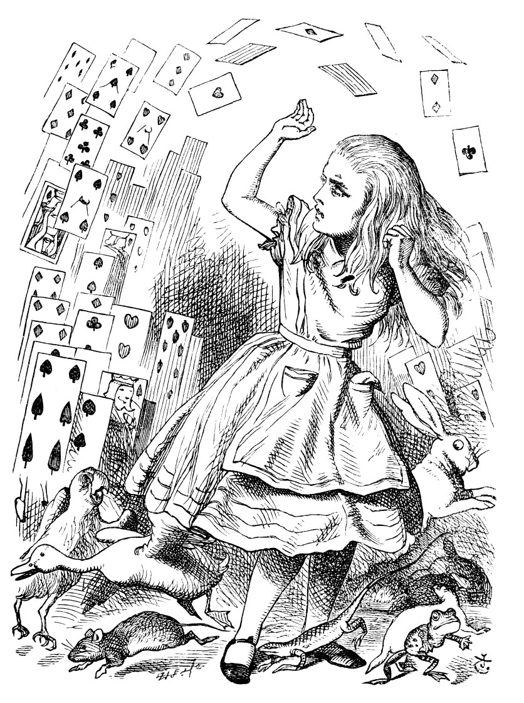

## Introduction

Let's make a website in RStudio to show off our data viz portfolio, and to share with friends, parents, prospective employers...

We will encounter a new package called `blogdown` and use workflows with [github](https://github.com) and a free web hosting service called [Netlify](https://www.netlify.app) to create a website where all our RMarkdowns become individual blog posts, complete with Titles, Sections, Text, Diagrams and Links!

## References

1. Allison Hill  

2. Sharon Macliss

3. Yihui Xie  

