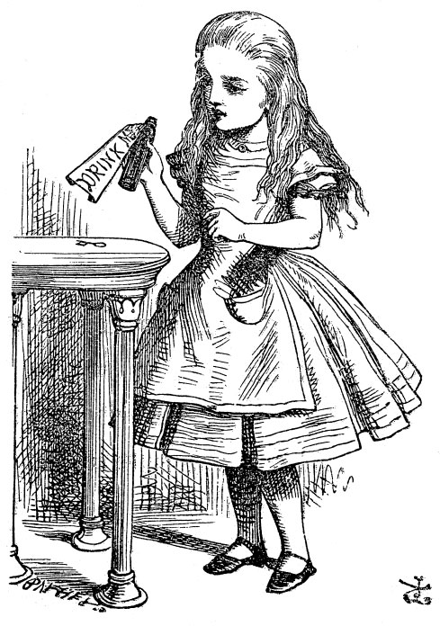

## Introduction

We will get acquainted with the RMarkdown format, which allows us to mix text narrative, code, code-developed figures and items from the web in a seamless document.

Then we can try to create something in the lines of what Hans Rosling did. 

Something that can:  
  - provide a visualization  
  - provide insight  
  - tell a story  
  - is reproducible  

## References:

1. <https://ysc-rmarkdown.netlify.app/slides/01-basics.html> Nice RMarkdown presentation and *"code movies"* !

1. <https://rmarkdown.rstudio.com/index.html>

1. <https://www.markdowntutorial.com>

1. https://andrewbtran.github.io/NICAR/2018/workflow/docs/02-rmarkdown.html

1. https://yihui.name/tinytex/ *(install!)*

1. https://github.com/rstudio/cheatsheets/blob/master/rmarkdown-2.0.pdf

1. https://rmarkdown.rstudio.com/html_document_format.html

1. https://rmarkdown.rstudio.com/pdf_document_format.html

## Assignment(s)

1. Complete the markdowntutorial in [reference 1]

2. Create a fresh RMarkdown document and use as many as possible of the RMarkdown constructs from the Cheatsheet [reference 4]

## Optional

3. Go to reference 3 and install **tinytex**. Try to `knit` your document into PDF also, using `tinytex`.  

## Fun Stuff

1. Desirée De Leon, Alison Hill: *rstudio4edu: A Handbook for Teaching and Learning with R and RStudio*, <https://rstudio4edu.github.io/rstudio4edu-book/>
