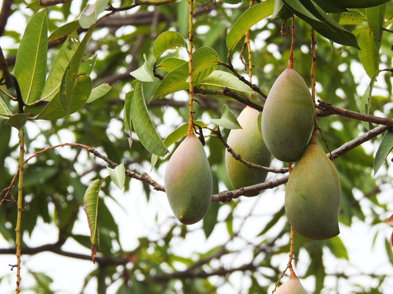

```{r include=FALSE}
library(blogdown)
library(tidyverse)
library(mosaic)
```


### Seeing Data

Let us first examine the street traffic data we have gathered for any "model-like" pattern!

We will use a tool called, umm....**WTFcsv**. Let us first quickly see what this tool offers us!

  <br>
  `r blogdown::shortcode("vimeo", "150216437")` 
  <br>
  

Let us import our data into the **WTFcsv** tool [(**Web Link**)](https://databasic.io/en/wtfcsv/) and see what patterns lurk beneath our data!


### Is Randomness a Design Tool?

1. Do you remember plucking mangoes from the trees in your childhood gardens? Did you happen to be the youngest in the group? Did you have run home to get the salt + chilly powder? 
Why did you trust your friends? ;-D




2. Let us throw some chalk pieces on the floor at random and see what happens!!


### Words belong Hamlet

Let us read the famous nunnery scene from **Hamlet**:

a)  Hamlet in 4 Minutes:\
    <br> `r blogdown::shortcode("youtube", "EmjWIMMtjDc")` <br>

b)  *To be or Not to be*: [(Web Link)](https://www.nosweatshakespeare.com/quotes/hamlet-to-be-or-not-to-be/)

What was Hamlet's problem? How did he solve that problem?

### Suppose we were Hamlet....

What would we want to know?

Who is our friend? What is the chance that we will survive? 

We would need to conduct an "Experiment", rather like Hamlet did, without quite going or feigning madness of course. But there is a **Madness to the Method**, as we will see...


From [StatsRef](https://www.statsref.com/HTML/?statistics__statistical_analys.html) : 

>The PPDAC summary table suggests a relatively linear flow from problem definition through to conclusions — this is typically not the case. It is often better to see the process as cyclical, with a series of feedback loops. A summary of a revised PPDAC approach is shown in the diagram below. As can be seen, although the clockwise sequence (1→5) applies as the principal flow, each stage may and often will feed back to the previous stage. 
In addition, it may well be beneficial to examine the process in the reverse direction, starting with Problem definition and then examining expectations as to the format and structure of the Conclusions (without pre-judging the outcomes!). This procedure then continues, step-by-step, in an anti-clockwise manner (e→a) determining the implications of these expectations for each stage of the process.


### Design of Experiments

Let us pretend we are Hamlet and design a simple experiment to find out some "truth" ( highly probable idea) that is important to us.

For example: Let us consider the **Short Term Memory** of Foundation Students: 

- is it different between those who pursue "*Art-related*" degrees and those who pursue "*Design-related*" degrees? 
- Between Male and Female students? Any other factors?

We will choose one of these questions, or a similar one, and use the **PPDAC Method** to proceed with our Experiment. This paper by Lawrence to guide our Hypothesis Testing and the Design of our Experiment: 

- **Lawrence - A Design of Experiments Workshop as an Introduction to Statistics** [(**Weblink to PDF**)](Lawrence - A Design of Experiments Workshop as an Introduction to Statistics.pdf)

This is the paper describing a simple *Design of Experiments* workshop in class much like ours. We will try to mimic as much of this as we can. Do read through this in the evening today in preparation for our experiment.


### Making a Data Comic out of our Experiment

What have been our Conclusions with the Experiment? Let us take our Experiment and make a comic out of it: 

**Data Comic Generator from Gramener** [(**Weblink**)](https://gramener.com/comicgen)

<br>
`r blogdown::shortcode("youtube", "E_2hdZuugI8")`
<br>


### The Permutation Test

From: Tim C. Hesterberg (2015) What Teachers Should Know About the Bootstrap: Resampling in the Undergraduate Statistics Curriculum, The American Statistician, 69:4, 371-386, DOI: 10.1080/00031305.2015.1089789

>Student B. R. was annoyed by TV commercials. He suspected that there
were more commercials in the “basic” TV channels, the ones that come with a cable TV subscription, than in the “extended” channels you pay extra for. To check this, he collected the data shown in Table 1. He measured an average of 9.21 minutes of commercials per half hour
in the basic channels, vs only 6.87 minutes in the extended channels. This seems to support his hypothesis. But there is not much data—perhaps the difference was just random. The poor guy could only stand to watch 20 random half hours of TV. Actually, he didn’t even do that—he got his girlfriend to watch half of it. (Are you as appalled by the deluge of commercials as I am? This is per half-hour!)

```{r echo = FALSE}
scores <- tibble(
  basic = c(6.95,10.013,10.62,10.15,8.583,7.62,8.233,10.35,11.016,8.516),
  extended = c(3.383,7.8,9.416,4.66,5.36,7.63,4.95,8.013,7.8,9.58))
scores %>% knitr::kable()
diff = mean(scores$basic) - mean(scores$extended)
diff

```

> The average difference in ad times between the two sets of TV channels is 2.34.

> How easy would it be for a difference of 2.34 minutes to occur just by chance? To answer this, we suppose there really is no difference between the two groups, that “basic” and “extended” are just labels. So what would happen if we assign labels randomly? How often would a difference like 2.34 occur? We’ll pool all twenty observations, randomly pick 10 of them to label “basic” and label the rest “extended”, and compute the difference in means between the two groups. We’ll repeat that many times, say ten thousand, to get the permutation distribution shown in Figure 1. The observed statistic 2.34 is also shown; the fraction of the distribution to the right of that value (≥ 2.34) is the probability that random labeling would give a difference that large. In this case, the probability, the P-value, is 0.005; it would be rare for a difference this large to occur by chance. Hence we conclude there is a real difference between the groups.

```{r echo=FALSE, warning=FALSE, message=FALSE}
scores_long <- scores %>% pivot_longer(., cols = c("basic", "extended"), values_to = "times", names_to = "channel")
scores_long %>% knitr::kable()

null_dist_time <-
  do(10000) * diff(mean(
    scores_long$times ~ shuffle(scores_long$channel),
    data = scores_long))

null_dist_time %>% 
  ggplot(., aes(x = extended)) + 
  geom_histogram(aes(fill = extended >= 2.34)) +
  geom_vline(aes(xintercept = 2.34), colour = "green") + 
  labs(x = "Distribution of Diff in Ad Time Means under null hypothesis for Channel Type", title = "Figure1 - Is 2.34 possible by Chance?") + 
  guides(fill = guide_legend("Greater than 2.34"))

```

### References

1.   Seeing Probability Theory:  <https://seeing-theory.brown.edu/basic-probability/index.html> A Superb visual website to see patterns in theory! Go and play there with Hamlet!

1. Sampling and Survivourship Bias: Abraham Wald and the Story of WW2 Fighter Planes. [**(Web Link)**](https://medium.com/@penguinpress/an-excerpt-from-how-not-to-be-wrong-by-jordan-ellenberg-664e708cfc3d)

1. Scientific Method, Statistical Method and
the Speed of Light by R. J. MacKay and R. W. Oldford [**(Web Link)**](https://projecteuclid.org/euclid.ss/1009212817)

1. The Man Who Invented Modern Probability - Andrei Kolmogorov:[**(Web Link)**](https://getpocket.com/explore/item/the-man-who-invented-modern-probability)  

1. Tim C. Hesterberg (2015) What Teachers Should Know About the Bootstrap: Resampling in the Undergraduate Statistics Curriculum, The American Statistician, 69:4, 371-386, DOI: 10.1080/00031305.2015.1089789


### Fun Stuff

Hamlet's *To be or not to be* in Pidgin English - Video on Twitter!

`r blogdown::shortcode("twitter", "1108724221784530945")`

