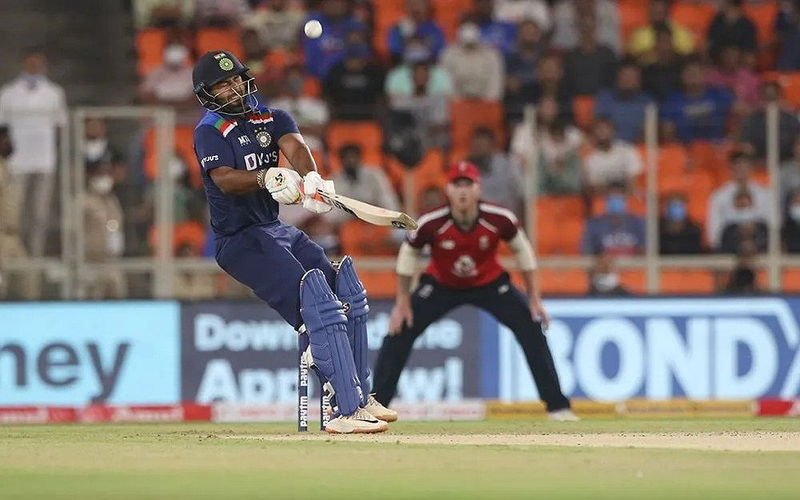

```{r include=FALSE}
library(blogdown)
```

## Introduction
We read The Three Musketeers, and also saw a brief video from Squid Game. Let us further contemplate the actions of the characters. 

### Discussion-2

Are there COSTs to ACTIONs? Who decides?

-   Players
-   Payoffs
-   Game Matrix
-   Strategies

How does one minimize costs and maximize rewards?

What strategies are possible as a bowler in Cricket? As a batsman? What strategies are **permitted**? By whom?

```{r, out.width = "350px",out.height = "450px", echo=FALSE}

```

## The Game of Trust

And finally, let us **play** a Game,  on the <u>[**Game of Trust Website**](https://ncase.me/trust)</u> !

## Robert Axelrod's Study on Cooperation

This is a famous study of the Iterated Prisoners' Dilemma by Robert Axelrod, **The Evolution of Cooperation**. [(PDF)](Axelrod-Hamilton.pdf). We will read just a we bit of it in class. 

And here is Robert Axelrod on the **RadioLab Podcast**

<iframe frameborder="0" scrolling="no" height="130" width="100%" src="https://www.wnyc.org/widgets/ondemand_player/wnycstudios/#file=/audio/json/104010/&amp;share=1">


</iframe>
Spotify:

```{=html}
<iframe style="border-radius:12px" src="https://open.spotify.com/embed/episode/1pFEPQUVNgTkRa13y4Gilk?utm_source=generator" width="100%" height="352" frameBorder="0" allowfullscreen allow="autoplay; clipboard-write; encrypted-media; fullscreen;
picture-in-picture" loading="lazy">
```
</iframe>

</iframe>

Transcript: <u><https://www.wnycstudios.org/podcasts/radiolab/segments/104010-one-good-deed-deserves-another></u>

## SouthWest Airlines: A Case Study

The story of Southwest Airlines' **Early Bird Check-In**<u>[(Weblink)](https://mindyourdecisions.com/blog/2013/03/05/southwest-airlines-boarding-and-game-theory/)</u>

## Hotelling's Phenomenon: A Case Study

Why are Hotels and Petrol Pumps located next to each other?
<u>[(Weblink)](https://mindyourdecisions.com/blog/2008/03/25/game-theory-tuesdays-hotelling%e2%80%99s-game-or-why-gas-stations-have-competitors-nearby/)</u>
Here is the **Hotelling's Phenomenon**, explained. 

 <br> `r blogdown::shortcode("youtube", "u4cKzGj58q4")` <br>

## What are the Assumptions in Game Theory?

-   That gains and pains can be **quantified**
-   Rationality
-   Players have identical and opposed aims (Symmetry)
-   In most cases, the game is **zero-sum**
-   Some form of spoke/unspoken agreement as to what may and may not be done ( i.e Rules of the Game )


## References

1. Here is a good Summary of modern thinking about Human Cooperation: *The Evolution of Human Cooperation*, <u>[**PDF**](The%20Evolution%20of%20Human%20Cooperation%20–%20The%20Evolution%20Institute.pdf)</u>

1.  John D. Williams, *The Compleat Strategyst: Being a Primer on the Theory of Games of Strategy*, RAND Corporation, <ISBN:9780833042224>. This is a very humourous and fun book on Game Theory ! It is available for free online at the <u>[**RAND Corporation Website.**](https://www.rand.org/content/dam/rand/pubs/commercial_books/2007/RAND_CB113-1.pdf)</u>

2.  Ken Binmore,*Playing for Real: A Text on Game Theory*, <ISBN:9780195300574>, Oxford University Press, March 2007. <u>[Available here.](https://djvu.online/file/yFqEW5Mqk0aVd)</u>

3.  Avinash Dixit, Susan Skeath, David Reiley, *Games of strategy*, ISBN: 9780393124446, New York :W.W. Norton & Company, 2015.

4.  Brams Steven J., 1994. "Game Theory and Literature," Games and Economic Behavior, Elsevier, vol. 6(1), pages 32-54, January. <u>[Available here.](http://www.sscnet.ucla.edu/polisci/faculty/chwe/austen/brams1994.pdf)</u>

5.  Alexander Mehlmann,*The game’s afoot! Game theory in myth and paradox*, American Mathematical Society 2000. <u>[AMS Bookstore](https://bookstore.ams.org/stml-5/)</u>


## Game Theory Pop Music, Movie Clip, and TV ad Playlist !!

1.  Chris de Burgh: Don't Pay the Ferryman! <u><https://www.youtube.com/watch?v=Q-a5TAL-IXs></u>

2.  Abba: The Name of the Game <u><https://www.youtube.com/watch?v=T5Qf_7HM1cM></u>

3.  Bachchan vs Warsi: Want a Pepsi - Tit for Tat <u><https://www.youtube.com/watch?v=gc6QZcxbMZE></u>

4.  The Princess Bride - Battle of Wits - Which Strategy to Use here? (Asymmetric Information) <u><https://www.youtube.com/watch?v=rMz7JBRbmNo></u>

5.  The Gods Must be Crazy (Brinkmanship) <u><https://www.youtube.com/watch?v=9LvViKftRnA></u>

