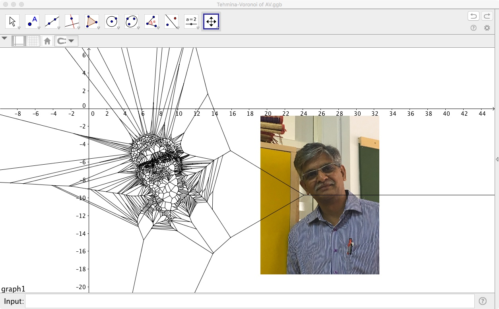

```{r setup, echo=FALSE}
library(blogdown)
library(emoji)
```

## A Model for Proximity: The Voronoi and the Delaunay Diagrams

So how do we model "proximity"? Let us take a quick look at this description of <u>[**Predator-Prey Dynamics.**](/pdf/Proximity/FollowingtheHerd.pdf)</u>


### Plotting the Delaunay and Voronoi Diagrams

How do we plot these diagrams?

We will use this tool: <u>[**Geogebra**](https://www.geogebra.org/classic)</u>

Download and install this on your laptops. You can also use it in your browser <u><https://www.geogebra.org/classic?lang=en></u> and download the Geogebra (*.ggb*) files that you create. 

1. Exercise 1: Let us first see <u>[**Soho with the Voronoi Diagram**](/pdf/Proximity/SohoMap.ggb)</u>

Now let us make such a diagram step by step:

1. Exercise 2: Let us try with just three points and see what we need to do to plot the Voronoi Diagram.

1. Exercise 3: With 4 points: <u>[Four Pointer Voronoi](/pdf/Proximity/four points.ggb)</u>

1. Exercise 4: Let us now add more points. How do we make a multi-point Voronoi? We need to make a <u>[**"list of points" in Geogebra**](/pdf/Proximity/VoronoiLargeNoOfPointsInGeogebra.pdf)</u>

#### Discussion
- Did you see how the Delaunay Triangulation seems to "dislike" obtuse-angles, and changes the triangulation pattern when a certain (sum of) angles become more than 180?
- Wasn't that a very Kandinsky-like thing to do, even for an algorithm?
- The Delaunay Triangulation gives us a set of traingular elements that cover our desired surface
- The Voronoi Diagram uses the Delaunay to give us *possibly infinite* proximal neighbourhoods. 


## Fun Stuff with Geogebra and Voronoi

1. Predator Prey Movement....
 - Create a set of points in Geogebra. 
 - Colour/Shape one of the outermost points as a predator which circles the herd. 
 - Use the Voronoi diagram to model the *Zone of Danger* for each of the animals in the inner herd. 
 - Try **Animation** in Geogebra !!
 
2. Service Areas with Voronoi
- Import a 5km * 5km square of area in your home town, from Google Maps, into Geogebra. 
- Locate points of interest, all in one category ( ATMs, Post Offices, Hospitals, Police Stations...)
- Plot the Voronoi Diagram to show the area served by each such institution.
- Calculate the area in Geogebra.
- Assume a flat population/sqkm and use that to calculate the number of people served by each.

**All** of this can be done without leaving Geogebra !!

3. Voronoi Portraits and Facial Recognition

A. My name is Arnold Schwarzenegger

- Take a picture of yourself and import it into Geogebra
- Plot Points on the Portrait such that the main facial features are defined.
- Use a Delaunay Triagulation of these points to create a Portrait. 



B. My Face is My Fortune

- Do the same for a famous person, past or present.
- Run a small survey in the class to see how many people can recognize celebrity!

## Other Distances?

### Hamming Distances
We have used the simplest and most common of geometric distances between entities, the **Euclidean Distance ** to model proximity. Are there other *measures of distance*?

- How would you measure distance between *digital words*? For example $10010011$ and $11011011$?

>The **Hamming distance** between two equal-length strings of symbols is the number of positions at which the corresponding symbols are different. The symbols may be letters, bits, or decimal digits, among other possibilities. For example, the Hamming distance between:
"karolin" and "kathrin" is 3.
"karolin" and "kerstin" is 3.
"kathrin" and "kerstin" is 4.
0000 and 1111 is 4.
2173896 and 2233796 is 3.

The Hamming Distance can be calculated using a logical operation known as <u>["Exclusive-OR" or "XOR"](https://www.khanacademy.org/computing/computer-science/cryptography/ciphers/a/xor-bitwise-operation)</u>. 


### Great Circle Distances
How would you measure distance over a *curved surface* such as the earth?

View the path here: <u><https://www.greatcirclemap.com/></u>
Calculate distances here: <u><https://www.gpsvisualizer.com/calculators></u>

### Taxicab Distances

And if a *man hatta* live in New York?


We will use the Euclidean and maybe other concepts of distance when we get into our Machine Learning models!


## So where are all these Proximities used?


### A Brief Description of the GPS System
TBW.


### A Brief Foray into Cryptography

In the Sherlock Holmes story,<u>[**The Adventure of the Dancing Men**](https://www.gutenberg.org/files/108/108-h/108-h.htm#chap03)</u>, a criminal known the one of the characters communicates with her using a childish/child-like drawing which looks like this:


In this message, each character is a visual representation, or a substution for, a letter from the alphabet. The characters with flags are the first letter of a new word. The message is translated in the story as "Am here, Abe Slaney". 

The entire **code alphabet** is shown in the figure below:


This code is a good example of a <u>[**Substitution Cipher**](https://www.geeksforgeeks.org/substitution-cipher/)</u> with non-text substition. See <u><https://www.boxentriq.com/code-breaking/dancing-men-cipher></u> and <u><https://www.dcode.fr/dancing-men-cipher></u> for examples where you can encode and decode your own text, and send them to friends. `r emoji::emoji("sunglasses")` `r emoji("smirk_cat")`

The intent behind any substitution cipher is to be create **distance** from the original message, or characters. The algorithms to encode and decode uses this idea of **distance** to perform their operations and are entirely reversible.


## Painting with Proximity/Distance
Well, all right, all right, tech is fine. Can we use the idea of Proximity to create **art**? Well, we are not Kandinsky, but we can try. Here goes:

- Fire up the Strava app, or equivalent, on your phones.
- Walk out into the college campus, preferably under open sky.
- With the app on, try to create a figure <u>[like this](<https://gpsart.info/en/gpsart-en/nowhow1-en/>)</u>
- Share the image with your friend!

## References

1. <u>**Voronoi Diagrams and a Day at the Beach**
[**(PDF)**](/pdf/Proximity/VoronoiDiagrams-ADayAtTheBeach.pdf)</u>
Talks about cholera in Soho, the Voronoi diagram, and how to construct it using waves on a beach!!


