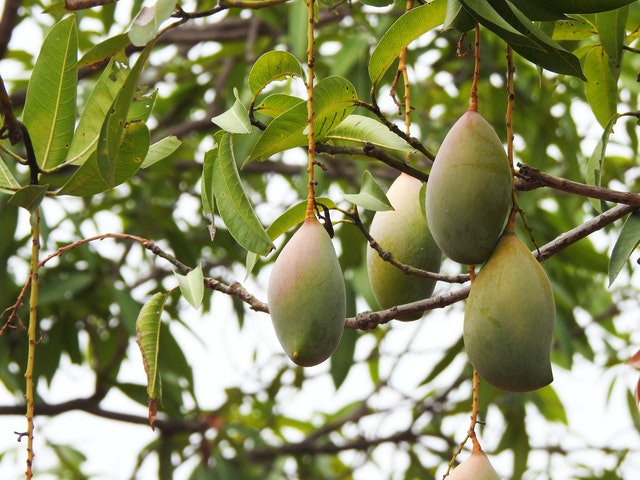

```{r include=FALSE}
library(blogdown)
library(tidyverse)
library(ggformula)
library(mosaic)
library(emoji)
```
#### God Does not Play Dice


## The Science of Surprise

Let us then examine the street traffic data we have gathered for any
"model-like" pattern! Is our data clean? Do we have two columns of data,
one containing 60counts of vehicles, and the other containing 
inter-vehicular gap times in seconds?\
We will use a tool called, ah...umm...ahem...er...**WTFcsv**. Let us 
first quickly see what this tool offers us!

<br> `r blogdown::shortcode("vimeo", "150216437")` <br>

Let us import our data into the <u>[**WTFcsv**
tool](https://databasic.io/en/wtfcsv/)</u> and see what patterns lurk
beneath our data!

### Discussion-1

-   There were similar patterns in everybody's data
    `r emoji::emoji("open_mouth")`

```{r, echo=FALSE}
ggplot2::theme_set(theme_classic())
gf_histogram(~ rpois(n = 60, lambda = 3)) %>% 
    gf_labs(x = "No. of Vehicles Spotted", y = "How Often", title = "Sixty Readings of Vehicles on the Road",
            subtitle = "Poisson Dist.")

gf_histogram(~ rexp(n = 160, rate = 1/3)) %>% 
  gf_labs(x = "Gap Time in seconds", y = "How Often", title = "Vehicle Arrival Gap Times",
          subtitle = "Exp. Dist")

```

-   What we saw was an example of the **Poisson Arrival Process**.
-   This has applications in *Service Design*, *Traffic Management*,
    *Logistics*, *Finding Defects in Materials*, *Weather Modelling*, *Pest Control*...

From <u><https://stats.stackexchange.com/a/297375></u>:

> (Say) Lambda($\lambda$) is the *average number* of cars that pass per
> unit of time, let's say 60/hour ($\lambda$ = 60). We know, however,
> that the actual number will vary - some days more, some days less. The
> **Poisson Distribution** allows us to *model this variability*.
>
> Now, an average of 60 cars per hour equates to an average of 1 car
> passing by each minute. Again though, we know there's going to be
> variability in the amount of time between arrivals: Sometimes more
> than 1 minute; other times less. The **Exponential Distribution**
> allows us to *model this variability*.
>
> All that being said, cars passing by on a road won't always follow a
> Poisson Process. If there's a traffic signal just around the corner,
> for example, arrivals are going to be bunched up instead of steady. On
> an open highway, a slow tractor-trailer may hold up a long line of
> cars, again causing bunching. In these cases, the Poisson Distribution
> may still work okay for longer time periods, but the exponential will
> fail badly in modeling arrival times.
>
> Note also that there is huge variability based on **time of day**:
> busier during commuting times; much slower at 3am. Make sure that your
> lambda is reflective of the specific time period you are considering.

Lambda then becomes a **parameter** of the model. And the higher the
$\lambda$, the more the traffic. Hence shorter the *average
inter-vehicular gap time*, which is $\sim \frac{1}{\lambda}$.

-   So everything random is not really random?
-   Is *anything* random at all?
-   Does seeing a pattern make it "not random"?
-   Are we just Victims of Randomness and cannot do much else but put up
    with it?

## Poisson Distribution as a 4As Complexity Idea...
Consider a coin toss. One gets HEAD(H) or TAIL(T), and if the coin is fair, the long term chances of getting a H or a T are even. If one tosses a single coin several times, one gets different sequences of Hs and Ts.

If we assume that an H means people <u>[**get into their car and drive**](https://youtu.be/w9NbXDXvr8M)</u>, what can
we say of many many people? They are all tossing coins, so to speak, and leave only if they get a H. *Each sequence of Hs and Ts is a manifestation of car traffic*, with H being a vehicle, and T being no vehicle. 

In a large society with $n~ -> \infty$, not many people drive out at any given time, so $p$ is low. So the product $people \times p(H) = np$ can be thought of as a constant, say 10, or 100. 

The Accumulated random binary Actions of a large number of people gives us an aggregate <u>[**Poisson distribution**](https://math.oxford.emory.edu/site/math117/connectingPoissonAndBinomial/)</u> for the occurrence of traffic, with a mean of $\lambda = np$. 

## Is Randomness a Design Tool?




But we are interested in more than just the Poisson Process. And mangoes
are far more interesting than cars!!!


1.  Do you remember plucking mangoes from the trees in your childhood
    gardens?
2.  Did you happen to be the youngest in the group?
3.  Did you have run home to get the salt + chilly powder?
4.  Why did you trust your friends not to eat off the best mangoes in
    your absence? ;-D
5.  Were you used to being the "*denner*" in every game? 
6.  Or the last person to bat or bowl, or whatever was the cool thing in the game...
6.  Or did you do that "bat numbers" thing?
7.  Why did you trust your friends? ;-D
8.  What strategy did you use when playing "Rock, Paper, Scissors"? Were
you always "steady as a rock", or "variable as traffic"?

Perhaps you suffered, but maybe you didn't because everyone "got their 
turn" and they weren't always the first, nor were you always the last...
So somehow it was all...fair, because it was "random".

And you didn't stick with just one of Rock, Paper, or Scissors. But chose one at.....random.

So can we use **Randomness** in Design? With *intent*? And is <u>[this](https://www.jacksonpollock.org)</u> the use of
**randomness** in Art?

### Pedagogical Vandalism

Let us throw some chalk pieces on the floor at random and see what
happens!!

1.  Was that a completely "mad" thing to do, throwing stuff on the
    floor? Or was it an act of ***Pedagogical Vandalism***? (See
    <u>[*wreck this
    Journal*](https://youtu.be/OCTaIZc1o8g?si=o7Bhi437vFZppXJQ)</u>).

2.  Is Randomness just too much to handle or comprehend?

3.  Or can we "tame" it in some way, and put it to use in Art, Design,
    and Tech?

4.  Have we been doing this all along? Have we been <u>[*holding
    infinity in the palm of our
    hands*](https://www.poetryfoundation.org/poems/43650/auguries-of-innocence)</u>,
    in the हाथ कीे लकीरे?

5.  What **diagrams or thought experiments** can we create to do this?

6.  WHY would this be a good idea? Is there a very **Human Motivation**
    behind this desire we might have?

7.  Or let's ask <u>[this
    lady](https://wyldnetworks.com/blog/hedy-lamarr-frequency-hopping-spread-spectrum)</u>
    here. 

## <u>[Wait, But Why?](https://waitbutwhy.com)</u>

-   Randomness can help create fairness?
-   Visibly?
-   *Generate Randomness* to make things fair? How?
-   What does that even mean, to <u>["generate randomness"](https://www.random.org/coins/)</u>?
-   If something is random-random, how can it be fair "every time"?
-   What does <u>[**"every
    time"**](https://web.archive.org/web/20190302202830id_/http://pdfs.semanticscholar.org/a931/ac1b3ef11235d4516f341b3b5bd8b1ee330e.pdf)</u>
    even mean?

We'll see.

### References

1.  Seeing Probability Theory:
    <u><https://seeing-theory.brown.edu/basic-probability/index.html></u>
    A Superb visual website to see patterns in theory! Go and play there
    with Hamlet!

2.  Penguin Press \@ Medium. *Abraham Wald and the Missing Bullet
    Holes*. <u>[**(Web
    Link)**](https://medium.com/@penguinpress/an-excerpt-from-how-not-to-be-wrong-by-jordan-ellenberg-664e708cfc3d)</u>

{width=200px}

3.  R. J. MacKay and R. W. Oldford. <u>[**Scientific Method, Statistical
    Method and the Speed of
    Light**](https://projecteuclid.org/euclid.ss/1009212817)</u>

4.  <u>[The Man Who Invented Modern Probability - Andrei
    Kolmogorov](https://getpocket.com/explore/item/the-man-who-invented-modern-probability)</u>

5.  Robert Scholz. May 1982. <u>[**The Origin of Spread Spectrum
    Communications**](https://web.archive.org/web/20190302202830id_/http://pdfs.semanticscholar.org/a931/ac1b3ef11235d4516f341b3b5bd8b1ee330e.pdf)</u>

6.  Emma Neeson. 04 March 2023. <u>[**Hedy Lamarr and the Frequency
    Hopping Spread Spectrum: The mother of
    Wi-Fi**.](https://wyldnetworks.com/blog/hedy-lamarr-frequency-hopping-spread-spectrum)</u>

7.  Karan Kashyap, *Calculating the Value of Pi: A Monte Carlo
    Simulation*,
    <u><https://www.cantorsparadise.com/calculating-the-value-of-pi-using-random-numbers-a-monte-carlo-simulation-d4b80dc12bdf></u>
    
8. Mozart Dice Game: Generate Mozart-like tunes by throwing dice: <u><https://vician.net/mozart/></u>

