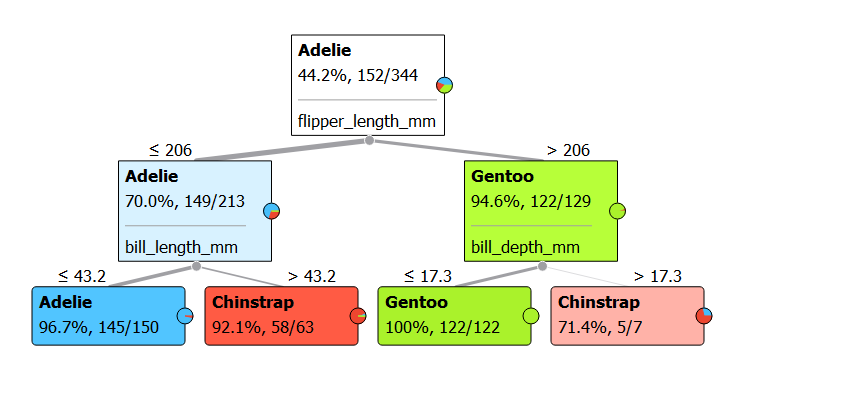

### A Childhood Game

Have you played **20 Questions**?

- How does one create questions in the game?  
  - Categories?
  - Numbers? How?
  - Comparisons?

- What sort of answers can you expect for each question?

- Can you imagine how the **20 Questions** Game can be shown as a **tree**? 

### What is a Decision Tree?

```{r echo=FALSE}
library(DiagrammeR)
grViz("
digraph tree_diagram {

  # a 'graph' statement
  graph [overlap = false, fontsize = 10]

  # several 'node' statements
  node [shape = circle,
        fontname = Helvetica,
        label = root]
  A; 

  node [shape = circle,
        fixedsize = true,
        label = nodes,
        fillcolor = purple,
        width = 0.9] // sets as circles
  B; C; 

node [shape = diamond,
        fixedsize = true,
        label = leaf,
        color = springgreen,
        width = 0.9] 
  D;E;

  # several 'edge' statements
  A->B[color = blue, label = yes]; A->C[color = red,label = no]; 
B->D[color = blue,label = yes]; B->E[color = red,label = no]
}
")
```

### Using Orange to view Decision Trees

What if we played **many** 20 Questions games in parallel? There would be many things to guess and there would be 20 questions aimed at guessing each of them. Would it be possible to play this "parallel" game? No?

Let us try!!

Let us look at the now famous `penguins` dataset, available here:

https://raw.githubusercontent.com/mwaskom/seaborn-data/master/penguins.csv

We see that there three `species` of penguins, that live on three `islands`. The measurements for each penguin are `flipper_length_mm`, `bill_depth_mm` and  `body_mass_g`. 

1. **Task 1:** Create a few data visualizations for the variables, and pairs of variables from this dataset. 

2. **Task 2:** Can you imagine how each of this dataset can be used in a `20 Questions Game`, to create a **Decision Tree** for this dataset as shown below?




### How do we Use our Decision Tree

Our aim is to make `predictions`. Predictions of what? Either a **numerical value** or a **class/category**. Trees can do both these things for us.

What we need to do is to use some data to **design the tree** and then use the tree to predict some aspect of the remaining, but similar, data. 

Let us split the `penguins` dataset into two pieces: a `training set` to design our tree, and a `test set` to check how it is working.

Download this [penguin tree file](penguins-tree.ows) and open it in Orange.


### A Visual Introduction to Random Forests

https://waternova.github.io/random-forest-viz/


## References


1. https://towardsdatascience.com/data-science-made-easy-data-modeling-and-prediction-using-orange-f451f17061fa

2. The beauty of Random Forests: https://orangedatamining.com/blog/2016/12/22/the-beauty-of-random-forest/

3. Pythagorean Trees for Random Forests: https://orangedatamining.com/blog/2016/07/29/pythagorean-trees-and-forests/

