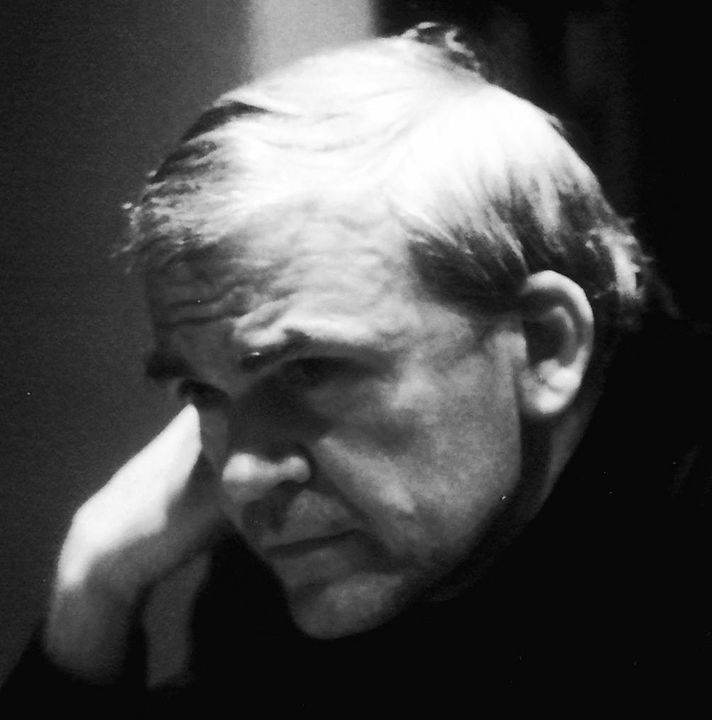

```{r setup, include=FALSE}
knitr::opts_chunk$set(echo = TRUE)
library(blogdown)
```

## Milan Kundera


## Story

We will read this terrifying story by this great Writer. <u>[**The Hitchhiking Game**](/pdf/ISTW/MilanKundera-hitchhiking.pdf)</u>

## Themes

-   Young Love
-   Games and Teasing
-   Ego and Pain
-   Rules in the Game
-   Consent

## Notes and References

### Additional Material

### Song for the Story

Song: Chalo Ek Baar Phir Se\
Album: Gumrah\
Year: 1963

Artist: Mahendra Kapoor\
Director: B.R.Chopra\
Star Cast: Sunil Dutt, Mala Sinha, Ashok Kumar, Shashikala, Nirupa Roy, Nana Plasekar\
Music Director: Ravi\
Lyricist: Sahir Ludhianvi

`r blogdown::shortcode("youtube", "GxdKkMeLuUA")`

| Hindi (and quite some Urdu!) Lyrics                           | English Translation                                                        |
|---------------------------------|---------------------------------------|
| ***chalo ek baar phir se, ajnabii ban jaayein ham donon(2)*** | Come, let us become strangers once again                                   |
| -----                                                         | -----                                                                      |
| ***na mai.n tumse koii ummiid rakhuu.n dilnavaazii kii***     | I shall no longer maintain hopes of compassion from you                    |
| ***na tum merii taraf dekho ghalat andaaz nazaro.n se***      | Nor shall you gaze at me with your deceptive glances.                      |
| ***na mere dil ki dhaDkan laDkhaDaaye merii baato.n me.n***   | My heart shall no longer tremble when I speak,                             |
| ***na zaahir ho tumhaari kashm-kash ka raaz nazaro.n se***.   | Nor shall your glances reveal the secret of your torment.                  |
| ----                                                          | ----                                                                       |
| ***tumhe.n bhii koii uljhan roktii hai pesh-qadmii se***      | Complications prevent you from advancing further,                          |
| ***mujhe bhii log kahte hai.n ki yeh jalve paraaye hai.n***   | I too am told that I wear disguises.                                       |
| ***mere hamraah bhi rusvaayiaa.n hai.n mere maazii kii***     | The disgraces of my past are now my companions,                            |
| ***tumhaare saath bhii guzrii huii raato.n ke saaye hai.n***  | while the shadows of bygone nights are with you too.                       |
| -----                                                         | -----                                                                      |
| ***taarruf rog ho jaaye to usko bhuulnaa bahtar***            | Should knowing one another become a disease, then it is best to forget it. |
| ***taalluq bojh ban jaaye to usko toDnaa achhaa***            | Should a relationship become a burden, then it is best to end it.          |
| ***voh afsaana jise anjaam tak laanaa na ho mumkin***         | For that tale which cannot culminate in a conclusion,                      |
| ***use ek khuubsuurat moD de kar chhoDna achhaa***            | it is best to give it a beautiful turn and leave it be.                    |
| -----                                                         | -----                                                                      |
| ***chalo ek baar phir se, ajnabii ban jaaye.n ham dono.n***   | Come, let us become strangers once again.                                  |

## Writing Prompts

##   

\
\
\

\
