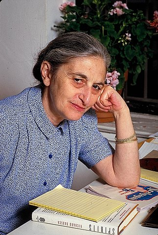

```{r setup, include=FALSE}
knitr::opts_chunk$set(echo = TRUE)
library(blogdown)
```


## India : Ruth Prawer Jhabvala

From: <https://www.britannica.com/biography/Ruth-Prawer-Jhabvala>

> Ruth Prawer Jhabvala, original name Ruth Prawer, (born May 7, 1927, Cologne, Germany—died April 3, 2013, New York, New York, U.S.), novelist and screenwriter, well known for her witty and insightful portrayals of contemporary Indian lives and, especially, for her 46 years as a pivotal member of Ismail Merchant and James Ivory’s filmmaking team.

> Jhabvala’s family was Jewish, and in 1939 they emigrated from Germany to England; she was made a naturalized British citizen in 1948. After receiving an M.A. in English (1951) from Queen Mary College, London, she married an Indian architect and moved to India, where she lived for the next 24 years. After 1975 she lived in New York City, becoming a U.S. citizen in 1986.


### Story

We will read this beautiful, beautifully written story, with a completely cringe-worthy character in it.

<u>[**The Interview**](/pdf/ISTW/RuthJhabvala-The Interview.pdf)</u>

### Themes

- Joint Family
- "Victim Mentality"
- Incest


### Notes and References

1. <u>[**The Difficult Genius of Ruth Prawer Jhabvala**](<https://www.theatlantic.com/entertainment/archive/2019/01/difficult-genius-ruth-prawer-jhabvala/581464/?utm_source=copy-link&utm_medium=social&utm_campaign=share>)</u>


### Additional Material

1. The Great Indian Family: New Roles, Old Responsibilities, <https://www.amazon.in/Gitanjali-Prasad/e/B001HPLWHW/ref=dp_byline_cont_pop_book_1>

2. Mukul Kesavan, The ugly Indian man: Of hygiene, hair and horrible habits, <https://www.telegraphindia.com/opinion/the-ugly-indian-man-of-hygiene-hair-and-horrible-habits/cid/1026680#>

### Song for the Story

Song: Yeh Jeevan Hai Is Jeevan Ka Yahi Hai  
Movie: Piya Ka Ghar  
Year: 1972  
Singer: Kishore Kumar
Music: Laxmikant Pyarelal  
Lyrics: Anand Bakshi  
Cast: Anil Dhawan, Jaya Bhaduri 
Director: Basu Chatterjee  

`r blogdown::shortcode("youtube", "IEcYHmAbznE")`


### Writing Prompts

1. Critical Reflection on the Story!  
1. Sarcastic Piece on the Indian Male 
1. Nav-Vadhu describing the first week after an arranged marriage  
1. An analysis of a regional movie that has the Joint Family as a Theme 
1. The Joys of Living in a Joint Family
