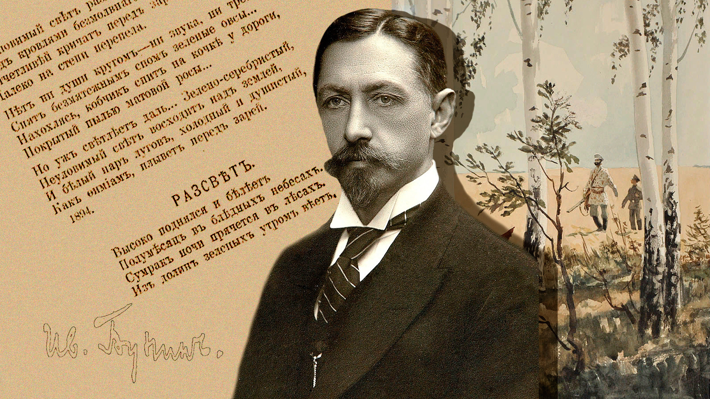

```{r setup, include=FALSE}
knitr::opts_chunk$set(echo = TRUE)
library(blogdown)
```

## Ivan Bunin



> IVAN BUNIN, the first Russian writer to win the Nobel Prize (1931), was born in 1870
to an aristocratic family in Vorornezh. After attending the University of Moscow briefly,
he brought out his first book, a volume of verse. For this and his realistic accounts of the
decay of the Russian nobility, he was awarded the Pushkin Prize for Literature and
elected to the Russian Academy. He fled to western Europe, following the Revolution,
and lived mainly in Paris, sometimes nearly destitute, until his death at the age of eightythree. His study of the dying patriarchy among Russian peasants raises him into the front
rank of European novelists, but his present reputation rests on his short stories, in such
collections as The Gentleman from San Francisco and The Grammar of Love. In many
of his stories he contrasts the transitoriness of human life with the endurance of beauty
and nature. Somerset Maugham has called "Sunstroke" one of the world's best stories.


### Story

We will read Ivan Bunin's short story, <u>[**Sunstroke**](/pdf/ISTW/IvanBunin-Sunstroke.pdf)</u>


### Themes

- First Love
- Shipboard Romances ( cliche )
- Time and Memory
- "River of Life" situation

  
### Additional Material

1. **River Volga**

](Volgarivermap.png){width="70%"}  

1. The Map of the Story  

```{r,echo=FALSE,warning=FALSE,message=FALSE}
library(tidyverse)
library(sf)
library(maps)
library(tmap)
library(tmaptools)
library(rnaturalearth)
library(leaflet)
library(htmlwidgets)
tmap_mode("plot")
data("rivers")
data("World")
data("metro")
tmap_options(check.and.fix = TRUE)

volga_bb_bigger <- osmplotr::get_bbox(latlon = c(25, 35, 55, 60))

russian_rivers <- rivers %>%
  filter(name %in% c("Volga", "Don", "Dnieper"))
countries <- ne_countries(scale = "large", returnclass = "sf")
bunin_world <-
  countries %>% filter(
    name %in% c(
      "Russia",
      "Ukraine",
      "Azerbaijan",
      "Kazakhstan",
      "Georgia",
      "Armenia",
      "Turkey",
      "Greece",
      "Bulgaria",
      "Romania",
      "Iran",
      "Poland",
      "Belarus",
      "Hungary",
      "Serbia",
      "Slovakia",
      "Latvia",
      "Estonia",
      "Moldova",
      "Albania",
      "North Macedonia",
      "Kosovo",
      "Montenegro"
    )
  )
bunin_cities <-
  world.cities %>% filter(
    country.etc %in% c("Russia", "Ukraine"),
    name %in% c(
      "Moscow",
      "Samara",
      "Volgograd",
      "Anapa",
      "Sevastopol",
      "Odesa",
      "Kerch",
      "Rostov-on-Don"
    )
  ) %>% st_as_sf(coords = c("long", "lat"))

bunin_map <- tm_shape(bunin_world, bbox = volga_bb_bigger) +
  tm_borders(lwd = 2) +
  tm_fill(
    col = "name",
    legend.show = FALSE,
    id = "name",
    palette = "Set3",
    labels = "",
    legend.col.show = FALSE
  ) +
  
  tm_text(
    text = "name",
    fontface = "plain",
    fontfamily = "sans",
    size = 0.5,
    auto.placement = TRUE,
    case = "upper"
  ) +
  
  tm_shape(russian_rivers, bbox = volga_bb_bigger) +
  tm_lines(
    col = "name",
    lwd = 2,
    palette = "Blues",
    legend.col.show = FALSE
  ) +
  
  tm_shape(bunin_cities) +
  tm_symbols(col = "red",
             legend.col.show = FALSE) +
  tm_text(
    text = "name",
            fontface = "bold",
            fontfamily = "monospace",
    size = 0.75,
    auto.placement = TRUE
  ) +
  
  tm_layout(main.title = "World from Ivan Bunin\'s story \"Sunstroke\"",
            fontface = "italic", 
            fontfamily = "serif",
            bg.color = "skyblue")
bunin_map
# tmap_bunin <- tmap_leaflet(bunin_map, mode = "view", show = FALSE,add.titles = FALSE) %>% setView(1249033,2682288,zoom=16)%>% fitBounds(25,35,55,60) %>% clearBounds() #https://tlorusso.github.io/geodata_workshop/tmap_package#interactive-map-with-leaflet-and-tmap
# #saveWidget(tmap_bunn, file="tmap_bunin.html")
# tmap_bunin
```


2. Ivan Bunin – Biographical. NobelPrize.org. Nobel Prize Outreach AB 2022. Sat. 5 Mar 2022. <https://www.nobelprize.org/prizes/literature/1933/bunin/biographical/>


### Notes and References  


### Song for the Story !!

Naah. 
