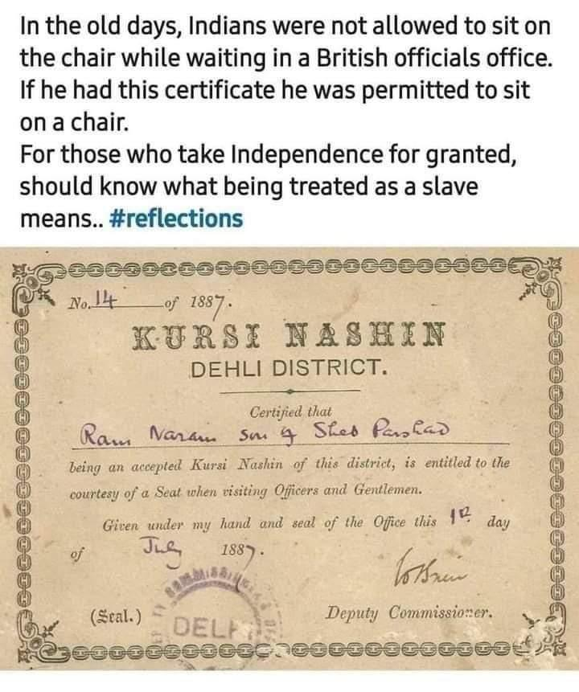

```{r setup, include=FALSE}
knitr::opts_chunk$set(echo = TRUE)
library(blogdown)
```

## Ventura Garcia Calderon


> Ventura García Calderón (1886–1959) was a Peruvian man of letters and a diplomat who was at the center of the hispanophone community in Paris in the first half of the twentieth century. Known as a proponent of Spanish American literature, García Calderón achieved a global celebrity for his dramatic, colorful, and ironic short stories. These stories, published in both Spanish and French, feature a raw depiction of reality, a strong sense of retributive justice, and a sympathy for the marginalized people that characterize European Naturalism. García Calderón adapted this style to advance his goal of providing European readers with an authentic understanding of Peru and Spanish America, thus replacing the voyeuristic and patronizing notion of the "exotic" inherited from literary romanticism and nineteenth-century travel writers. 

> The construction of García Calderón's stories was subversive and destabilized the widespread notion of Peru held by European critics and readers. While international critics during the author's lifetime unanimously praised García Calderón's fiction as well as his essays that theorize the transformation and renaissance of Spanish language and literature by americano writers, scholars since the 1960s have largely misunderstood his reformative project. 

### Story

We will read Ventura Garcia Calderon's short short story, <u>[**The Lottery Ticket**](/pdf/ISTW/TheLotteryTicket.docx)</u>


### Themes

- Marginalized People
- Colour
- Women and Objectification
- Mob Justice
- The Art of Protest!

  
### Additional Material

1. **Kursi Nashin**: A Certificate of Discrimination from British India



2. Review of **The Lottery Ticket** <https://caponomics.blogspot.com/2013/05/short-story-review-lottery-ticket-by.html>

2. Ventural Garcia Calderon at **Short Story Magic Tricks**: <https://shortstorymagictricks.com/2021/07/06/the-lottery-ticket-by-ventura-garcia-calderon/>

4. Goldberg, N. S. (2014). Rereading Ventura García Calderón. Hispania, 97(2), 220–232. http://www.jstor.org/stable/24368768 [^1]


### Notes and References  

1. Rene Girard's Mimetic Theory and the Scapegoat: <https://violenceandreligion.com/mimetic-theory/>

2. Frear, G. L. (1992). René Girard on Mimesis, Scapegoats, and Ethics. The Annual of the Society of Christian Ethics, 12, 115–133. http://www.jstor.org/stable/23559770


### Songs for the Story !!

1. Song for the Black Hero of this story:  
Title: What About Me?  
Band: Moving Pictures  
Band Location: Sydney, NSW, Australia  
Album: Days Of Innocence  
Composed By: Garry Frost, Frances Swan  
Release Date:: January, 1982  
Chart Position:   
- No.1 (Australia)  
- No.29 (US Billboard Hot 100)  
`r blogdown::shortcode("youtube", "OzQKECQgjW8")`  


2. Song for Cielito:  
Title: Bette Davis Eyes  
Artiste: Kim Carnes  
Album: Mistaken Identity  
Composed by: Donna Weiss and Jackie DeShannon  
Year: 1981  
Chart Position:  
- No.1 (Australia)  
- No.1 (US Billboard Hot 100)  
- No. 10 (UK Singles Charts)
`r blogdown::shortcode("youtube", "2Wdu5FYGTRs")`  

### The "Lottery" Idea in Literature

1. Shirley Jackson, *The Lottery*. <https://www.newyorker.com/magazine/1948/06/26/the-lottery>

1. Munshi Premchand. *Lottery*, short story in Hindi.  <https://en.wikipedia.org/wiki/Lottery_(short_story)> 

1. Anton Chekhov, *The Lottery Ticket*. <https://www.classicshorts.com/stories/lottery.html>


