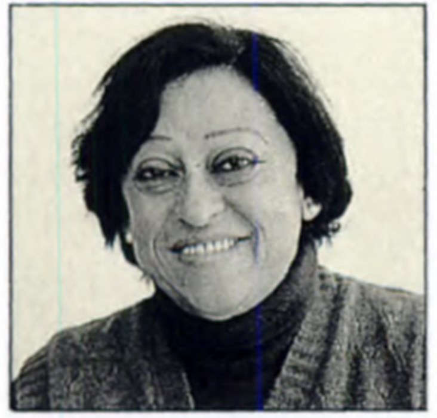
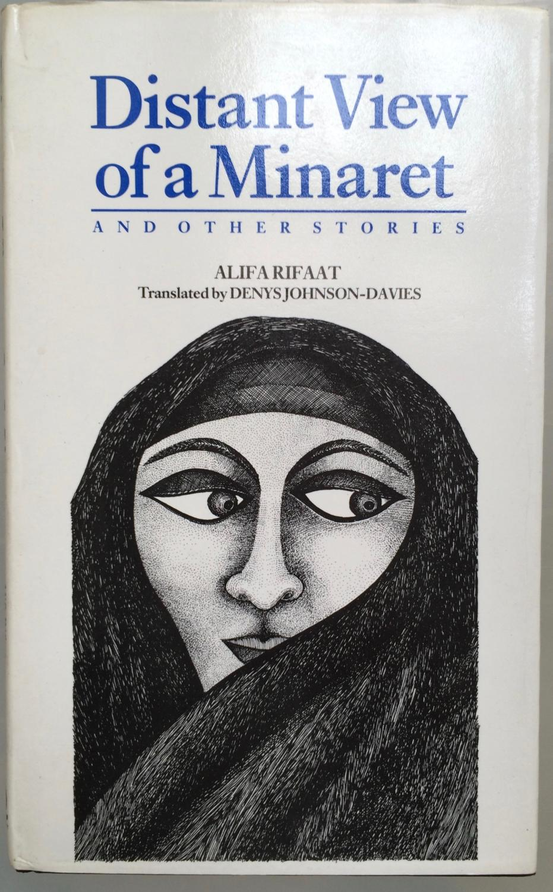

```{r setup, include=FALSE}
knitr::opts_chunk$set(echo = FALSE)
#devtools::install_github("mccarthy-m-g/embedr")
library(embedr) # Embed multimedia in HTML files
```

## Alifa Rifaat



From the book blurb:

> “More convincingly than any other woman writing in Arabic today, Alifa
> Rifaat lifts the veil on what it means to be a woman living within a
> traditional Muslim society.” So states the translator’s foreword to
> this collection of the Egyptian author’s best short stories. Rifaat
> (1930–1996) did not go to university, spoke only Arabic, and seldom
> traveled abroad. This virtual immunity from Western influence lends a
> special authenticity to her direct yet sincere accounts of death,
> sexual fulfillment, the lives of women in purdah, and the frustrations
> of everyday life in a male-dominated Islamic environment. Translated
> from the Arabic by Denys Johnson-Davies
> <https://www.theguardian.com/world/2017/jun/18/denys-johnson-davies-obituary>,
> the collection admits the reader into a hidden private world,
> regulated by the call of the mosque, but often full of profound
> anguish and personal isolation. Badriyya’s despairing anger at her
> deceitful husband, for example, or the haunting melancholy of “At the
> Time of the Jasmine,” are treated with a sensitivity to the discipline
> and order of Islam.

## Story

We will read Rifaat's story *Bahiyya's Eyes* from the Collection
<u>[**Distant View of a Minaret and Other
Stories**.](Distant%20View%20of%20a%20Minaret%20and%20Other%20Storie%20-%20Rifaat,%20Alifa.pdf)</u>
{width="240"}

## Themes

-   Age and Aging
-   Disease and Healthcare
-   Woman's Place in Society
-   "Eyes are the Gateway to the Soul" - Herman Melville
-   Religion, Tradition, and Conservative Belief: Is Belief always
    "Blind"?
-   Through a Child's Eyes: A Child's Discoveries about the World
-   Children and Family

## Additional Material

### Notes and References

1.  بَهِيّ**ة** Bahiyyah is an Arabic name for girls that means
    “brilliant”, “beautiful”, “radiant”.

2.  Alifa Rifaat on the Dangerous Women Project
    <u><https://dangerouswomenproject.org/2016/04/30/alifa-rifaat/></u>

3.  Banipal Magazine of Modern Arabic Literature.
    <u><http://www.banipal.co.uk></u>

4.  <u><https://www.arabicfiction.org/en></u>

5.  Denys Johnson-Davies
    <u><https://www.theguardian.com/world/2017/jun/18/denys-johnson-davies-obituary></u>

6.  Malti-Douglas, Fedwa. *Men, Women, and God(s): Nawal El Saadawi and
    Arab Feminist Poetics*. Berkeley: University of California Press,
    c1995 1995. <u><http://ark.cdlib.org/ark:/13030/ft8c6009n4/></u>

7.  *Ya Baheya, the Woman Behind the Legend*.
    <u><http://www.shira.net/music/ya-baheya-background.htm></u>

8.  *Oyun Baheya*, the Song. <u><https://youtu.be/sb4ZNdLGeIo></u>

### Song for the Story

Song: Do Naina aur Ek Kahani\
Film: Masoom(1983)\
Artist: Arati Mukherjee\
Music Director: R.D Burman\
Lyricist: Gulzar\
Starring: Naseeruddin Shah, Shabana Azmi, Master Jugal, Baby Urmila,
Saeed Jaffery\
Director : Shekhar Kapoor\

<u><https://youtu.be/qfrdkbQHw48></u>

`r embedr::embed_audio("old_Masoom-Do Naina Aur Ek Kahani.mp3")`

| Hindi Lyrics                                         | English Translation                                              |
|---------------------------------|---------------------------------------|
| Do naina aur ek kahanee(2)                           | Two eyes and one story,                                          |
| thoda sa badal, thoda sa panee aur ek kahanee(2)     | some clouds, some water, and a story                             |
| ------                                               | ------                                                           |
| Chhotee see do jhilon me woh, bahatee rahatee hai(2) | In two small lakes, they keep floating/flowing                   |
| Koi sune ya na sune, kahatee rahatee hai             | Whether anyone is listening or not, they keep telling the story, |
| Kuchh likh ke aur, kuchh jubanee                     | Some Written, and Sometimes by speaking out                      |
| ------                                               | ------                                                           |
| Thodee sai hain janee hui, thodee see nayee(2)       | A part of the story is known, but a small part of it is new      |
| Jahaan ruke aansu, waheen puree ho gayee             | Whenever the tears stop, that is where the story stops too,      |
| Hai toh nayee fir bhi, hain puranee                  | It is new but its old at the same time                           |
| ------                                               | -------                                                          |
| Ek khatm ho toh, dusaree raat aa jatee hai(2)        | As one night passes, it is time for the other night,             |
| Hothhon pe fir bhulee hui, bat aa jatee hai          | And those forgotten words cross my lips                          |
| Do naino kee hain yeh kahanee                        | That is the story of the two eyes!                               |
| thoda sa badal, thoda sa panee aur ek kahanee        | some clouds, some water, and a story                             |
| Do naina aur ek kahanee...                           | Two eyes and one story.....                                      |

## Writing Prompts

1.  Contemplate your life, and demise, and write a Will. Dwell on
    relationships and not merely on (imaginary) opulence/ property.
2.  Your Friend is Blind.
3.  A Child discovers a piece of Family History.
