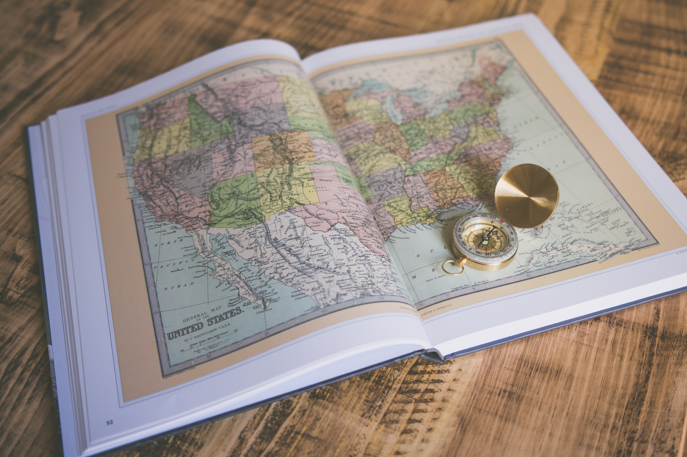

## What you will learn

- Close Reading  
- Language and Style differences among Writers
- Cultural and General References in a specific instance of World Literature
- Writing logically with Flow

## Introduction

Several Short Stories from different parts of the World will be read in detail. The following aspects of the stories shall be discussed in class: 

• The story/sequence, the interesting events  
• Setting  
• The characters, their voices, identity, emotions, impressions  
• The authenticity of the speaker/narrator and author  
• Said and unsaid  
• Language construction that seems unique to the location of the story; Peculiar turns of phrase; caricature and cliché.  
• Cultural, local, or historical references to places, people, events  
• Affinities with our own culture and languages; memories  
• Large themes that the story seems to address  

A video or a song will be also played wherever possible to bring in a multi-sensorial  appreciation of the ideas from the story. The unit will also include exposure to the use of open-source technological tools such as Calibre (e-Book Library Manager), the Hemingway App for improved writing and Browser plug-ins to foster the reading habit.

The students will be required to do:  
a) A Reflective Piece of Writing about the Story that was read in class.  
b) A Creative Piece of Writing on a choice of topics to be announced after reading each story in class.  

 

## References

1. Neumann, Bonnie H., Ed.; McDonnell, Helen M., Ed., *Teaching the Short Story: A Guide to Using Stories from around the World*. National Council of Teachers of English, Urbana, IL,USA. ISBN-0-8141-1947-6

1.Ron Hansen, *You've Got to Read This: Contemporary American Writers Introduce Stories That Held Them in Awe*. Harper Perennial, 1994. ISBN:9780060982027

1. 
