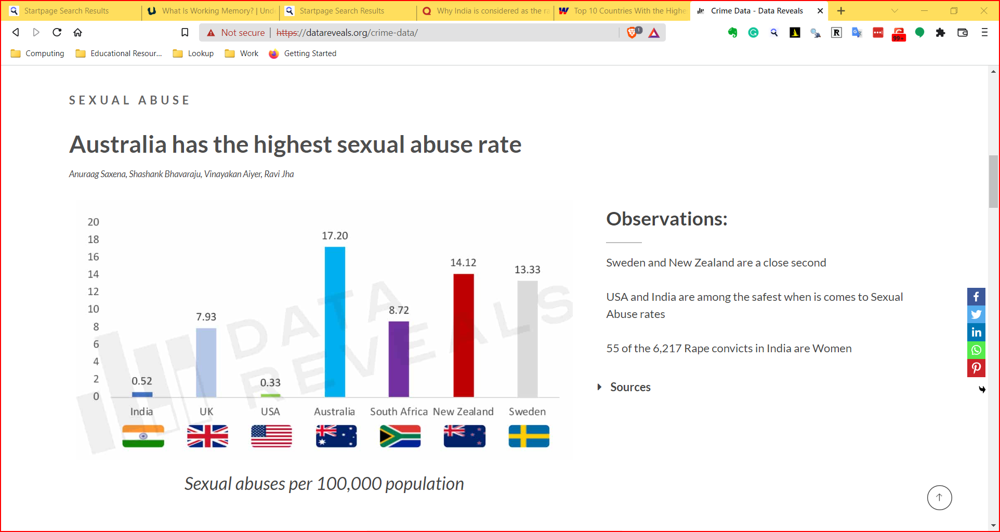

```{r setup, include=FALSE}
knitr::opts_chunk$set(echo = TRUE)
library(blogdown)
library(tidyverse)
library(ggtext)
```

## Where does Data come from?

Let us look at the slides. Click on the icon above:

```{r}
knitr::include_url("10-Nature-of-Data/10-Nature-of-Data.html")

```

## Why Visualize?

-   We can digest information more easily when it is pictorial
-   Our [Working
    Memories](https://www.understood.org/en/articles/working-memory-what-it-is-and-how-it-works)
    are both *short-term* and *limited* in capacity. So a picture
    abstracts the details and presents us with an overall summary, an
    insight, or a story that is both easy to recall and easy on
    retention.\
-   Data Viz includes *shapes* that carry strong cultural memories and
    impressions for us. These cultural memories help us to use data viz
    in a *universal way* to appeal to a wide variety of audiences. (Do
    humans have a gene for geometry?)
-   It helps sift facts and mere statements: for example:

```{r echo=FALSE, fig.alt= "Source https://www.deccanherald.com/national/india-is-known-as-the-rape-capital-of-the-world-rahul-783495.html", fig.cap="Source https://www.deccanherald.com/national/india-is-known-as-the-rape-capital-of-the-world-rahul-783495.html"}
knitr::include_graphics("rape-capital.png")

```

```{r echo=FALSE, fig.alt= "Source https://datareveals.org/crime-data/", fig.cap= "Source https://datareveals.org/crime-data/"}


```

## What are Data Types??

<https://www.youtube.com/watch?v=dwFsRZv4oHA>

`r blogdown::shortcode("youtube", "dwFsRZv4oHA")`

In more detail:

`r blogdown::shortcode("youtube", "hZxnzfnt5v8")`

## How do we Spot Data Variable Types?

By asking questions!

+----------+--------------------+----------+-------------+----------+
| Pronoun  | Answer             | Variable | Example     | What     |
|          |                    | / Scale  |             | Ope      |
|          |                    |          |             | rations? |
+==========+====================+==========+:============+==========+
| What,    | Name, Place,       | Qua      | Name        | -        |
| Who,     | Animal, Thing      | litative |             |    Count |
| Where,   |                    | /        |             |     no.  |
| Whom,    |                    | **N      |             |     of   |
| Which    |                    | ominal** |             |          |
|          |                    |          |             |    cases |
|          |                    |          |             | -   Mode |
+----------+--------------------+----------+-------------+----------+
| How,     | A Manner / Method, | Qua      | -   Socio   | -        |
| What     | Type or Attribute  | litative |             |   Median |
| Kind,    | from a list, with  | /        |   -economic | -   Per  |
| What     | list items in some | **O      |     status  | centiles |
| Sort     | " order\*\*" (     | rdinal** |     ("low   |          |
|          | e.g. good, better, |          |     income, |          |
|          | improved, best..)  |          |     middle  |          |
|          |                    |          |     income, |          |
|          |                    |          |     high    |          |
|          |                    |          |     income) |          |
|          |                    |          |             |          |
|          |                    |          | -           |          |
|          |                    |          |   education |          |
|          |                    |          |     level   |          |
|          |                    |          |             |          |
|          |                    |          |     ("high  |          |
|          |                    |          |             |          |
|          |                    |          |    school", |          |
|          |                    |          |     "B S"," |          |
|          |                    |          |     M       |          |
|          |                    |          |             |          |
|          |                    |          |   S","PhD") |          |
|          |                    |          |             |          |
|          |                    |          | -   income  |          |
|          |                    |          |     level   |          |
|          |                    |          |             |          |
|          |                    |          |     ("less  |          |
|          |                    |          |     than    |          |
|          |                    |          |     50K",   |          |
|          |                    |          |             |          |
|          |                    |          | "50K-100K", |          |
|          |                    |          |     "over   |          |
|          |                    |          |     100K")  |          |
|          |                    |          |             |          |
|          |                    |          | -   S       |          |
|          |                    |          | atisfaction |          |
|          |                    |          |     rating  |          |
|          |                    |          |     (       |          |
|          |                    |          |             |          |
|          |                    |          |  "extremely |          |
|          |                    |          |             |          |
|          |                    |          |   dislike", |          |
|          |                    |          |             |          |
|          |                    |          |  "dislike", |          |
|          |                    |          |             |          |
|          |                    |          |  "neutral", |          |
|          |                    |          |     "like", |          |
|          |                    |          |             |          |
|          |                    |          |  "extremely |          |
|          |                    |          |     like"). |          |
+----------+--------------------+----------+-------------+----------+
| How Many | Quantities with    | Quan     | -   pH      | -   Mean |
| / Much / | Scale.             | titative | -   SAT     |          |
| Heavy?   |                    | /        |     score   | -        |
| Few?     | **Differences**    | **In     |             | Standard |
| Seldom?  | are meaningful,    | terval** |  (200-800), |     D    |
| Often?   | but not products   |          | -   Credit  | eviation |
| When?    | or ratios          |          |     score   |          |
|          |                    |          |             |          |
|          |                    |          |  (300-850). |          |
|          |                    |          | -   Year of |          |
|          |                    |          |             |          |
|          |                    |          |    Starting |          |
|          |                    |          |     in      |          |
|          |                    |          |     College |          |
+----------+--------------------+----------+-------------+----------+
| How Many | Quantities, with   | Quan     | -           | -   Cor  |
| / Much / | Scale and a Zero   | titative |   Weight,le | relation |
| Heavy?   | Value.             | /        | ngth,Height | -        |
| Few?     |                    | R        |             |    Coeff |
| Seldom?  | Differences and    | atio\*\* | -           |     of   |
| Often?   | Ratios /Products   |          | Temperature |     V    |
| When?    | are meaningful.    |          |     in      | ariation |
|          | (e.g Weight )      |          |     Kelvin  |          |
|          |                    |          |             |          |
|          |                    |          | -   Enzyme  |          |
|          |                    |          |             |          |
|          |                    |          |   activity, |          |
|          |                    |          |     dose    |          |
|          |                    |          |     amount, |          |
|          |                    |          |             |          |
|          |                    |          |    reaction |          |
|          |                    |          |     rate,   |          |
|          |                    |          |     flow    |          |
|          |                    |          |     rate,co |          |
|          |                    |          | ncentration |          |
|          |                    |          |             |          |
|          |                    |          | -   Pulse   |          |
|          |                    |          |             |          |
|          |                    |          | -           |          |
|          |                    |          |    Survival |          |
|          |                    |          |     time    |          |
+----------+--------------------+----------+-------------+----------+

As you go from `Qualitative` to `Quantitative` data types in the table,
I hope you can detect a movement from fuzzy groups/categories to more
and more crystallized numbers. Each variable/scale can be subjected to
the operations of the previous group. In the words of [S.S.
Stevens](https://stats.idre.ucla.edu/other/mult-pkg/whatstat/what-is-the-difference-between-categorical-ordinal-and-interval-variables/)
,

> the basic operations needed to create each type of scale is
> cumulative: to an operation listed opposite a particular scale must be
> added all those operations preceding it.

## What Are the Parts of a Data Viz?

```{r echo=FALSE,message=FALSE}

g <- diamonds %>% slice_sample(n = 500) %>% ggplot(aes(x = carat, y = price, colour = cut)) + geom_point() +
  labs(title = "Plot Title", 
       subtitle = "Plot Subtitle",
       caption = "Plot Caption",
       x = "x-Axis Title",
       y = "y-Axis Title") + 
  guides(colour=guide_legend(title = "Plot Legend", 
                             colour = "orange")) + theme_bw() +
  theme(plot.title.position = "panel",
        plot.title = element_text(size = 20, 
                                  colour = "orange"),
        legend.title = element_text(colour = "orange", 
                                    size = 12),
        panel.background = element_rect(fill = "white"),
        plot.subtitle = element_text(size = 12, 
                                     colour = "orange"),
        plot.caption = element_text(size = 8, 
                                    colour = "orange"),
        axis.title.x = element_text(colour = "orange", 
                                    size = 12),
        axis.title.y = element_text(colour = "orange", 
                                    size = 12)
        )

annotation <- tibble(
   x = c(2,-0.01, 1.2),
   y = c(0, 10000, 17000),
   angle = c(0, 90, 0), 
   label = c("X-axis", "Y-axis", "Annotation")
)

# Add text
g + geom_text(data=annotation, aes( x=x, y=y, label=label, angle = angle),                 , 
           color="orange", 
           size=7 , fontface="bold" )
```

## How to pick a Data Viz?

Most Data Visualizations use one or more of the following geometric
attributes or aesthetics. These geometric aesthetics are used to
*represent* qualitative or quantitative variables from your data.

```{r echo=FALSE, fig.cap="From Claus Wilke, Fundamentals of Data Visualization"}
knitr::include_graphics("common-aesthetics-1.png")
```

What does that mean? We can think of simple visualizations as
**combinations** of these aesthetics. Some examples:

+-----------+-----------+--------------------+-----------------------+
| Aesthetic | Aesthetic | Shape              | Chart Picture         |
| #1        | #2        |                    |                       |
+===========+===========+:==================:+=======================+
| Position  | Position  | Points/Circles     |  |
+-----------+-----------+--------------------+-----------------------+
| Position  | Position  | Columns            |  |
+-----------+-----------+--------------------+-----------------------+
| Position  | Position  | Rectangles, with   |  |
+-----------+-----------+--------------------+-----------------------+
| Position  | Position  | Box + Whisker, Box |  |
|           |           | upper and lower    |                       |
|           |           | quartile resp.     |                       |
+-----------+-----------+--------------------+-----------------------+
| Position  | Postion Y |                    |  |
|           | Qual Var  |                    |                       |
+-----------+-----------+--------------------+-----------------------+
| Quant     | Shape =   |                    | {width="100"} |
+-----------+-----------+--------------------+-----------------------+

## What Tool are we going to be using?

Fire up this website in your browser:

<https://www.datawrapper.de/>

This is a #NoCode #NoInstallation browser-only tool that is free for us
to use.

Let us play with this tool today and try to make as many visualizations
and explanations as possible. The datasets we will is:

1)  

2)  

## An Example

## What is the Story here?

## Your Turn

Try these two datasets in datawrapper.
