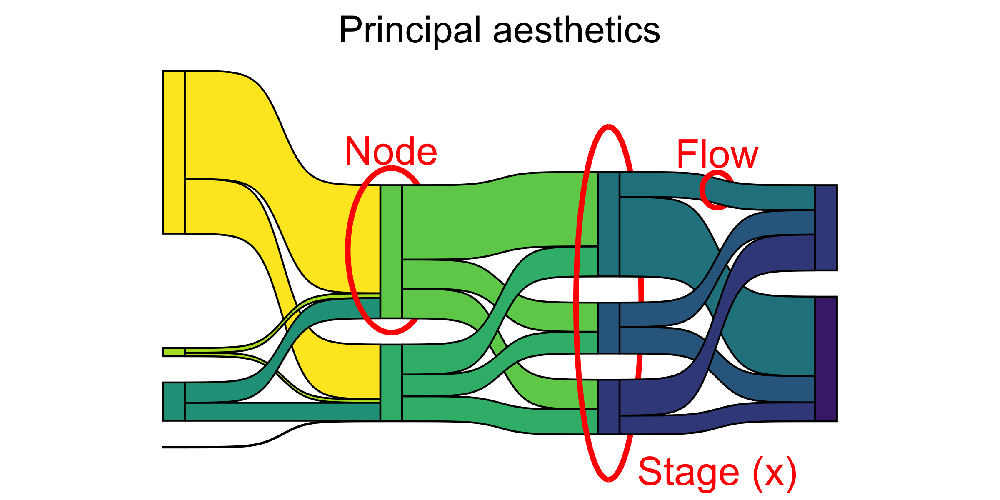

```{r setup, include=FALSE}
knitr::opts_chunk$set(echo = FALSE)
library(blogdown)
library(tidyverse)
library(patchwork)
library(ggstream) # stream plots in R
library(ggalluvial)


```

## Introduction

What do we mean by "evolution" here?
We mean data that changes in *category* or *membership* over *time* or *space*. The dataset may contain only categories and the time and space parameters may be implicit.
For example: what does the graph below depict?


```{r, echo=FALSE}

```


## What Time Evolution Charts can we plot?

In these cases, the x-axis is typically *time*...and we chart the variable of another Quant variable with respect to time, using a *line* geometry. 

Let is take a healthcare budget dataset from[Our World in Data](https://ourworldindata.org/grapher/public-health-expenditure-share-GDP-OWID): We will plot graphs for 5 countries (India, China, Brazil, Russia, Canada )

```{r charts, echo=FALSE, warning=FALSE,message=FALSE}
health <-
  read_csv("data/public-health-expenditure-share-GDP-OWID.csv")
health_filtered <- health %>%
  filter(Entity %in% c(
    "India",
    "China",
    "United States",
    "United Kingdom",
    "Russia",
    "Sweden"
  ))
p1 <- ggplot(health_filtered,
         aes(x = Year, y = public_health_expenditure_pc_gdp, colour = Entity)) + geom_line() + labs(y = "Healthcare Budget\n as % of GDP")

p2 <-  
  ggplot(health_filtered,
         aes(x = Year, y = public_health_expenditure_pc_gdp, fill = Entity)) + geom_area()+ labs(y = "Healthcare Budget\n as % of GDP")


p1 / p2 + plot_layout(nrow = 2) + plot_annotation(title = "Line and Area Charts to show Evolution (over Time )",subtitle = "", tag_levels = 'A') & theme_minimal()

```


## What Space Evolution Charts can we plot?

Here, the *space* can be any Qual variable, and we can chart another Quant or Qual variable move across levels of the first chosen Qual variable.

For instance we can contemplate Enrollment at a University, and show how students move from course to course in a University. Or how customers drift from one category of products or brands to another....or the movement of cricket players from one IPL Team to another !!

> A sankey diagram is a visualization used to depict a flow from one set of values to another. The things being connected are called **nodes** and the connections are called **links**. 
Sankeys are best used when you want to show a many-to-many mapping between two domains or multiple paths through a set of stages.

```{r}


```

```{r more-charts, echo=FALSE, warning=FALSE,message=FALSE}
library(ggalluvial)
data("Titanic")
Titanic %>% as_tibble() %>% 
ggplot(data = .,
       aes(axis1 = Class, axis2 = Sex, axis3 = Age,
           y = n)) +
  geom_alluvium(aes(fill = Survived)) +
  geom_stratum() +
  scale_x_discrete(limits = c("Class", "Sex", "Age"), 
                   expand = c(.2, .05)) +
  geom_text(stat = "stratum", aes(label = after_stat(stratum))) +
  xlab("Demographic") +
  theme_minimal() +
  ggtitle("passengers on the maiden voyage of the Titanic",
          "stratified by demographics and survival")
```

Here is another example of a Sankey Diagram:This diagram show how energy is converted or transmitted before being consumed or lost: supplies are on the left, and demands are on the right. Data: Department of Energy & Climate Change via Tom Counsell

<iframe width="100%" height="684" frameborder="0"
  src="https://observablehq.com/embed/@d3/sankey?cells=chart"></iframe>
  
  


## Conclusion


## References

1. Global Migration, <https://download.gsb.bund.de/BIB/global_flow/>
 A good example of the use of a Chord Diagram.
