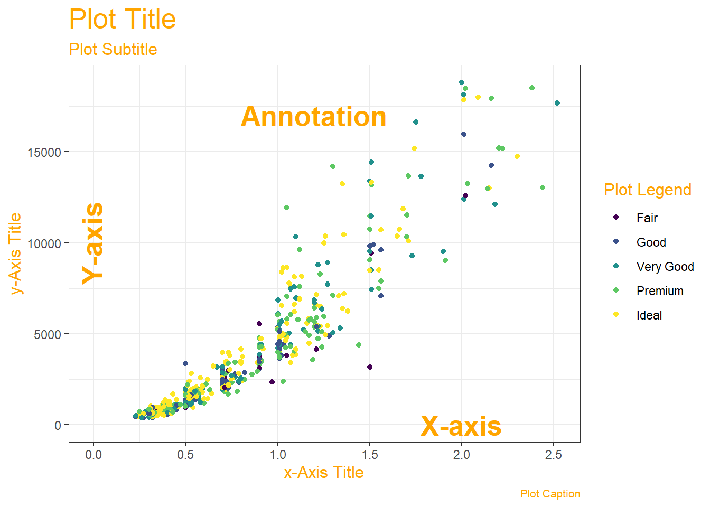

## Introduction

We will explore visualizing of different kinds of data in this set of modules.

## What Are the Parts of a Data Viz?

## How to pick a Data Viz?

Most Data Visualizations use one or more of the following geometric attributes or aesthetics. These geometric aesthetics are used to *represent* qualitative or quantitative variables from your data.

What does that mean? We can think of simple visualizations as **combinations** of these aesthetics. Some examples:

| Aesthetic #1                      | Aesthetic #2                                 |                                                              Shape                                                              | Chart Picture                                                                                                                                      |
|-----------------------------------|----------------------------------------------|:-------------------------------------------------------------------------------------------------------------------------------:|----------------------------------------------------------------------------------------------------------------------------------------------------|
| Position X = Quant Variable       | Position Y = Quant Variable                  |                                           Points/Circles with Fixed Size and/or Line                                            |                                                                          |
| Position X = Qual Variable        | Position Y = Count of Qual Variable          |                                                             Columns                                                             |                                                                             |
| Position X = Qual Variable        | Position Y = Qual Variable                   |                                   Rectangles, with *area* proportional to joint (X,Y) *count*                                   |                                                                               |
| Position X = Qualitative Variable | Position Y = Rank Ordered Quant Variable     | Box + Whisker, Box length proportional to *Inter-Quartile Range*, whisker-length proportional to upper and lower quartile resp. |  |
| Position X = Quant Variable       | Position Y = Quant Variable + Quant Variable |                                                   Lines + Area between Lines                                                    |                                                                            |

|     |
|-----|
|     |
