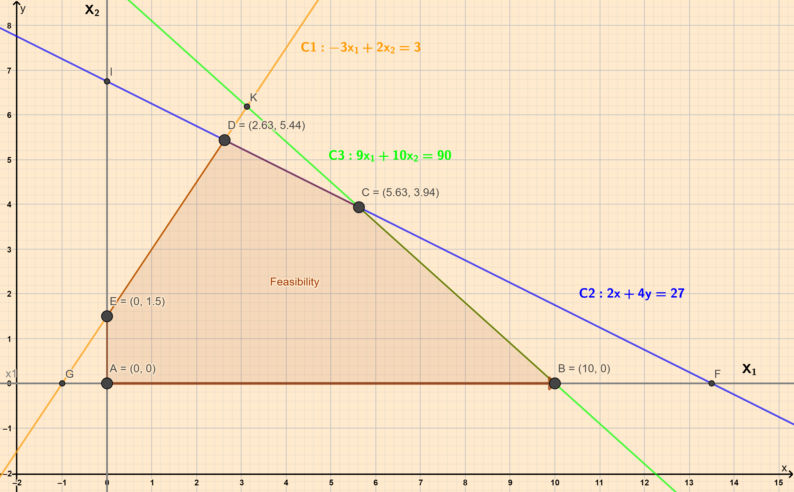

```{r setup, include=FALSE}
knitr::opts_chunk$set(
  echo = FALSE,
  collapse = TRUE,
  #cache = TRUE, autodep = TRUE, 
  comment = "#",
  fig.show = "asis", 
  warning=FALSE, message=FALSE, fig.align = "center",
  scipen = 1, digits = 2)
library(blogdown)
library(tidyverse)
library(plotly)
library(gMOIP)

```

## What is the Simplex Method?
To be written up.

## A ~~Random~~ Walk with the Simplex Method

Let us try to form a geometric intuition for the Simplex method.

We will define an LP problem, and geometrically traverse the steps the
Simplex method might take to solve for the optimum solution.

Let us define a problem:

$$
Maximise\ 7.75x_1 + 10x_2\\
$$ $$
Subject\ to\\
  \begin{cases}
    C1: -3x_1 + 2x_2 &<= 3\\
    C2: 2x_1 + 4x_2 &<= 27\\
    C3: 9x_1 + 10x_2 &<= 90\\
    x_1, x_2 >= 0
  \end{cases}
$$

The Objective function is: $7.75x_1 + 10x_2$

The Constraints are defined by the three *inequalities* $C1::C3$. In
order to plot these, we *convert the inequalities to equalities* and
plot these as lines. Each line splits the $x_1:x_2$ plane into two
half-planes. The inequality part is then taken into account by choosing
the appropriate *half-plane* created by the equation. The *intersection*
of all the half-planes defined by the constraints is the **Feasibility
Region**.

```{r echo=FALSE}
A <- matrix(c(-3,2,2,4,9,10), ncol = 2, byrow = TRUE)
b <- c(3,27,90)
obj <- c(7.75, 10)  # coefficients c

```

The Feasibility region for this LP problem is plotted below:

```{r simplex-1}


```

The corner points of the Feasibility Region are:

```{r}
cornerPoints(A, b, type = rep("c", ncol(A))) %>% 
  as_tibble() %>% 
  cbind(name = c("D", "C", "E","B", "A")) %>% 
  relocate(name) %>% arrange(name)

```

Recall that:

-   The optimum in an LP problem is found **on** the boundary, at one of
    the vertices
-   At each of these vertices on or more constraints ($C1::C_n$) is
    *tight*, i.e. there is no slack.

## Procedure

1.  We start with an arbitrary point on the edge of the Feasibility Region.
    $A = (0,0)$ is a common choice. At this point, since all variables
    are $0$, the objective function is also $0$.

2.  We (arbitrarily) decide to **move along the boundary** of the
    Feasibility Region, to another FSP. We arbitrarily chose the $x_1$ 
    axis, and set/keep $x_2 = 0$. We now wish to find out the $x_1$
    coordinate of the next FSP point. This would be at the intersection
    of the $x_1$ axis and *one of* the Constraint lines.\
    All the three Constraint Lines would possibly intersect the
    $x_1$ axis. We need to choose that *intercept point* that has the
    smallest, non-negative $x_1$ intercept value. (Why?)\
    So, which *Constraint Line* intersects the $x_1$ axis at the
    **smallest value**? Is it point B, or point F?\
    To find out, we substitute $x_2 = 0$ in each of the Constraint
    equations, and solve for the $x_1$:  
    $$
\begin{cases}
    C1: -3x_1 + 2 \times 0 = 3 \ => x_1 = \color{red}{-1}\\
    C2: 2x_1 + 4\times0 = 27 \ => x_1 = 13.5\ Point\ F\\
   {\mathbf{ \color{lightgreen}{C3}: 9x_1 + 10\times0 = 90 \ => x_1 = 10\  \color{lightgreen}{Point\ B}}}
\end{cases}
$$  
    Negative values for any variable are not permitted. So the smallest
    value of intercept is $x_1 = 10$ for Constraint $C3$. We therefore
    move to point $B(10,0)$. At this point the objective function has
    improved to:

$$
Objective = 7.75\times 10 + 10\times0 = 77.5\ at\ Point\ B
$$

3.  We now start from Point B, and move to the next nearest point. In
    identical fashion to Step2, we "imagine" that we move along *a new
    axis* defined by:  
$$
Intercept = Point\ B(10,0)\\ 
$$
$$
Equation = Constraint\ C3: 9x_1 + 10x_2 = 90\\
$$
    We express $x_1$ in terms of $x_2$ with $C3$:
$$
\hat C3: x_1 = \frac{90 - 10x_2}{9}
$$
    As in Step 2, we substitute this equation $\hat C3$ into the other two         constraints, $C1$ and $C2$:
$$
\begin{cases}
    C1: -3\times \frac{90 - 10x_2}{9} + 2x_2 = 3 \ => x_2 = 6.18\ Point\ G\\
     {\mathbf{ \color{lightgreen}{C2}: 2\times \frac{90 - 10x_2}{9}+ 4x_2 = 27 => x_2 = 3.93\ \color{lightgreen}{Point\ C}}}
\end{cases}
$$
    As before we choose the smaller of the two intercepts, so
    $x_1 = 3.93$. Calculating for $x_1$, we get point $C(5.63, 3.93)$. At
    this point the objective function has improved to:


$$
7.75\times 5.63 + 10\times 3.93 = 82.9\ at\ Point\ C
$$

4.  We now proceed along the $C2$ towards the next point. In identical
    fashion to Step 2 and 3, we "imagine" that we move along *a new
    axis* defined by:
    $$
    Intercept = Point\ C(5.63,3.93)
    $$
    $$
    Equation = Constraint\ C2: 2x_1 + 4x_2 = 27 \\
    $$
    Again, We express $x_1$ in terms of $x_2$ with $C2$ this time:
    $$
    \hat C2: x_1 = \frac{27 - 4x_2}{2}
    $$
    As in Step 2 and, we substitute this equation $\hat C2$ into the other         constraint, the only remaining $C1$:
    $$
    {\mathbf C1: -3\times \frac{27 - 4x_2}{2} + 2x_2 = 3 \ => x_2 = 5.44\ Point\ D\\}
    $$
    Calculating for $x_1$, we get point $C(2.63, 5.44)$. At this point
    the objective function has improved to:
    $$
    7.75\times 2.63 + 10\times 5.44 = 74.8\ at\ Point\ D
    $$
     Since this value for the Objective function is **smaller** than
     that at the previous point, we decide that Point $C(5.63,3.93)$ is the
     optimal point.\
     So the final result is:
     $$
       x_1(max) = 5.63\\ 
     $$
     $$
       x_2(max) = 3.93\\ 
     $$
     $$
       Maximum\ Objective\ Function\ Value = 82.9
     $$
     The final result is plotted below:

```{r}
plotPolytope(
   A,
   b,
   obj,
   type = rep("c", ncol(A)),
   crit = "max",
   faces = rep("c", ncol(A)),
   plotFaces = TRUE,
   plotFeasible = TRUE,
   plotOptimum = TRUE,
   labels = list("coord")
)
```


## Summary
The essence of this "intuitive method" can be captured as follows:  

1. Start from a known simple point on the edge of Feasibility Region, e.g. (0,0), since the two coordinate axes frequently form two edges to the Feasibility Region.  
1. Move along one of the axis to find a first adjacent edge point. This adjacent point corresponds to the "tightening" of one or other of the Constraint equations(i.e. slack = 0 for that Constraint)  
1. Calculate the Objective function at that point.   
1. Use this new point as the next starting point and move along the Constraint line from the previous step.  
1. Repeat step 2 and 3, calculating the Objective function each time.  
1. Keep the solution point where the objective function hits a maximum, i.e. when moving to the next point *reduces* the value of the Objective function.  

