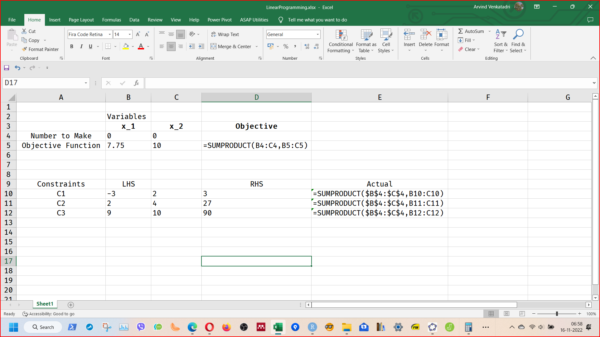
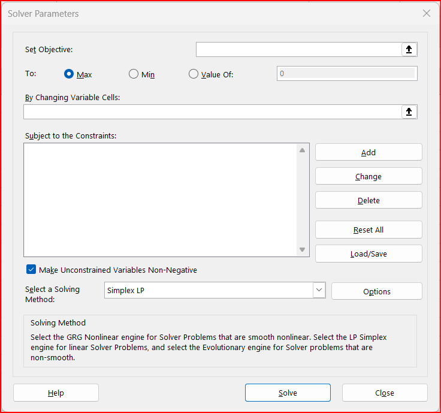
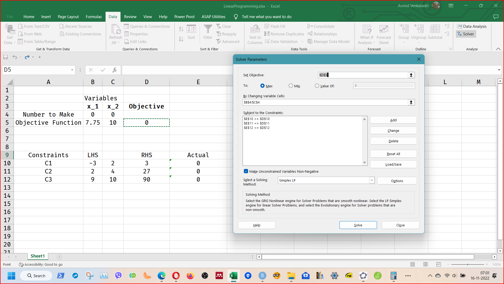
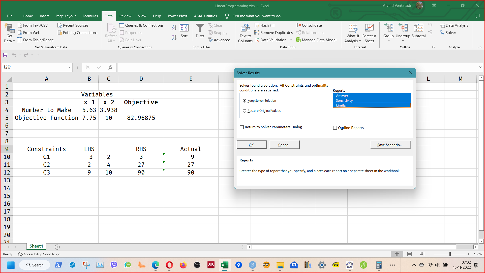

```{r setup, include=FALSE}
knitr::opts_chunk$set(
  echo = FALSE,
  collapse = TRUE,
  #cache = TRUE, autodep = TRUE, 
  comment = "#",
  fig.show = "asis", 
  warning=FALSE, message=FALSE, fig.align = "center",
  scipen = 1, digits = 2)
library(blogdown)
library(tidyverse)
library(plotly)
library(gMOIP)

```

## Using the Excel Solver Add-In

Let us take the same problem as before:

$$
Maximise\ 7.75x_1 + 10x_2 \\
$$
$$
Subject\ to \\
  \begin{cases}
    C1: -3x_1 + 2x_2 &<= 3 \\
    C2: 2x_1 + 4x_2 &<= 27 \\
    C3: 9x_1 + 10x_2 &<= 90 \\
    x_1, x_2 >= 0
  \end{cases}
$$

## Procedure

1. Set up an Excel sheet as shown in the picture below. We enter in the objective function and the constraints in tabular form as shown:

```{r}


```

2. Next we invoke the Solver Add-in: (Data -> Solver):

```{r}


```

3. We set up the Solver for our problem as follows:
Hit the SOLVE button.

```{r}


```


4. Choose to have all the three kinds of Reports from Solver (Answers, Sensitivity, and Limits). 

```{r}


```


This will create three new tabs which give additional information on:  
- How "centered" the solution is, or is it sensitive to variations of some parameters  
- How much slack do the individual constraints still have, at the end  


We will discuss this in class!

The complete Excel file is [**here**](Files/LinearProgramming.xlsx) for your reference. 

