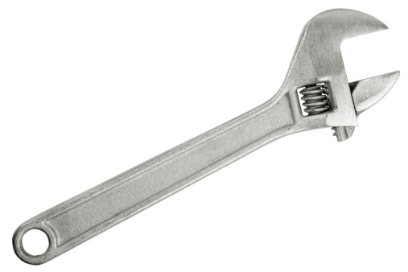

```{r setup, include=FALSE}
library(blogdown)
```

# Some Everyday Objects for us to Contemplate

1) 


1) 


1) 

Let us make a list for each Object:

  - What is the Object meant to do? What is its main Purpose?
  
  - What are the other Accompanying Objects that it works with?
  
  - What is One Parameter or Knob for each of the Objects that you have listed?
  
  - What are the current Settings for each Knob?
  
  - Change the Setting of Each Knob to its natural opposite extreme. What Happens?
  
  - You will see that in many cases, each Knob creates a Certain Outcome at one Setting and another Outcome at the Opposite Setting.
  
  - This is the Source of your Contradiction !!
  
What sort of Contradictions do we see in these familiar objects? What is good and what is not so good? Could that be the source of a problem to solve?


In TRIZ, the fundamental way of looking at an Inventive Design Problem is to discover and propose **Contradictions**. These are rendered in as **simple** and **stark** a language as possible...the starker the better! 

Once we have our Contradiction (and there can be more than one in a given Design Situation !) we can use TRIZ Principles to solve them **WITHOUT COMPROMISE**


# Game Plan # 1  

Let us play a quick Game to motivate the philosophy of TRIZ-oriented thinking and to obtain an understanding of its main ideas:  

## The Candle Game  

You have to Stick the lighted candle to the Wall in such a way that the melting wax does not drop on to the floor. 


# Some Example Contradictions...

We see them everywhere....if one is observant!! Let's see a few:

### C1: Contradiction-1
How is this for a Contradiction?  A shelf in a supermarket carries this placard for a shelf of ***FRESH JUICE***:

```{r include=FALSE}
blogdown::shortcode("twitter", "1453536795564683264")
```


### C2: Contradiction-2

Here is another:
```{r include=FALSE}
blogdown::shortcode("tweet", "1238079127992795137")
```
 
### C3: Contradiction-3
And another:
```{r include=FALSE}
blogdown::shortcode("tweet", "1276893105065771008")
```
Snails want to stay safe, and there is safety on the ground, but the ground is too hot. On the Ground, a Snail can be by itself, above the ground, they need to group together


### C4:Contradiction-4

Most people's healthcare is tied to their job....Therefore, every corona-time layoff creates yet another person without health insurance in this country. (*The Corona Pandemic needs healthcare and therefore health Insurance.* - AV)

This outbreak is highlighting, with extreme clarity, every major ***contradiction*** of this society and its decaying social order. <https://t.co/EtSUY3pPMi>

```{r include=FALSE}
blogdown::shortcode("tweet", "1238167337792090112")

```

--- Revolutionary Left Radio (\@RevLeftRadio)


<blockquote class="twitter-tweet"><p lang="en" dir="ltr">The first U.S. layoffs from the coronavirus are here.<br><br>Job losses have begun in ports, bakeries and travel agencies. Economists worry more layoffs are coming in the next few weeks as many businesses see plummeting sales. <a href="https://t.co/Jf00rrLkV2">https://t.co/Jf00rrLkV2</a></p>&mdash; The Washington Post (@washingtonpost) <a href="https://twitter.com/washingtonpost/status/1237821091680313344?ref_src=twsrc%5Etfw">March 11, 2020</a></blockquote> <script async src="https://platform.twitter.com/widgets.js" charset="utf-8"></script>


## Contradiction Challenges:

1. Challenge #1: https://web.archive.org/web/20200813061353/https://triz-journal.com/triz-challenge-may-2001/

1. Challenge #2: https://web.archive.org/web/20200813061945/https://triz-journal.com/triz-challenge-july-2001/

1. Challenge #3: https://web.archive.org/web/20200813061928/https://triz-journal.com/triz-challenge-july-2002/

1. Challenge #4: https://web.archive.org/web/20200813063906/https://triz-journal.com/triz-challenge-november-2003/


# Materials

1. Valeri Souchkov, "How to Define a Contradiction", [(Weblink)](http://xtriz.com/Training/TRIZ_DefineContradiction_Tutorial.pdf)

1. Open Source TRIZ: TRIZ Power Tools: Formulating Contradictions: [Webpage](https://www.opensourcetriz.com/triz-books/triz-skills/resolving-contradictions.html)


# References on Metaphors

1. David Chen, ***Creative Paradoxical Thinking and Its Implications for Teaching
and Learning Motor Skills***[(PDF)](pdf/TRIZ/CreativeParadoxicalThinking2011.pdf)

1. Holyoak and Thagard, ***The Analogical Mind***, [(PDF)](pdf/TRIZ/Holyoak-Thagard-The Analogical Mind.pdf)

1. Joshua Ferris, ***The Market Value of my Father***, a metaphorical Short Story, [(Web Link)](https://www.wealthsimple.com/en-ca/magazine/joshua-ferris)


## Additional Readings

1. https://www.bbc.com/worklife/article/20201109-why-the-paradox-mindset-is-the-key-to-success

1. https://hbr.org/2008/06/the-contradictions-that-drive-toyotas-success


1. 


