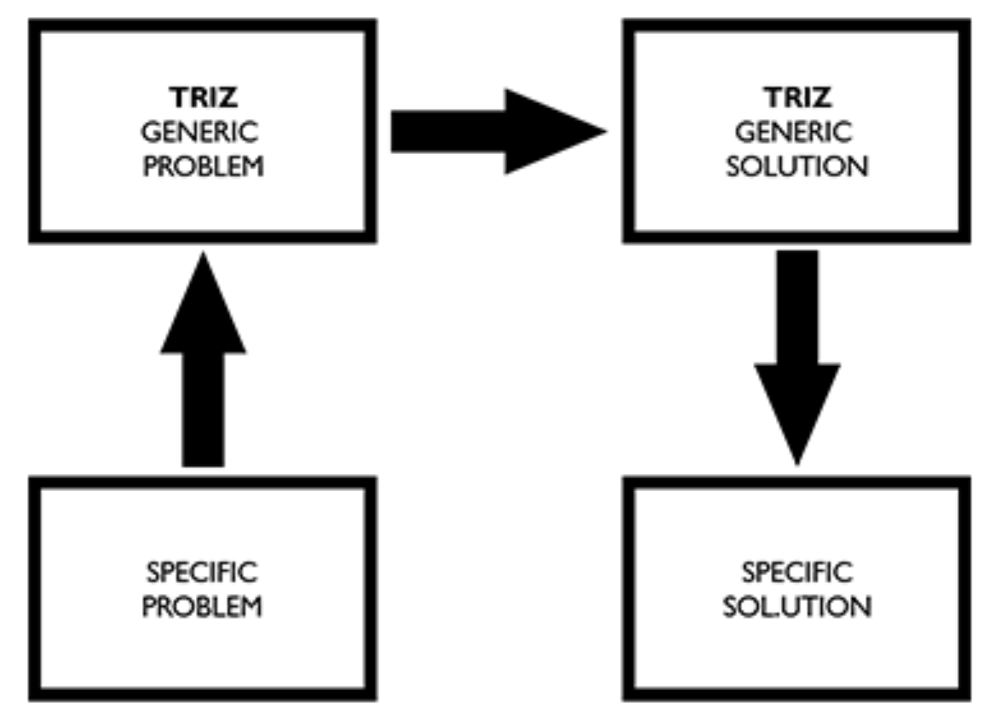
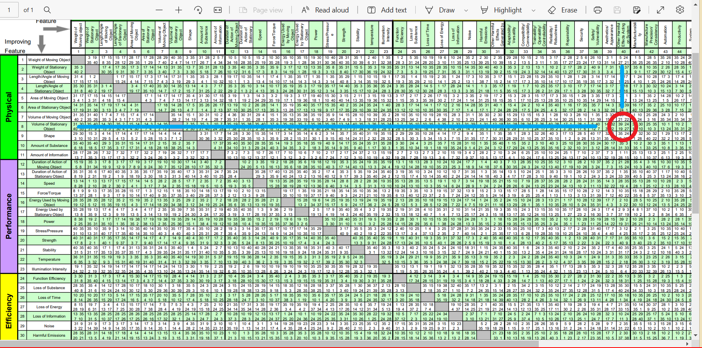

```{r, setup, include=FALSE}

knitr::opts_chunk$set(echo = FALSE, message = FALSE, warning = FALSE, fig.align="center")
library(qcc)
library(SixSigma)
library(hugodown)

```

# Introduction

Here we go with another of my *TRIZ Chronicles* ! The earlier editions
are here: [**Lawrence of
Arabia**](https://arvindvenkatadri.com/project/2022-12-20-triz-lawrence-of-arabia/ "https://arvindvenkatadri.com/project/2022-12-20-triz-lawrence-of-arabia/")
and
[**Spotify**](https://arvindvenkatadri.com/project/2023-01-09-triz-spotify/ "https://arvindvenkatadri.com/project/2023-01-09-triz-spotify/").

This is another piece stems from my teaching a course on Creative
Thinking and Problem Solving based on TRIZ, titled *Play and Invent*,
over the past 8 years or more at the [**Srishti Manipal Institute of
Art, Design, and Technology, Bangalore
INDIA.**](https://srishtimanipalinstitute.in "https://srishtimanipalinstitute.in")

# Power from your Balcony

What do you think of this innovation?


`r blogdown::shortcode("tweet", user = "gigadgets_", id = "1163459865009721346")`


<br>

<iframe width="560" height="315" src="https://www.youtube.com/embed/9HHJ0rt5xwg" title="YouTube video player" frameborder="0" allow="accelerometer; autoplay; clipboard-write; encrypted-media; gyroscope; picture-in-picture; web-share" allowfullscreen></iframe>


<br>

This solution to urban "micro-power" generation has won numerous awards, most notably the [James Dyson Award in 2018](https://www.jamesdysonaward.org/2018/project/o-wind-turbine/). The inventors are [Nicolas Orellana](https://www.linkedin.com/in/nicorellana/) and [Yaseen Noorani](https://www.linkedin.com/in/yaseen-noorani-b5402a79/?originalSubdomain=uk). 

Without further ado, let us do a TRIZ Analysis of this remarkable invention. 


## A TRIZ Analysis of the Dyson O-Wind Generator

For a TRIZ workflow, we proceed as
[**before**](https://arvindvenkatadri.com/project/2022-12-20-triz-lawrence-of-arabia/ "https://arvindvenkatadri.com/project/2022-12-20-triz-lawrence-of-arabia/"):

-   First, using the method described in [**Open Source
    TRIZ**](https://www.youtube.com/watch?v=cah0OhCH55k "Open Source TRIZ on YouTube")**,**
    we identify *knobs* or *parameters* within the situation

-   We see how turning these could lead to identifying a Statement /
    Cause for a Problem in the form of a *Contradiction*.

-   Re-word the plain English Contradiction into TRIZ Parameters and
    look it up in the Contradiction Matrix. Obtain the Inventive
    Principles.

-   Apply these Inventive Principles into your Problem and solve it.

    {width="331"}

Here below is a quick *Ishikawa Diagram* to help us identify the
*Parameters* of this Problem:

```{r, echo=FALSE, message=FALSE, warning=FALSE}

#Cause and Effect Diagram or Fish- bone Sample
library(qcc)
library(SixSigma)

#Effect
effect <- "Power Generation and Consumption"

#Causes
causes.head <- c("Measurement", "Material", "Methods", "Environment", "Manpower", "Machines")

#Individual Causes
causes <- vector(mode =  "list", length = length(causes.head))
causes[1] <- list(c("Tx Losses", "Distance", "Wind Direction", "Wind Velocity", "AC Grid @ 50Hz", "Voltage", "Amperage", "Energy Load"))

causes[2] <- list(c("HT Cables", "Wires", "Transfomers","Apartment Walls", "Urban Canyons", "High Rises"))

causes[3] <- list(c("Long Distance HV Transmission", "Solar", "Atomic", "Hydro", "Thermal", "Conventional Wind Energy"))

causes[4] <- list(c("Wind","Heat", "Apartment Balcony"))

causes[5] <- list(c("Residents","Neighbours", "Birds"))
causes[6] <- list(c("Transformers", "HT Cables", "Fuses", "Switches"))

#Fishbone Diagram
#
ss.ceDiag(effect,causes.head,causes, main ="Power to the People",ss.col = c("", "red"), sub = paste("Ishikawa Cause-Effect Diagram \n (Made with R)"))


```

In the video itself, we heard about how electrical power **consumption centers** are the urban areas and these are far away from the **generation sites**. This leads to capital costs in HT Transmission equipment; we go to HT transmission to reduce losses on the way. This is already a *Contradiction*, which we might solve using **Segmentation** to arrive at *Local Generation of Power*. This leads easily to Solar Panels on rooftops for example. Again while this *may* be cheaper than the electrical distribution system, it still uses a fair bit of capex and space and is centralized per building  Can we take **Segmentation** even further and think of a *household-based* power generation unit? 

Each of the above terms in the Ishikawa can be a **knob** for us.
[**Turning the *knobs/parameters* in the Ishikawa
Diagram**](https://www.youtube.com/watch?v=cah0OhCH55k "Open Source TRIZ on Youtube"),
we try to improve a certain Parameter or we try to reduce its effect. In
doing so we could construct several alternative **Problem
Descriptions**. ( Of course not all Parameters may be accessible in a
given situation )


With all this discussion, we can state at least one of our Problems as
an [**Administrative
Contradiction(AC)**](https://altshuller.ru/world/eng/triz6.asp "https://altshuller.ru/world/eng/triz6.asp")
in *plain English*:

> <center>**AC**: We wish to pull out plastics from the **river**
> without interrupting other human activities (economic / recreational /
> transportation )</center>

Next, based on this Contradiction and the inspection of the Ishikawa
Diagram above, we are now ready to define a TRIZ *Ideal Final Result*:

> <center>**IFR**:The River must flow. The Plastics must not.</center>

Short and pithy.

We could do alternative Problem Definitions too, depending upon what our
focus was. (Our focus here is the **river)**. The way we would look at
the Parameters in the Ishikawa Diagram would be different in each case.
More on this in just a bit!

Let us take our AC and convert it into a *Technical Contradiction(TC)*,
keeping this IFR in mind. We will look at the *48 TRIZ Parameters* in
the [**TRIZ**
](/pdf/TRIZ/ContradictionMatrix2003.pdf)[**Contradiction**](/pdf/TRIZ/ContradictionMatrix2003.pdf "Download PDF of TRIZ Contradiction Matrix 2003")[**Matrix**
**(PDF)**](/pdf/TRIZ/ContradictionMatrix2003.pdf) and see which
Parameter we want to improve, while not worsening another. Here is what
we can obtain. We will analyze the Contradiction both ways[^2]:

> **- TC 1**: Increase `Volume of Stationary Object`(8) and not worsen
> `Harmful effects acting on the system`(40)
>
> **- TC 2**: Improve `Harmful effects acting on the system`(40) and not
> worsen `Volume of Stationary Object`(8)

Here we choose these Parameters based on our IFR, which also reflects
that we choose the make the **river** our focus. We want to increase the
`volume` of the stationary plastic **in the river**, while not worsening
the `harmful effects` acting on the **river**. Note how the IFR is
included here, in using the word **stationary** for the object: the
plastic must **not** flow, while the river **must**.

As stated in my previous articles ( [**Lawrence of
Arabia**](https://arvindvenkatadri.com/project/2022-12-20-triz-lawrence-of-arabia/ "Lawrence of Arabia: A TRIZ Analysis")
and
[**Spotify**](https://arvindvenkatadri.com/project/2023-01-09-triz-spotify/ "TRIZ Analysis of a Recent Spotify Ad")),
there is considerable flexibility and possibility for imaginative
interpretations of the AC, using the *language of TRIZ*, the **48
Parameters** in the Contradiction Matrix. Parameters chosen from the
TRIZ Matrix can be thought of as *metaphors* for the knobs that lie
within our AC; Going from the AC to the TC is an act of *making
metaphors*. We could easily have chosen the Parameter
`Amount of Substance (10)` i.e. the plastic *on the river*, as the
"metaphoric thing" to improve but the current IFR speaks of the
**river**. Or we could choose `Aesthetics and Appearance (39)` as our
target, leading to different solutions perhaps, but in a focussed
manner. TRIZ tends to [**focus our
attention**](https://scholar.princeton.edu/sites/default/files/kahneman/files/attention_hi_quality.pdf "Daniel Kahneman")
like no other method that I know of.

We could also formulate a *Physical Contradiction(PC)*[^3]:

> <center>**PC**: The Plastic must be in the River and not in the River
> at the same time.</center>

which is aimed at the river, as with the IFR. Again, if the IFR is
formulated differently we could obtain a very different set of AC and
PC.

## Solving the Technical Contradiction

Let us take the both the TC-s into the Contradiction Matrix and arrive
at the list of TRIZ Inventive Principles. Here is the Matrix solution
for `TC-1` in the figure below; The square for solutions to `TC-1` has
been circled in red.



Here is what the Matrix suggests:

For `TC-1`:

1.  39(Inert Atmosphere)

2.  24(Intermediary)

3.  19(Periodic Action)

4.  27(Cheap Short-Living Objects) (**!!**)

    and with `TC-2`:

5.  5(Merging)

6.  17(Another Dimension)

7.  ~~39(Inert Atmosphere)~~

8.  ~~19(Periodic Action)~~

This is neat list for us to try to use!! Let us apply some these
Inventive Principles! Viewing these Inventive Principles as we
*Generalized Solutions* we try to map these back into the Problem at
hand:

-   **(39)Inert Atmosphere**: Hmm...what can be inert in the River? What
    could "inert" mean here? The River should be inert...so must not
    flow! OK, so a place where it must be still, perhaps!!
-   **24(Intermediary)**: OK, something between the River and the
    Plastic. But...we don't want nets or dams or weirs...then what? Need
    to think!!
-   **19(Periodic Action)**: What can be "periodic" in the River? Waves?
    But how do we **make** waves? Need to think some more!!
-   **27(Cheap Short Living Objects)**: What can be cheap short and
    short living in the River water? Not fish, surely...wait,
    **BUBBLES**!!!

So (breathlessly): we create bubbles in the water and use them as an
*Intermediary* to create waves/barriers that nudge the Plastic where we
want it it to be, for collection. And of course bubbles are both *Inert*
**and** *Atmosphere*, literally! And they are *Cheap* and *Short-Lived*
so we need to regenerate them *Periodically!* We can periodically
*sweep* the river with a broom made of bubbles and not seriously disturb
any other activity. Waah TRIZ, waah!

**5(Merging)** is quite easy to interpret now, in retrospect.
**17(Another Dimension)** is also evocative and powerful as a Solution:
the River flows **horizontally** but the barrier we need to create is
**vertical**. Yet another interpretation could be that the Bubbles
**dissolve in the River water** (assuming **another dimension,** as it
were) and give us the benefit of purifying the water too, as fountains
do!!

So there you have it! It seems that [**Going
Dutch**](https://thegreatbubblebarrier.com/ "The Great Bubble Barrier")
even with bubbles, is a good idea !

## Using TRIZ Separation Principles

As Hipple explains, there is frequently an underlying **physical**
parameter, such as *length*, *breadth*, *weight*, or *energy, or speed*
for example that lies at the root of our *Technical Contradiction*.

Our IFR states that we want the Plastics to not flow, and the River to
flow at the same time. But the Plastics are
[**in**](https://christophertyler.org/CWTyler/AlicePDFs/13treacle.pdf "The Treacle Well ( Alice in Wonderland )")
the River! This is a sort of a Physical Contradiction!

Can we make the River "less of a River" in places? Can we make
**separate** zones in the River that flow and not flow, and allow us to
harvest the plastic?Indeed,our Inventive Principles such as **(39)Inert
Atmosphere** and **24(Intermediary)** suggest such a "spatial"
separation. So we are applying SEPARATION in SPACE here, to solve a
Physical Contradiction related to "time". TRIZ offers us a smaller and
more easily "memorizable" set of metaphoric solutions in the form of
**Separation Principles**. Here they are:

-   [Separation in Time]{.smallcaps}
-   [Separation in Space]{.smallcaps}
-   [Separation on Condition]{.smallcaps}
-   [Separation between Parts and the Whole]{.smallcaps}

Note that while these *Separation Principles* are just a handful to
memorize, they are in my opinion, a little harder to apply straightway.
But then practice would help us. Note that all the Inventive Principles
in the Matrix can be, and have been, classified as to whether they hew
to a particular kind of *Separation* *Principle.*

If there is any interesting situation that could be analyzed with TRIZ,
please send me a DM! Thanks !

## References

1.  Meijer, J.J.L, Emmerik, T., Ent, R., Schmidt, C., Lebreton, L.
    (2021). More than 1000 rivers account for 80% of global riverine
    plastic emissions into the ocean. Science Advances.
    <https://www.science.org/doi/10.1126/sciadv.aaz5803>

2.  Jack Hipple, The Ideal Result and How to Achieve It. Springer;
    2012th edition (June 26, 2012)

3.  Valery Souchkov, Defining Contradictions.
    <http://www.xtriz.com/Training/TRIZ_DefineContradiction_Tutorial.pdf>

4.  Open Source TRIZ: Making Contradictions.
    <https://www.youtube.com/watch?v=cah0OhCH55k>

[^1]: The Contradiction Matrix is not quite symmetric, so stating the
    Contradiction both ways allows us to access a slightly larger set of
    Inventive Principles from two cells of the Matrix.

[^2]: The Contradiction Matrix is not quite symmetric, so stating the
    Contradiction both ways allows us to access a slightly larger set of
    Inventive Principles from two cells of the Matrix.

[^3]: Arriving at *Physical Contradictions* is not always easy! If we
    can, then there are a very crisp set of **TRIZ Separation
    Principles** that we can apply to solve the Problem.
