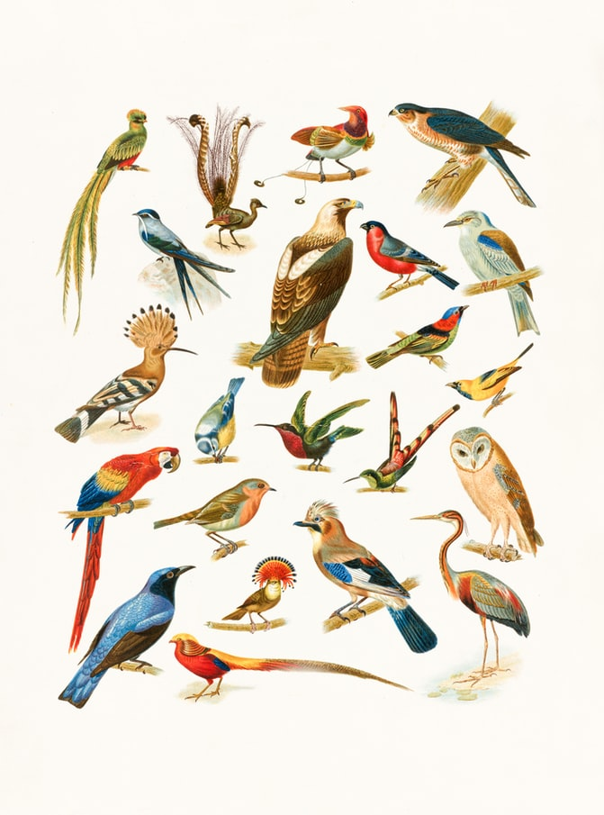

```{r, echo=FALSE, fig.alt="Boston Public Library on Unsplash", fig.align='center'}

```

## Introduction

We will briefly study the Big5/MBTI Personality Test Matrix and understand the "dichotomies" these embody. We will then use these to understand ourselves, as we create some novel situations for ourselves in a Game.

- Please complete the MBTI test at this website. <u><https://www.16personalities.com/free-personality-test></u>
- On the Chart on the wall, you will see a sort of Matrix-like chart showing one cell for each MBTI Type. Please write in your name in the cell that shows your MBTI type. 

On with the Games!!

## Icebreaker Game!

Look at the slide full of numbers on the screen ( PPT is linked in the references below). I would like you to:  

- *Silently* work through the slide until you have found all the numbers   
- Raise your hand when you have done so. 


## A Team Game

I have divided you up into 4 groups. Each group will be given a specific task. You will need to:  

- Discuss how to complete the Task  
- Complete the Task and document your work  
- *Also* document **the main aspects of Discussion in your group**. Who said/ suggested what; what were the points of agreement; what were the contentious points etc.   
- Present all of this : 7 + 5 minutes / team  

## References

1. Here is the MBTI Test site: <u><https://www.16personalities.com/free-personality-test></u>

2. <u>[Ice-breaker Activity Presentation](https://slidetodoc.com/numbers-icebreaker-this-is-one-of-many-free/)</u>

3. MBTI Game: <u>[PDF](/pdf/MBTI Activities.pdf)</u>

## Why does this Matter to Us?


- In the Icebreaker Game, some of you would have difficulty trying to spot the pattern WITHOUT discussing with your friends!
- Others would have perhaps frowned at the slightest whisper in the class, as they were concentrating!

- In the Team Game, you might have realized that each of the 4 teams had members that were different in ONE of the MBTI characteristics! So I had pitted I vs E people; N vs S people; T vs F people, and J vs P people. The tasks allocated to each of you was precisely one to make that *dichotomy* surface in your discussions. And of course, the documentation of the discussions was far more important than the end results !! ;-D

So what have learnt then? From the two exercises, we see that:  

  - Reality depends upon the viewer: and that there are many possible points of view. Note that this is about our *cognitive bias* that may depend upon our cultural outlook, and our ability to miss things. 
  - It is emphatically not about <u>[alternative facts](https://www.dictionary.com/e/slang/alternative-facts/)</u> which is arrant nonsense.
  - We all have our "default modes" for behaviour, that give us a restricted appreciation of the World
  - As creators we need to be able straddle, if possible, the spectrum of the 4 preference pairs, in order to comprehend reality better. 
  - Comprehending reality better gives a stronger basis for Art/Design **decisions** and plans for action.


## Additional References
1. <u><https://youtu.be/g34SYgKbqFY></u>


