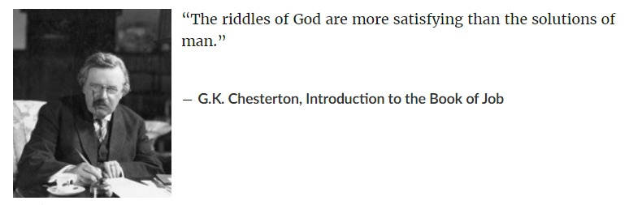
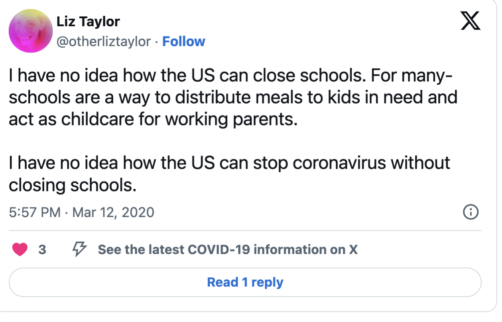
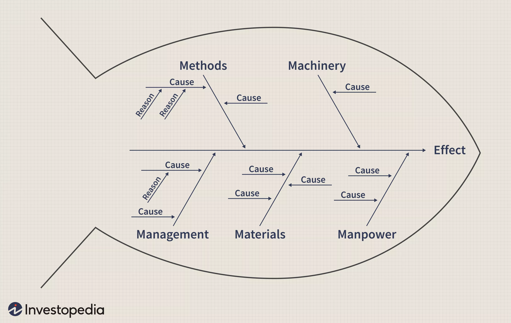

```{r,echo=FALSE, fig.align='center',fig.alt="Image by Etienne Girardet on Unsplash"}
knitr::include_graphics("featured.jpg")

```


```{r setup, include=FALSE}
library(blogdown)
```





*Mary, Mary, quite contrary,*\
*How does your garden grow?*\
*With silver bells, and cockle shells,*\
*And pretty maids all in a row.*\


Let us take our first baby step into the world of TRIZ. What did you think of immediately when you saw the first picture on this page?

In TRIZ, the fundamental way of looking at an Inventive Design Problem is to discover and propose **Contradictions**. These are rendered in as **simple** and **stark** a language as possible...the starker the better! Once we have our Contradiction (and there can be *more than one* in a given Design Situation !) we can use TRIZ Principles to solve them **WITHOUT COMPROMISE.**

What sort of Contradictions do we see in these familiar objects? What is good and what is not so good? Could that be the source of a problem to solve?

## Some Everyday Objects for us to Contemplate

1)  

2)  

3)  

Contemplate and note down for each Object:

-   What is the Object meant to do? What is its *Main Purpose*?

-   What are the other *Accompanying Objects* that it works with?

-   What is *One Aspect, or Parameter, or Knob* for each of the Objects that you have listed, that makes the Object useful?

-   What are the current *Settings/Values for each Knob*?

-   Change the *Setting of Each Knob* to its natural opposite extreme. What Happens? Is it a good thing? When?

-   You will see that in many cases, each Knob creates a Certain *Outcome* at one Setting and another *Outcome* at the Opposite Setting.

-   Are both Outcomes desirable? Do you want "eat your cake and have it too?"

-   This could be the source of your **PROBLEM / CONTRADICTION** !!

In **TRIZ**, this way of expressing a *Problem* as a simple *Contradiction* is referred to as stating an **ADMINISTRATIVE CONTRADICTION (AC).** <u>[(Ohhhhhh, those Russians...)](https://youtu.be/16y1AkoZkmQ)</u>.

Later we will use our experience with making metaphors to convert the AC into a more TRIZ-like Contradiction, using *TRIZ language*.

Let us now consider some examples first and then get some practice at setting up simple *AC*:

## Some Example Contradictions...

We see them everywhere....if one is observant!! Let's see a few:

### C1: Contradiction-1

How is this for a Contradiction? A shelf in a supermarket carries this placard for a shelf of ***FRESH JUICE***:


### C2: Contradiction-2

Here is another:



### C3: Contradiction-3

Snails want to stay safe, and there is safety on the ground, but the ground is too hot. On the Ground, a Snail can be by itself, above the ground, they become visible to predators.

```{r echo=FALSE, fig.height=3}
knitr::include_graphics("Snails-1.jpeg")
knitr::include_graphics("Snails-2.jpeg")
```

So...they need to group together and not appear to be "by themselves".

### C4: Contradiction-4

Most people's healthcare is tied to their job....Therefore, every corona-time layoff creates yet another person without health insurance in this country. (*The Corona Pandemic needs healthcare and therefore health Insurance.*)

> This outbreak is highlighting, with extreme clarity, every major ***contradiction*** of this society and its decaying social order. <https://t.co/EtSUY3pPMi>\
> --- Revolutionary Left Radio (\@RevLeftRadio)


### C5 - Whiteboard Markers are made wrong!


Pens need to be stored nib-down, to have ink flow under gravity. But you can't then tell the colour!

## Contradictory Situations: Houston, We have a Problem!

`r blogdown::shortcode("youtube" ,"YwG4F-16Tno")`

We don't contemplate only *objects* at all times; indeed, as designers/artists/creators, we want to be able to **make** objects. What we more commonly contemplate is a **situation**.

How does one figure Parameters/Aspects/Knobs inside situations?

We use what is called an **Ishikawa Fishbone Diagram**. There are many versions of this diagram depending upon the **DOMAIN** it is applied in; it should be considered more as a process for thinking. You should search for other forms of this diagram and quickly learn to apply them.

```{r,echo=FALSE, fig.dim=c(4,3)}


```

> NOTE: Deciding which are the Knobs that matter, and how they effect the outcome is not always this simple. It would typically involve research using **structured experimentation** to determine the effects of turning the knobs and deciding which ones matter. This experimentation lies within a DOMAIN called <u>[**Design of Experiments**](https://r-for-artists.netlify.app/slides/10-nature-of-data/10-nature-of-data)</u>. 

## Documenting the Administrative Contradiction

You can document your analysis of the *Situation* using the following questionnaire **5W+H** format:

1.  **What** does the problem seem to be?

2.  **Who** has the problem?

**(Think Knobs!!)**

3.  **When** does the problem occur? All the time? Under certain circumstances? 

4.  **Where** does the problem occur?

5.  **Why** does the problem occur? <u>[("Ask why 5 times" -- W. Edwards Deming)](https://www.mindtools.com/a3mi00v/5-whys)</u>

6.  **How** does the problem occur?

> NOTE: This process should remind you of our exercise on the Guilford and Wallach-Kogan Divergent Thinking Game, except that this is of course more structured method, whereas that was simple brainstorming.

With this method you should be able to state an *Administrative Contradiction* in the following (loose!) sentence structure --- Items in `< >` come from the Ishikawa and your 5W + H questions):

`When we, as < WHO / MANPOWER >, attempt to perform < HOW / METHOD > during <WHEN> on < WHERE / MACHINERY / KNOB>, we improve <EFFECT>, but lose out on <negative EFFECT>.`

Let's see this method in action. The area of work may not be ours, but the context should be clear enough!

<iframe width="853" height="480" src="https://www.youtube.com/embed/cah0OhCH55k" title="How to Properly Formulate a Contradiction" frameborder="0" allow="accelerometer; autoplay; clipboard-write; encrypted-media; gyroscope; picture-in-picture" allowfullscreen></iframe>


Let us now apply these ideas to examine the following challenges below.

## Contradiction Challenges

1.  Challenge #1: <u>[**Web**](https://web.archive.org/web/20200813061353/https://triz-journal.com/triz-challenge-may-2001/)</u> and <u>[**PDF**](TRIZ%20Challenge%20-%20May%202001The%20Triz%20Journal.pdf)</u>

2.  Challenge #2: <u>[**Web**](https://web.archive.org/web/20200813061945/https://triz-journal.com/triz-challenge-july-2001/)</u> and <u>[**PDF**](TRIZ%20Challenge%20-%20July%202001The%20Triz%20Journal.pdf)</u>

3.  Challenge #3: <u>[**Web**](https://web.archive.org/web/20200813061928/https://triz-journal.com/triz-challenge-july-2002/)</u> and <u>[**PDF**](TRIZ%20Challenge%20-%20July%202002The%20Triz%20Journal.pdf)</u>

4.  Challenge #4: <u>[**Web**](https://web.archive.org/web/20200813063906/https://triz-journal.com/triz-challenge-november-2003/)</u> and <u>[**PDF**](TRIZ%20Challenge%20-%20November%202003The%20Triz%20Journal.pdf)</u>


## More Contradictions?

1. If you live in an apartment complex, you might see people walking. Some walk "normally", along the driveways or pathways. Some walk with excruciatingly specific intent along the periphery of every walkable surface, going into far corners and turning and walking around the far edges of building, and near to compound walls and gates. 
Why are they doing this?

2. What was the boon requested by <u>[Hiranyakashipu](https://hinduism.en-academic.com/329/Hiranyakashipu)</u>?

3. Why do most people love landscape paintings such as those by <u>[Ivan Shishkin](https://artsandculture.google.com/entity/ivan-shishkin/m059y1y?hl=en)</u> and <u>[John Constable](https://www.theartstory.org/artist/constable-john/)</u>?
See this <u>[page](https://landarchconcepts.wordpress.com/what-is-prospect-refuge/)</u> for a well-articulated TRIZ-contradiction in landscape paintings.

4. *Good fences make good neighbours*, it is said. Spot the Contradiction here?

5. Why do police cars switch on their sirens as they rush to a potential crime site? Isn't it better to arrive swiftly and silently to catch the criminal? (Note: this is also close to the idea of the <u>[IFR in TRIZ.](../75-triz-ideal-final-result/)</u>)

6. Is this piece of music Disco? Opera? Ballet? Flashmob? College Dance? All o' them at once? And yet...it is one of the <u>[most iconic pieces of **Pop** music](https://en.wikipedia.org/wiki/MacArthur_Park_(song))</u>, that set the tone for generations/genres of music!!

`r blogdown::shortcode("youtube", "1UK-MbSJciM")`<br>

6. All students say *Bro*, *My Bad*, and much much worse, *Think Different* (grammar-challenged *&^%$#@ peasants). They all sound the same, these <u>["Words of Wisdom"](https://youtu.be/UzNDPtIbv6A)</u>. And yet want Faculty to identify, know, and appreciate them individually. Bah. 

6. And finally, what does this even mean!!??!!

      > Always go to other people's funerals, otherwise they won't come to yours.  [<u>[-Yogi Berra](https://www.brainyquote.com/quotes/yogi_berra_161244)</u>]{style="float:right"}
      

## References

1. Dr Rafiq Elmansy. (02/05/2023). *How to Use the Fishbone Diagram in Root Cause Analysis?* <u><https://www.designorate.com/problem-solving-cause-and-effect-diagram/></u>


## Additional Readings

Do glance through these articles and try to form a "contradiction mentality" about things around you:

1.  <u><https://www.bbc.com/worklife/article/20201109-why-the-paradox-mindset-is-the-key-to-success></u>

1.  <u><https://hbr.org/2008/06/the-contradictions-that-drive-toyotas-success></u>

1. Open Source TRIZ: Contradiction Challenges! <u><https://www.opensourcetriz.com/images/1_OpenSourceTRIZ_Pictures/1.1_Teaching_Materials/01_Contradictions_Exercises_Actual.pdf></u>

1. Kannada Proverbs: Contradictions? <u>https://girmitt.wordpress.com/kannada-proverbs/</u>

