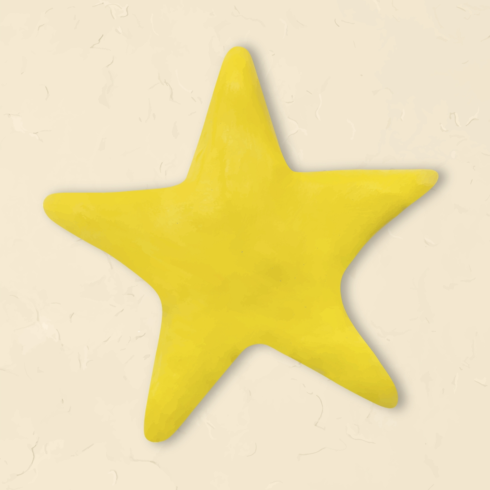

```{r,echo = FALSE, eval=FALSE,fig.alt="Petr Slováček on Unsplash", fig.align='center'}
knitr::include_graphics("featured.jpg")
```

```{r include=FALSE}
library(blogdown)

```

## Introduction

Don't we want to generate some "magic" in our thoughts! So taking some inspiration from her "childlike belief" that can "alter reality", let us hark back to our childhoods and see what we can do with these objects below:

## Activities

### Activity-1: Some Objects to Contemplate

How many different uses can you imagine for each of these objects? Can you briefly describe and quickly sketch a few ideas?

```{r echo=FALSE, fig.alt="Images by rawpixel.com", fig.dim=c(4,3)}
knitr::include_graphics("images/256px-Brick.jpg")

```

### Activity-2: Some Shapes to Contemplate

Where do you reckon you can "see" these shapes ? Can you briefly describe and quickly sketch a few ideas?

```{r echo=FALSE, out.height="40%", out.width="40%", fig.cap="Images by rawpixel.com"}
knitr::include_graphics("images/zigzag.jpg")

```

#### Scoring your Ideas

Scoring is comprised of four components:

-   **Fluency** - total. Just add up all the responses. In this example it is 6.
-   **Flexibility** - or different categories of ideas or, as Csikszentmihalyi would have us say, DOMAINS. Is your brick a Toy? Can it be used as...a Horticultural support thing? That is two domains, so two points.
-   **Elaboration** - amount of detail (for Example: "in a bonsai" = 0, whereas "in a bonsai to create a root-over-rock structure as an island" = 2 (one for root-over-rock, two for further detail about the island structure).
-   **Originality** - each response it compared to the total amount of responses from all of the people you gave the test to. Responses that were given by only 5% of your group are unusual (1 point), responses that were given by only 1% of your group are unique - 2 points). Total all the points. Higher scores indicate creativity\*

\*You might have noticed that the higher fluency the higher the originality (if you did "good for you!") This is a contamination problem and can be corrected by using a corrective calculation for originality (originality = originality/fluency).

#### Discussion

Both these activities are examples of exercises in divergent thinking. See the references for more information.

-   Did you use the words "as" and "like" to describe your ideas?
-   Did you not use these words to describe your ideas?
-   Were there, in your opinion, any outrageous ideas presented? Why were they outrageous?
-   Are metaphors more interesting when they are surprising?
-   How did the attributes of the objects ( shape , texture, size, weight, orientation...) get embedded in the ideas presented?
-   Were these "embeddings" meaningful? How and why so? (Ask Bourdieu !!)

### Activity-3: Gangs of Wasseypur

We will divide into two groups (four if necessary) and contemplate a brief description of the city of Wasseypur. There are 4 short questions / problems for you to consider at the end.

### Activity-4: Seymour Papert Constructionism Game


```{r, echo=FALSE}
knitr::include_url("/slides/PlayAndInvent/Constructionism/index.html")

```
### Activity-5: C'est ne une Pipe

1. We will break up into groups of 4-5. 
1. Each group will be given a household object, perhaps an unusual one. 
1. You need to imagine a use for it that is *not* what is the common known one.
1. Market it as a product that serves this new purpose. Make an ad. 
1. Use **only** Gen Z language in your ad. 
1. Ad = Performance/Jingle + Poster

## References

1.  **Guilford Test for Divergent Thinking**: [(Weblink)](https://curtbonk.com/bobweb/d1.html)

2.  **Wallas-Kogan Test for Divergent Thinking**: [(Weblink)](https://curtbonk.com/bobweb/d2.html)

3.  Thibodeau, Paul & Boroditsky, Lera. (2011). **Metaphors We Think With: The Role of Metaphor in Reasoning**. PloS one. 6. e16782. 10.1371/journal.pone.0016782. [(PDF)](Thibodeau-Boroditsky-Role-of-Metaphor.pdf)

4.  Bobo Hjort. (2003) **Drawing, Knowledge, and Intuitive Thinking: Drawing as a Way to Understand and Solve Complex Problems in Art and Complexity**. J. Casti and A. Karlqvist (editors) © 2003 Published by Elsevier Science B.V.[(PDF)](Hjort.pdf)

5.  David Chen, **Creative Paradoxical Thinking and Its Implications for Teaching and Learning Motor Skills** [(PDF)](CreativeParadoxicalThinking2011.pdf)

6.  Holyoak and Thagard, **The Analogical Mind**, [(PDF)](Holyoak-%20Thagard%20-%20Analogical%20Mind.1997pdf.pdf)

7.  Joshua Ferris, **The Market Value of my Father**, a metaphorical Short Story. [(Web Link)](https://www.wealthsimple.com/en-ca/magazine/joshua-ferris)
