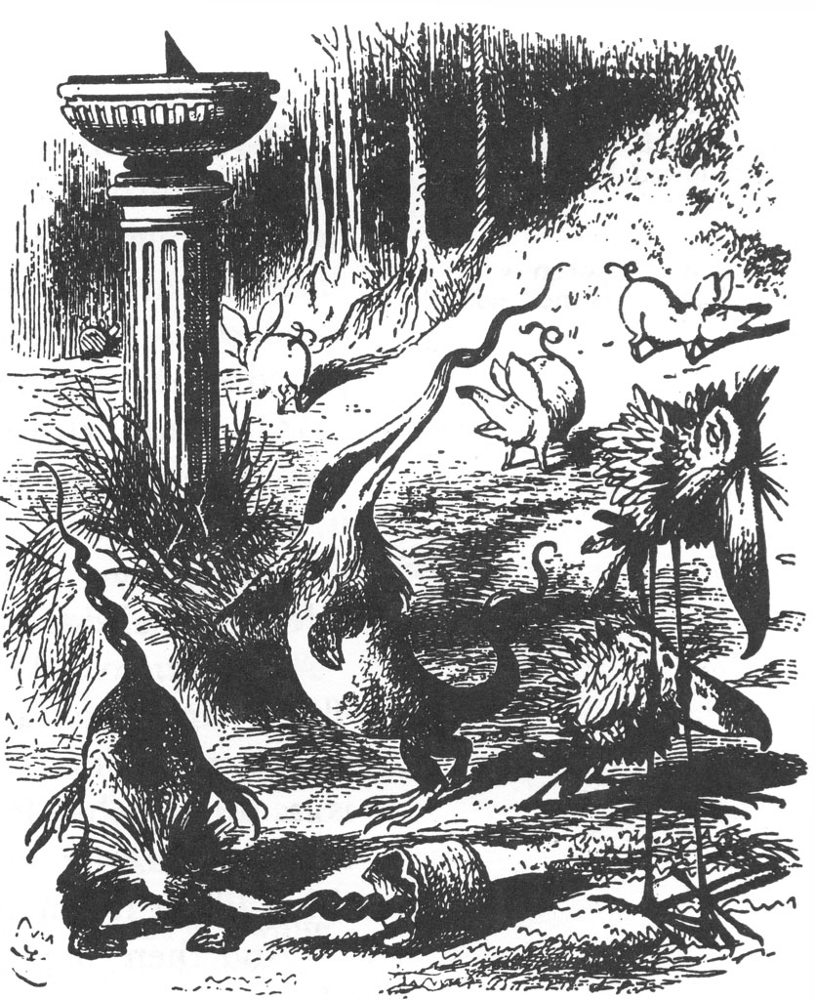

##  Introduction

We meet the most important idea in R: tidy data. Once data is `tidy`, there is a great deal of insight to be obtained from it, by way of tables, graphs and explorations!

We will get hands on with `dplyr`, the R-package that belongs in the `tidyverse` and is a terrific toolbox to clean, transform, reorder, and summarize your data. And we will be ready to ask Questions of our data and embark on anlayzing it. 

## Readings

+ [R4DS `dplyr` chapter](http://r4ds.had.co.nz/transform.html)

+ [ModernDive `dplyr` chapter](http://moderndive.com/5-wrangling.html)

+ [RStudio `dplyr` Cheatsheet](https://github.com/rstudio/cheatsheets/blob/master/data-transformation.pdf)
