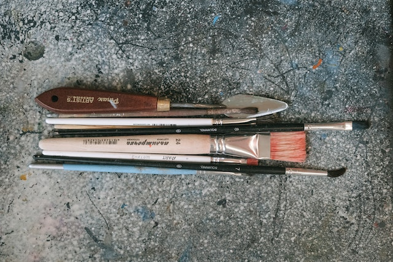

## Introduction

In this course we will gets hands on with three tools:
- [R](https://cran.r-project.org/) and [RStudio](https://posit.co/)
- [Radiant](https://radiant-rstats.github.io/docs/index.html), which is an interactive point-and-click tool based on R, developed at the University of San Diego
- [Orange Data Mining](https://orangedatamining.com/), a Python-based interactive point-and-click tool, developed at the University of Slovenia, Ljubljana. 

