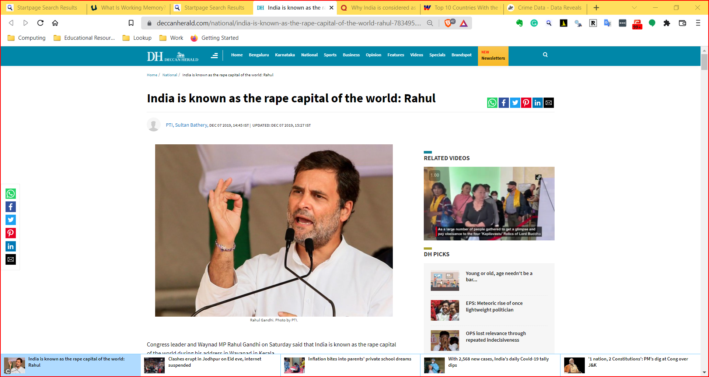

```{r setup, include=FALSE}
knitr::opts_chunk$set(echo = TRUE)
library(blogdown)
library(tidyverse)
library(ggtext)
```

## Where does Data come from?
Let us look at the slides. 

```{r,echo = FALSE}
knitr::include_url("10-Nature-of-Data/10-Nature-of-Data.html")

```


## Why Describe and Graph Data?

-   Summaries are *compressed data*
-   We can digest information more easily when it is pictorial
-   Our [Working Memories](https://www.understood.org/en/articles/working-memory-what-it-is-and-how-it-works) are both *short-term* and *limited* in capacity. So a picture abstracts the details and presents us with an overall summary, an insight, or a story that is both easy to recall and easy on retention.\
-   Business Data Viz includes *shapes* that carry strong cultural and business memories and impressions for us. These cultural memories help us to use data viz in a *universal way* to appeal to a wide variety of audiences. (Do humans have a gene for geometry?)
-   It helps sift facts and mere statements: for example:

```{r echo=FALSE, fig.alt= "Source https://www.deccanherald.com/national/india-is-known-as-the-rape-capital-of-the-world-rahul-783495.html", fig.cap="Source https://www.deccanherald.com/national/india-is-known-as-the-rape-capital-of-the-world-rahul-783495.html"}


```


```{r echo=FALSE, fig.alt= "Source https://datareveals.org/crime-data/", fig.cap= "Source https://datareveals.org/crime-data/"}
knitr::include_graphics("images/data-reveals-crime.png")

```

## What are Data Types??

<https://www.youtube.com/watch?v=dwFsRZv4oHA>

`r blogdown::shortcode("youtube", "dwFsRZv4oHA")`

In more detail:

`r blogdown::shortcode("youtube", "hZxnzfnt5v8")`

## How do we Spot Data Variable Types?

By asking questions!

+----------------------------------------------------+-------------------------------------------------------------------------------------------------------------------------------+-----------------------------+-------------------------------------------------------------------------------------------------+------------------------+
| Pronoun                                            | Answer                                                                                                                        | Variable / Scale            | Example                                                                                         | What Operations?       |
+====================================================+===============================================================================================================================+=============================+:================================================================================================+========================+
| What, Who, Where, Whom, Which                      | Name, Place, Animal, Thing                                                                                                    | Qualitative / **Nominal**   | Name                                                                                            | -   Count no. of cases |
|                                                    |                                                                                                                               |                             |                                                                                                 | -   Mode               |
+----------------------------------------------------+-------------------------------------------------------------------------------------------------------------------------------+-----------------------------+-------------------------------------------------------------------------------------------------+------------------------+
| How, What Kind, What Sort                          | A Manner / Method, Type or Attribute from a list, with list items in some " order\*\*" ( e.g. good, better, improved, best..) | Qualitative / **Ordinal**   | -   Socio -economic status ("low income, middle income, high income)                            | -   Median             |
|                                                    |                                                                                                                               |                             |                                                                                                 | -   Percentiles        |
|                                                    |                                                                                                                               |                             | -   education level                                                                             |                        |
|                                                    |                                                                                                                               |                             |                                                                                                 |                        |
|                                                    |                                                                                                                               |                             |     ("high school", "B S"," M S","PhD")                                                         |                        |
|                                                    |                                                                                                                               |                             |                                                                                                 |                        |
|                                                    |                                                                                                                               |                             | -   income level                                                                                |                        |
|                                                    |                                                                                                                               |                             |                                                                                                 |                        |
|                                                    |                                                                                                                               |                             |     ("less than 50K", "50K-100K", "over 100K")                                                  |                        |
|                                                    |                                                                                                                               |                             |                                                                                                 |                        |
|                                                    |                                                                                                                               |                             | -   Satisfaction rating ( "extremely dislike", "dislike", "neutral", "like", "extremely like"). |                        |
+----------------------------------------------------+-------------------------------------------------------------------------------------------------------------------------------+-----------------------------+-------------------------------------------------------------------------------------------------+------------------------+
| How Many / Much / Heavy? Few? Seldom? Often? When? | Quantities with Scale.                                                                                                        | Quantitative / **Interval** | -   pH                                                                                          | -   Mean               |
|                                                    |                                                                                                                               |                             | -   SAT score (200-800),                                                                        |                        |
|                                                    | **Differences** are meaningful, but not products or ratios                                                                    |                             | -   Credit score (300-850).                                                                     | -   Standard Deviation |
|                                                    |                                                                                                                               |                             | -   Year of Starting in College                                                                 |                        |
+----------------------------------------------------+-------------------------------------------------------------------------------------------------------------------------------+-----------------------------+-------------------------------------------------------------------------------------------------+------------------------+
| How Many / Much / Heavy? Few? Seldom? Often? When? | Quantities, with Scale and a Zero Value.                                                                                      | Quantitative / Ratio\*\*    | -   Weight,length,Height                                                                        | -   Correlation        |
|                                                    |                                                                                                                               |                             |                                                                                                 | -   Coeff of Variation |
|                                                    | Differences and Ratios /Products are meaningful. (e.g Weight )                                                                |                             | -   Temperature in Kelvin                                                                       |                        |
|                                                    |                                                                                                                               |                             |                                                                                                 |                        |
|                                                    |                                                                                                                               |                             | -   Enzyme activity, dose amount, reaction rate, flow rate,concentration                        |                        |
|                                                    |                                                                                                                               |                             |                                                                                                 |                        |
|                                                    |                                                                                                                               |                             | -   Pulse                                                                                       |                        |
|                                                    |                                                                                                                               |                             |                                                                                                 |                        |
|                                                    |                                                                                                                               |                             | -   Survival time                                                                               |                        |
+----------------------------------------------------+-------------------------------------------------------------------------------------------------------------------------------+-----------------------------+-------------------------------------------------------------------------------------------------+------------------------+

As you go from `Qualitative` to `Quantitative` data types in the table, I hope you can detect a movement from fuzzy groups/categories to more and more crystallized numbers. Each variable/scale can be subjected to the operations of the previous group. In the words of [S.S. Stevens](https://stats.idre.ucla.edu/other/mult-pkg/whatstat/what-is-the-difference-between-categorical-ordinal-and-interval-variables/) ,

> the basic operations needed to create each type of scale is cumulative: to an operation listed opposite a particular scale must be added all those operations preceding it.

```{r echo=FALSE, fig.alt= "", fig.cap= ""}
knitr::include_graphics("images/Ratio Interval Ordinal Nominal.PNG")

```

## References and Reading

1. Datasets Have Worldviews,<https://pair.withgoogle.com/explorables/dataset-worldviews/>


