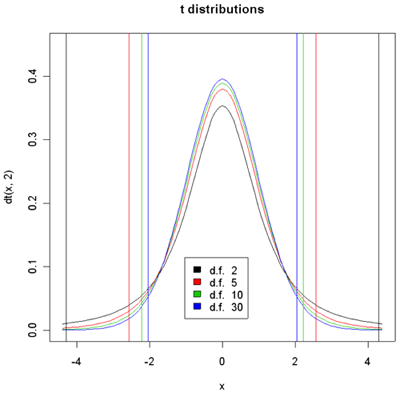

```{r setup, include=FALSE}
knitr::opts_chunk$set(echo = FALSE,warning = FALSE, message = FALSE, fig.align = "centre", scipen = 1, digits = 3, fig.width = 7, fig.height = 5)
# CRAN Packages
library(tidyverse)
library(broom)
library(patchwork)
library(kableExtra)

library(mosaic)
library(mosaicCore)
library(mosaicData)

library(openintro) # datasets and methods
library(statsExpressions) # datasets and methods
library(ggstatsplot) # special stats plots
library(ggExtra)

# Non-CRAN Packages
# remotes::install_github("easystats/easystats")
library(easystats)

```

## The Test for a Single Mean

We start with the simplest of models for inference: a single mean.

To reiterate our purpose: We have a sample of data, which comes from a
certain unknown population. We want to know if *the mean of the*
sample\* is close to the mean of the population, and if so how close\*.
We want to obtain a **point estimate** for the **population parameter
(mean)** and also a **confidence interval** as to how good our point
estimate is.

We will do this two ways: one with a standard statistical test, and then
with our hopefully more intuitive linear model

Let us now see how this Test for a Single Mean can be re-formulated as a
Linear Model + Hypothesis Test. The one-sample test is the same as a
linear model containing a dependent variable, $y$, and a constant only.
That is, a model with the form:

$$
y = \beta_0 \\
H_0:\ \beta_0 = 0\\
H_a:\ \beta_0 \ne 0
$$

This is the same as the equation from the *Linear Model* introduced at
the start\
but having dropped the last term. This is shown graphically below.

```{r echo=FALSE}
# Generate normal data with known parameters
rnorm_fixed = function(N, mu = 0, sd = 1)
  scale(rnorm(N)) * sd + mu


# T-test
dat = data.frame(y = rnorm_fixed(20, 0.5, 0.6),
                  x = runif(20, 0.93, 1.07))  # Fix mean and SD

ggplot(dat, aes(y = y, x = 0)) +
  geom_point() + 
  stat_summary(
    fun.y = mean,
    geom = "errorbar",
    aes(ymax = ..y.., ymin = ..y.., color = 'beta_0'),
    lwd = 2
  ) +
  scale_color_manual(name = NULL,
                     values = c("blue"),
                     labels = c(bquote(beta[0] * " (intercept)"))) +
  
  geom_text(
    aes(label = round(y, 1)),
    nudge_x = 0.05,
    size = 3,
    color = 'dark gray'
  ) +
  labs(title = "Stat Model for a Single Mean") + theme_classic()


```

In order to estimate whether this sample is good for us to estimate
with, we need to check on two aspects:

-   Is it a random sample? Are the samples chosen independently of each
    other from the population? ( Here we assume it is so )
-   Is the sample itself normally distributed? This we can check:

```{r echo=FALSE}
ggplot(data = dat) + geom_density(aes(x = y)) + labs(title = "Distribution of the Sample") + theme_classic()

```

Looks reasonably OK. We know that when the sample size is reasonably
high (\$ n \>=30 \$) we are likely to get a normal distribution. We will
deal with smaller sample sizes shortly.

> RULES OF THUMB: HOW TO PERFORM THE NORMALITY CHECK There is no perfect
> way to check the normality condition, so instead we use two rules of
> thumb:
>
> -   n \< 30: If the sample size n is less than 30 and there are no
>     clear outliers in the data, then we typically assume the data come
>     from a nearly normal distribution to satisfy the condition.
> -   n ≥ 30: If the sample size n is at least 30 and there are no
>     particularly extreme outliers, then we typically assume the
>     sampling distribution of ¯x is nearly normal, even if the
>     underlying distribution of individual observations is not.

## The Standard *t*-test

Using the CLT for our single mean, we see that:

-   The *Point Estimate* is $\bar{y}$ = `r mean(dat$y)`.

-   Standard Error SE = $\sigma /\sqrt(n)$

Unfortunately we do not know the population parameter $\sigma$ : that is
what we want to find out!! So, now? We use the standard deviation
**computed** from the **sample** s = `r sd(dat$y)` and state that:

$$
SE\ = \sigma/\sqrt(n)\ ~ \sim s/\sqrt(n)\\
where\ s = SD(sample) = 0.6/\sqrt(30) = 0.1095
$$

This works very well when we have lots of data (\$n\>= 30\$), and the
sample distribution is also normal. Proceeding in this way, we can
calculate the *Confidence Intervals* as follows: assuming we want 95%
confidence intervals:

$$
CI\ = \pmb\pm 1.96*SE + \bar{y} \\
= [\pmb \pm 1.96 * 0.1095 + 0.5] = [0.39, 0.60]
$$

When the sample size is smaller, the sample distribution may not be
normal, and we use another distribution that fits the bill, called
*t*-distribution:



# References

1.  *Common statistical tests are linear models (or: how to teach
    stats)* by [Jonas Kristoffer
    Lindeløv](https://lindeloev.github.io/tests-as-linear/)

2.  [CheatSheet](https://lindeloev.github.io/tests-as-linear/linear_tests_cheat_sheet.pdf)

3.  *Common statistical tests are linear models: a work through* by
    [Steve Doogue](https://steverxd.github.io/Stat_tests/)

4.  [Jeffrey Walker "Elements of Statistical Modeling for Experimental
    Biology"](https://www.middleprofessor.com/files/applied-biostatistics_bookdown/_book/)

5.  Diez, David M & Barr, Christopher D & Çetinkaya-Rundel, Mine:
    [OpenIntro Statistics](https://www.openintro.org/book/os/)

6.  Modern Statistics with R: From wrangling and exploring data to
    inference and predictive modelling by [Måns
    Thulin](http://www.modernstatisticswithr.com/)

7.  [Jeffrey Walker "A
    linear-model-can-be-fit-to-data-with-continuous-discrete-or-categorical-x-variables"](https://www.middleprofessor.com/files/applied-biostatistics_bookdown/_book/intro-linear-models.html#a-linear-model-can-be-fit-to-data-with-continuous-discrete-or-categorical-x-variables)
