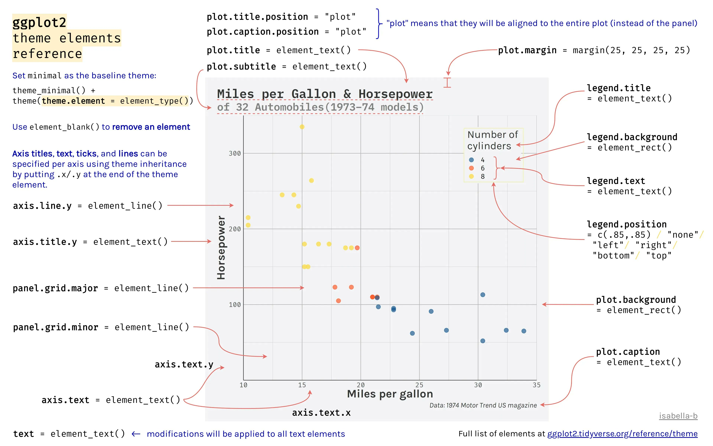

```{r setup, include = FALSE, cache = FALSE}
knitr::opts_chunk$set(
  error = TRUE,
  comment = NA,
  warning = FALSE,
  errors = FALSE,
  message = FALSE,
  tidy = FALSE,
  cache = FALSE,
  echo = TRUE,
  warning = FALSE,
  fig.retina = 1,
  fig.width = 9,
  fig.height = 8,
  fig.path = "06a-figs/"
)

```

# Introduction

This RMarkdown document is part of the Generic Skills Component  (GSK) of the Course of the  Foundation Studies Programme at Srishti Manipal Institute of Art, Design, and Technology, Bangalore India. The material is based on *A Layered Grammar of Graphics* by Hadley Wickham. The course is meant for First Year students pursuing a Degree in Art and Design. 

The intent of this GSK part is to build Skill in coding in R, and also appreciate R as a way to metaphorically visualize information of various kinds, using predominantly geometric figures and structures.

All RMarkdown files combine code, text, web-images, and figures developed using code. Everything is text; code chunks are enclosed in **fences** (```)

# Goals

- (Re)Understand different kinds of data variables
- Appreciate how they can be identified based on the *Interrogative Pronouns* they answer to
- Understand how each kind of variable lends itself to a specific choice of **colour scale** in the data visualization.


# Pedagogical Note

The method followed will be based on
[PRIMM](https://blogs.kcl.ac.uk/cser/2017/09/01/primm-a-structured-approach-to-teaching-programming/):

-   **PREDICT** Inspect the code and guess at what the code might do,
    **write predictions**
-   **RUN** the code provided and check what happens
-   **INFER** what the `parameters` of the code do and **write comments to explain**. What bells and whistles can you see?
-   **MODIFY** the `parameters` code provided to understand the
    `options` available. **Write comments** to show what you have aimed for and achieved.
-   **MAKE** : take an idea/concept of your own, and graph it.

In the following, there is some boiler plate code demonstrating the use of colour palettes in R. There are places where **YOUR TURN** is mention; copy and play with the boiler plate code to see what happens !

Let's load up a few packages that we need to start:

```{r, prep, message=FALSE}
#| label: prep
#| message: false
## packages
library(tidyverse)   ## data science package collection (incl. the ggplot2 package)
library(systemfonts) ## use custom fonts (need to be installed on your OS)  
library(scico)       ## scico color palettes(http://www.fabiocrameri.ch/colourmaps.php) in R 
library(ggtext)      ## add improved text rendering to ggplot2
library(ggforce)     ## add missing functionality to ggplot2
library(ggdist)      ## add uncertainity visualizations to ggplot2
library(magick)      ## load images into R
library(patchwork)   ## combine outputs from ggplot2
library(palmerpenguins)

library(showtext)   ## add google fonts to plots
```


We will want to add a few new fonts to our graphs. The best way (currently) is to use the `showtext` package ( which we loaded above) to bring into our work fonts from Google. To view and select the fonts you might want to work with, spend some time looking over:

1. [Google Webfonts Helper App](https://google-webfonts-helper.herokuapp.com/fonts)

2. [Google Fonts](https://fonts.google.com/)

```{r add_fonts}
font_add_google("Gochi Hand", "gochi")
font_add_google("Schoolbell", "bell")
font_add_google("Galada", "galada")
font_add_google("Schoolbell", "bell")
font_add_google("Roboto", "roboto")
font_add_google("Noto Sans", "noto")
font_add_google("Uchen", "uchen")
font_add_google("Ibarra Real Nova", "ibarra")
font_add_google("Open Sans", "open")
font_add_google("Anton", "anton")
font_add_google("Tangerine", "tangerine")
showtext_auto() # set the google fonts as default

```


We will work with a **familiar** dataset, so that we can concentrate on the chart aesthetics, without having to spend time getting used to the data: the `penguins` dataset again, from the `palmerpenguins` package. 

## Data

Always start your work with a **table** of the data:

```{r data}

penguins <- penguins %>% drop_na() # remove data containing missing data

## Create a nicely formatted table
## uses `kableExtra` package
## 
penguins %>% 
  kableExtra::kbl() %>%
  kableExtra::kable_paper(full_width = TRUE) %>%
  kableExtra::kable_styling(bootstrap_options = c("striped", "condensed", "responsive")) %>%
  kableExtra::scroll_box(width = "700px", height = "500px")

```


## Basic Plot

A basic scatter plot, which we will progressively dress up:

```{r}
## simple plot: data + mappings + geometry
ggplot(penguins, aes(x = bill_length_mm, y = bill_depth_mm)) +
  geom_point(alpha = .6, size = 3.5)

```


## Customized Plot

Let us set some ggplot theme aspects now!! Here is a handy picture showing ( most of ) the theme-able aspects of a ggplot plot. 

For more info, type `?theme` in your console.

```{r,echo=FALSE, fig.alt = "Rosana Ferrero (@RosanaFerrero) on Twitter Sept 11, 2022", fig.cap= "Rosana Ferrero (@RosanaFerrero) on Twitter Sept 11, 2022"}


```


```{r}
## change global theme settings (for all following plots)
theme_set(theme_minimal(base_size = 12, base_family = "open"))

## modify plot elements globally (for all following plots)
theme_update(
  axis.ticks = element_line(color = "grey92"),
  axis.ticks.length = unit(.5, "lines"),
  panel.grid.minor = element_blank(),
  legend.title = element_text(size = 12),
  legend.text = element_text(color = "grey30"),
  plot.title = element_text(size = 18, face = "bold"),
  plot.subtitle = element_text(size = 12, color = "grey30"),
  plot.caption = element_text(size = 9, margin = margin(t = 15))
)

```


Since we know what the basic plot looks like, let's add titles, labels and colours. We will also set limits and scales:

```{r}
ggplot(penguins, aes(x = bill_length_mm, y = bill_depth_mm)) +
  geom_point(aes(color = body_mass_g), alpha = .6, size = 3.5) + 
  
  ## custom axes scaling
  scale_x_continuous(breaks = 3:6 * 10, limits = c(30, 60)) +
  scale_y_continuous(breaks = seq(12.5, 22.5, by = 2.5), limits = c(12.5, 22.5)) +
  
  ## custom colors from the scico package
  scico::scale_color_scico(palette = "bamako", direction = -1) +
  
  ## custom labels
  labs(
    title = 'Bill Dimensions of Brush-Tailed Penguins (Pygoscelis)',
    subtitle = 'A scatter plot of bill depth versus bill length.',
    caption = 'Data: Gorman, Williams & Fraser (2014) PLoS ONE',
    x = 'Bill Length (mm)', 
    y = 'Bill Depth (mm)',
    color = 'Body mass (g)'
  )


```


## Using `{ggtext}`

From [Claus Wilke's website](https://wilkelab.org/ggtext/) → www.wilkelab.org/ggtext

> The `ggtext` package provides simple Markdown and HTML rendering for ggplot2. Under the hood, the package uses the `gridtext` package for the actual rendering, and consequently it is limited to the feature set provided by `gridtext`.  
Support is provided for Markdown both in theme elements (plot titles, subtitles, captions, axis labels, legends, etc.) and in geoms (similar to `geom_text()`). In both cases, there are two alternatives, one for creating simple text labels and one for creating text boxes with word wrapping.

NOTE: on some machines, the ggtext package may not work as expected. In this case, please do as follows, using your Console:

- remove gridtext: `remove.packages(gridtext)`.   
- Install development version of `gridtext`: `remotes::install_github("wilkelab/gridtext")`

### `element_markdown()`
We can use our familiar markdown syntax right inside the titles and captions of the plot. `element_markdown()` is a theming command made available by the `ggtext` package. 

`element_markdown()` → formatted text elements, e.g. titles, caption, axis text, striptext

```{r}
## assign plot to `gt` - we can add new things to this plot later
## (wrapped in parenthesis so it is assigned and plotted in one step)
(gt <- ggplot(penguins, aes(x = bill_length_mm, y = bill_depth_mm)) +
  geom_point(aes(color = body_mass_g), alpha = .6, size = 3.5) + 
  scale_x_continuous(breaks = 3:6 * 10, limits = c(30, 60)) +
  scale_y_continuous(breaks = seq(12.5, 22.5, by = 2.5), limits = c(12.5, 22.5)) +
  scico::scale_color_scico(palette = "bamako", direction = -1) +
   
  ## New code starts here: Two Step Procedure with ggtext
  ## 1. Markdown formatting of labels and title, using asterisks
  labs(
    title = 'Bill Dimensions of Brush-Tailed Penguins (*Pygoscelis*)',
    subtitle = 'A scatter plot of bill depth versus bill length.',
    caption = 'Data: Gorman, Williams & Fraser (2014) *PLoS ONE*',
    x = '**Bill Length** (mm)', 
    y = '**Bill Depth** (mm)',
    color = 'Body mass (g)'
  ) +
   
  ## 2. Add theme related commands from ggtext
  ## render respective text elements
  theme(
    plot.title = ggtext::element_markdown(),
    plot.caption = ggtext::element_markdown(),
    axis.title.x = ggtext::element_markdown(),
    axis.title.y = ggtext::element_markdown()
  )
)


```

### `element_markdown()` in combination with HTML

This allows us to change fonts in titles, labels, and captions:


```{r}
## use HTML syntax to change text color
gt_mar <- gt +
  labs(title = 'Bill Dimensions of Brush-Tailed Penguins <i style="color:#28A87D;">Pygoscelis</i>') +
  theme(plot.margin = margin(t = 25))


## use HTML syntax to change font and text size
gt_mar +
  labs(title = 'Bill Dimensions of Brush-Tailed Penguins <b style="font-size:32pt;font-family:tangerine;">Pygoscelis</b>')


```


### Adding images to ggplot

Save an image from the web in the same folder as your RMarkdown. Use html tags to include it, say as part of your plot title, as shown below.


```{r}
## use HTML syntax to add images to text elements
gt_mar + 
  labs(title = 'Bill Dimensions of Brush-Tailed Penguins &nbsp;&nbsp;&nbsp; ')
    


```

### Annotations with `geom_richtext()` and `geom_textbox()`

Further ggplot annotations can be achieved using `geom_richtext()` and `geom_textbox()`. 

`geom_richtext()` also allows formatted text labels with 360° rotation. One needs to pass a dataframe to `geom_richtext()` giving the location, colour, rotation etc of the label annotation. 

```{r}

gt_rich <- ggplot(penguins, aes(x = bill_length_mm, y = bill_depth_mm)) +
  geom_point(aes(color = species), alpha = .6, size = 3.5) + 
  
  ## add text annotations for each species
  ggtext::geom_richtext(
    data = tibble(
      
      # Three rich text labels, so three sets of locations x and y, and angle of rotation
      x = c(34, 56, 54), y = c(20, 18.5, 14.5),
            angle = c(12, 20, 335),
      species = c("Adélie", "Chinstrap", "Gentoo"),
      lab = c("<b style='font-family:anton;font-size:24pt;'>Adélie</b><br><i style='color:darkgrey;'>P. adéliae</i>", 
              "<b style='font-family:anton;font-size:24pt;'>Chinstrap</b><br><i style='color:darkgrey;'>P. antarctica</i>", 
              "<b style='font-family:anton;font-size:24pt;'>Gentoo</b><br><i style='color:darkgrey;'>P. papua</i>"),

    ),
    
    
    # Now pass these data variables as aesthetics
    aes(x, y, label = lab, color = species, angle = angle), 
    
    size = 4, fill = NA, label.color = NA,
    lineheight = .3
  ) +
  
  
  scale_x_continuous(breaks = 3:6 * 10, limits = c(30, 60)) +
  scale_y_continuous(breaks = seq(12.5, 22.5, by = 2.5), limits = c(12.5, 22.5)) +
  rcartocolor::scale_color_carto_d(palette = "Bold", guide = "none") +
  
  labs(
    title = 'Bill Dimensions of Brush-Tailed Penguins (*Pygoscelis*)',
    subtitle = 'A scatter plot of bill depth versus bill length.',
    caption = 'Data: Gorman, Williams & Fraser (2014) *PLoS ONE*',
    x = '**Bill Length** (mm)', 
    y = '**Bill Depth** (mm)',
    color = 'Body mass (g)'
  ) +
  
  # Use theme and element_markdown() to format axes and titles as usual
  theme(
    plot.title = ggtext::element_markdown(),
    plot.caption = ggtext::element_markdown(),
    axis.title.x = ggtext::element_markdown(),
    axis.title.y = ggtext::element_markdown(),
    plot.margin = margin(25, 6, 15, 6)
  )
  
gt_rich

```


### Formatted Text boxes on ggplots

`element_textbox()` and `element_textbox_simple()` → formatted text boxes with word wrapping

```{r}
gt_box <- ggplot(penguins, aes(x = bill_length_mm, y = bill_depth_mm)) +
  geom_point(aes(color = species), alpha = .6, size = 3.5) +
  
  scale_x_continuous(breaks = 3:6 * 10, limits = c(30, 60)) +
  scale_y_continuous(breaks = seq(12.5, 22.5, by = 2.5),
                     limits = c(12.5, 22.5)) +
  rcartocolor::scale_color_carto_d(palette = "Bold", guide = "none") +
  
  ## add text annotations for each species
  ## Creating a tibble for the labels!
  ggtext::geom_richtext(
    data = tibble(
      # Three rich text labels
      # So three sets of locations x and y, and angle of rotation
      x = c(34, 56, 54),
      y = c(20, 18.5, 14.5),
      angle = c(12, 20, 335),
      species = c("Adélie", "Chinstrap", "Gentoo"),
      notes = c(
        "<b style='font-family:anton;font-size:24pt;'>Adélie</b><br><i style='color:darkgrey;'>P. adéliae</i>",
        "<b style='font-family:anton;font-size:24pt;'>Chinstrap</b><br><i style='color:darkgrey;'>P. antarctica</i>",
        "<b style='font-family:anton;font-size:24pt;'>Gentoo</b><br><i style='color:darkgrey;'>P. papua</i>"
      )
      ),
    
    
    # Now pass these data variables as aesthetics
    aes(
      x,
      y,
      label = notes,
      color = species,
      angle = angle
    ),
    
    size = 4,
    fill = NA,
    label.color = NA,
    lineheight = .3
  ) +
  
  
# Now for the Plot Titles and Labels, as before  
  labs(
    title = 'Bill Dimensions of Brush-Tailed Penguins (*Pygoscelis*)',
    subtitle = 'A scatter plot of bill depth versus bill length.',
    caption = 'Data: Gorman, Williams & Fraser (2014) *PLoS ONE*',
    x = '**Bill Length** (mm)',
    y = '**Bill Depth** (mm)',
    color = 'Body mass (g)'
  ) +
  
# Add the ggtext theme related commands
  theme(
    ## turn title into filled textbox
    plot.title = ggtext::element_textbox_simple(
      color = "white",
      fill = "#28A78D",
      size = 32,
      padding = margin(8, 4, 8, 4),
      margin = margin(b = 5),
      lineheight = .9
    ),
    ## add round outline to caption
    plot.caption = ggtext::element_textbox_simple(
      width = NULL,
      linetype = 1,
      padding = margin(4, 8, 4, 8),
      margin = margin(t = 15),
      r = grid::unit(8, "pt")
    ),
    axis.title.x = ggtext::element_markdown(),
    axis.title.y = ggtext::element_markdown(),
    plot.margin = margin(25, 6, 15, 6)
  )

gt_box

```

`geom_textbox()` → formatted text boxes with word wrapping  

```{r}
gt_box +
  ## add textbox with long paragraphs
  ggtext::geom_textbox(
    data = tibble(x = 34, y = 13.7, label = "<span style='font-size:12pt;font-family:anton;'>Lorem Ipsum Dolor Sit Amet</span><br><br>Lorem ipsum dolor sit amet, consectetur adipiscing elit, sed do eiusmod tempor incididunt ut labore et dolore magna aliqua. Ut enim ad minim veniam, quis nostrud exercitation ullamco laboris nisi ut aliquip ex ea commodo consequat. Duis aute irure dolor in reprehenderit in voluptate velit esse cillum dolore eu fugiat nulla pariatur. Excepteur sint occaecat cupidatat non proident, sunt in culpa qui officia deserunt mollit anim id est laborum."),
    aes(x, y, label = label),
    size = 2.2, family = "sans",
    fill = "cornsilk", box.color = "cornsilk3",
    width = unit(11, "lines")
  ) +
  coord_cartesian(clip = "off") # ensure no clipping of labels near the edge


```

## Using `{ggforce}`

From [Thomas Lin Pedersen's website](www.ggforce.data-imaginist.com) → www.ggforce.data-imaginist.com

> `ggforce` is a package aimed at providing missing functionality to `ggplot2` through the extension system introduced with `ggplot2` v2.0.0. Broadly speaking `ggplot2` has been aimed primarily at explorative data visualization in order to investigate the data at hand, and less at providing utilities for composing custom plots a la `D3.js`. `ggforce` is mainly an attempt to address these “shortcoming” (design choices might be a better description). The goal is to provide a repository of geoms, stats, etc. that are as well documented and implemented as the official ones found in `ggplot2`.


We will start with the basic plot, with the `ggtext` related work done up to now:

```{r}
## use ggtext rendering for the following plots
theme_update(
  plot.title = ggtext::element_markdown(),
  plot.caption = ggtext::element_markdown(),
  axis.title.x = ggtext::element_markdown(),
  axis.title.y = ggtext::element_markdown()
)
```


```{r}
## plot that we will annotate with ggforce afterwards
gf <- ggplot(penguins, aes(x = bill_length_mm, y = bill_depth_mm)) + 
  scico::scale_color_scico(palette = "bamako", direction = -1) +
  coord_cartesian(xlim = c(25, 65), ylim = c(10, 25)) +
  rcartocolor::scale_fill_carto_d(palette = "Bold") +
  labs(
    title = "Bill Dimensions of Brush-Tailed Penguins (*Pygoscelis*)",
    subtitle = 'A scatter plot of bill depth versus bill length.',
    caption = "Data: Gorman, Williams & Fraser (2014) *PLoS ONE*",
    x = "**Bill Length** (mm)", 
    y = "**Bill Depth** (mm)",
    color = "Body mass (g)",
    fill = "Species"
  )

```


```{r}
 
## ellipsoids for all groups
(gf +
  ggforce::geom_mark_ellipse(
    aes(fill = species, label = species), 
    alpha = .15, show.legend = FALSE
  ) +
  geom_point(aes(color = body_mass_g), alpha = .6, size = 3.5)
)


```


```{r}

 
## ellipsoids for specific subset
(gf +
  ggforce::geom_mark_ellipse(
    aes(fill = species, label = species, filter = species == 'Gentoo'), 
    alpha = 0, show.legend = FALSE
  ) +
 geom_point(aes(color = body_mass_g), alpha = .6, size = 3.5)
#   coord_cartesian(xlim = c(25, 65), ylim = c(10, 25))
)


```


```{r}

## circles
(gf +
  ggforce::geom_mark_circle(
    aes(fill = species, label = species, filter = species == 'Gentoo'), 
    alpha = 0, show.legend = FALSE
  ) +
  geom_point(aes(color = body_mass_g), alpha = .6, size = 3.5)
)
 

```


```{r}

## rectangles
(gf +
  ggforce::geom_mark_rect(
    aes(fill = species, label = species, filter = species == 'Gentoo'), 
    alpha = 0, show.legend = FALSE
  ) +
  geom_point(aes(color = body_mass_g), alpha = .6, size = 3.5) 
)
 


```


```{r}
library(concaveman)
## hull
(gf +
  ggforce::geom_mark_hull(
    aes(fill = species, label = species, filter = species == 'Gentoo'), 
    alpha = 0, show.legend = FALSE
  ) +
  geom_point(aes(color = body_mass_g), alpha = .6, size = 3.5)
)
 

```


## ggplot tricks

```{r}
(gg0 <- 
  ggplot(penguins, aes(x = bill_length_mm, y = bill_depth_mm)) +
    ggforce::geom_mark_ellipse(
      aes(fill = species, label = species), 
      alpha = 0, show.legend = FALSE
    ) +
    geom_point(aes(color = body_mass_g), alpha = .6, size = 3.5) + 
    scale_x_continuous(breaks = seq(25, 65, by = 5), limits = c(25, 65)) +
    scale_y_continuous(breaks = seq(12, 24, by = 2), limits = c(12, 24)) +
    scico::scale_color_scico(palette = "bamako", direction = -1) +
    labs(
      title = "Bill Dimensions of Brush-Tailed Penguins (*Pygoscelis*)",
      subtitle = 'A scatter plot of bill depth versus bill length.',
      caption = "Data: Gorman, Williams & Fraser (2014) *PLoS ONE*",
      x = "Bill Length (mm)", 
      y = "Bill Depth (mm)",
      color = "Body mass (g)"
    )
)

```

### Left-Aligned Title

```{r}
(gg1 <- gg0 + theme(plot.title.position = "plot"))


```

### Right-Aligned Caption

```{r}
(gg1b <- gg1 +  theme(plot.caption.position = "panel"))


```

### Legend Design

```{r}
(gg2 <- gg1b + theme(legend.position = "top"))

ggsave("06a_legend_position.pdf", width = 9, height = 8, device = cairo_pdf)

(gg2b <- gg2 + 
  guides(color = guide_colorbar(title.position = "top", 
                                title.hjust = .5, 
                                barwidth = unit(20, "lines"), 
                                barheight = unit(.5, "lines"))))


```


### Add Images

```{r}
## read PNG file from web
png <- magick::image_read("https://raw.githubusercontent.com/allisonhorst/palmerpenguins/master/man/figures/culmen_depth.png")
## turn image into `rasterGrob`
img <- grid::rasterGrob(png, interpolate = TRUE)

gg5 <- gg2b +
  annotation_custom(img, ymin = 18.5, ymax = 30.5, xmin = 55, xmax = 65.5) +
    labs(caption = "Data: Gorman, Williams & Fraser (2014) *PLoS ONE* &bull; Illustration: Allison Horst")
gg5


```


## Using `{patchwork}`

> The goal of `patchwork` is to make it ridiculously simple to combine separate ggplots into the same graphic. As such it tries to solve the same problem as `gridExtra::grid.arrange()` and `cowplot::plot_grid` but using an API that incites exploration and iteration, and scales to arbitrily complex layouts.

→ https://patchwork.data-imaginist.com/

Let us make two plots and combine them into a single patchwork plot. 

```{r}
#| fig-width: 9
#| fig-height: 5.2
## calculate bill ratio
penguins_stats <- penguins %>% 
  mutate(bill_ratio = bill_length_mm / bill_depth_mm) %>% 
  filter(!is.na(bill_ratio))

## create a second chart
gg6 <- ggplot(penguins_stats, aes(y = bill_ratio, x = species, fill = species, color = species)) + geom_violin() + 
  labs(
    y = "Bill ratio",
    x = "Species",
    subtitle = "",
    caption = "Data: Gorman, Williams & Fraser (2014) *PLoS ONE* &bull; Illustration: Allison Horst"
  ) +
  theme(
    panel.grid.major.x = element_line(size = .35),
    panel.grid.major.y = element_blank(),
    axis.text.y = element_text(size = 13),
    axis.ticks.length = unit(0, "lines"),
    plot.title.position = 'plot',
    plot.subtitle = element_text(margin = margin(t = 5, b = 10)),
    plot.margin = margin(10, 25, 10, 25)
  )

```

Now to combine both plots into one using simple operators:

> For the special case of putting plots besides each other or on top of each other patchwork provides 2 shortcut operators. `|` will place plots next to each other while `/` will place them on top of each other.

First we stack up the graphs side by side:

```{r}
## combine both plots
gg5 | (gg6 + labs(title = "Bill Ratios of Brush-Tailed Penguins",
                  subtitle = "Violin Plots of Bill Ration versus species"))

```


We can place them in one column:

```{r}
gg5 / (gg6 + labs(title = "Bill Ratios of Brush-Tailed Penguins",
                  subtitle = "Violin Plots of Bill Ration versus species")) +
  plot_layout(heights = c(0.4, 0.4))


```


***

# Resources

* Yixuan Qiu's package vignette [showtext](https://github.com/yixuan/showtext)

* ["R for Data Science" book (open-access)](r4ds.had.co.nz/)
* [ggplot2 Book (open-access)](https://ggplot2-book.org/)
* [R Graph Gallery](https://www.r-graph-gallery.com/)
* [Slides of Cedric Scherer's talk](https://www.cedricscherer.com/slides/OutlierConf2021_ggplot-wizardry.pdf)
* [Extensive ggplot2 tutorial](https://www.cedricscherer.com/2019/08/05/a-ggplot2-tutorial-for-beautiful-plotting-in-r/)
* [“Evolution of a ggplot” blog post by Cedric Scherer](https://www.cedricscherer.com/2019/05/17/the-evolution-of-a-ggplot-ep.-1/ )
* [#TidyTuesday project](https://github.com/rfordatascience/tidytuesday) ([#TidyTuesday](https://twitter.com/hashtag/tidytuesday?lang=en) on Twitter)
* [#TidyTuesday Contributions by Cedric Scherer](https://github.com/Z3tt/TidyTuesday) incl. all codes
* [R4DS learning community](https://www.rfordatasci.com/) (huge Slack community for people learning R incl. a mentoring program)
* [Illustrations by Allison Horst](https://github.com/allisonhorst/stats-illustrations ) (more general about data and stats + R-related)
* R Packages:
  + [ggplot2](https://ggplot2.tidyverse.org/)
  + [ggtext](https://wilkelab.org/ggtext/)
  + [ggforce](https://ggforce.data-imaginist.com/) 
  + [ggdist](https://mjskay.github.io/ggdist/)
  + [ggraph](https://ggraph.data-imaginist.com/)
  + [ggstream](https://github.com/davidsjoberg/ggstream) 
  + [ggbump](https://github.com/davidsjoberg/ggbump)
  + [gggibous](https://cran.r-project.org/web/packages/gggibbous/vignettes/gggibbous.html) 
  + [waffle](https://github.com/hrbrmstr/waffle)
  + [geofacet](https://cran.r-project.org/web/packages/geofacet/vignettes/geofacet.html)
  + [cartogram](https://github.com/sjewo/cartogram)
  + [patchwork](https://patchwork.data-imaginist.com/) 
  + [sf](https://r-spatial.github.io/sf/)

