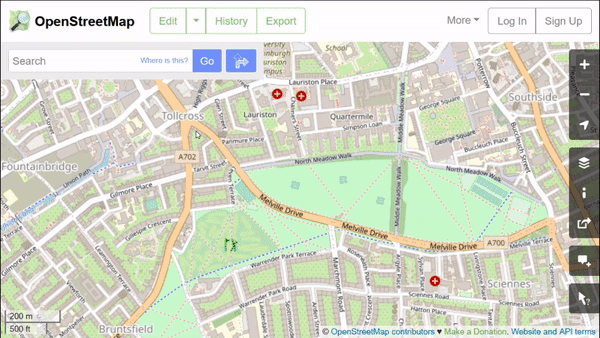

## Introduction

This RMarkdown document is part of my Workshop Course in R. The intent
is to build Skill in coding in R, and also appreciate R as a way to
metaphorically visualize information of various kinds, using
predominantly geometric figures and structures.

All RMarkdown/Quarto files combine code, text, web-images, and figures
developed using code. Everything is text; code chunks are enclosed in
**fences** (\`\`\`)

## Goals

At the end of this Lab session, we should:\
- know the types and structures of `spatial data` and be able to work
with them\
- understand the basics of modern spatial packages in R\
- be able to specify and download spatial data from the web, using R
from sources such as `naturalearth` and `Open Streep Map`\
- plot *static* and *interactive* maps using `ggplot`, `tmap` and
`leaflet` packages\
- add symbols and markers for places and regions of our own interest in
these maps.\
- plot maps on a globe using the `threejs` package

## Pedagogical Note

The method followed will be based on
[PRIMM](https://blogs.kcl.ac.uk/cser/2017/09/01/primm-a-structured-approach-to-teaching-programming/):

-   **PREDICT** Inspect the code and guess at what the code might do,
    **write predictions**
-   **RUN** the code provided and check what happens
-   **INFER** what the `parameters` of the code do and **write comments
    to explain**. What bells and whistles can you see?
-   **MODIFY** the `parameters` code provided to understand the
    `options` available. **Write comments** to show what you have aimed
    for and achieved.
-   **MAKE** : take an idea/concept of your own, and graph it.

All jargon words will be capitalized and in **bold** font.

## Set Up

The `setup` code **chunk** below brings into our coding session **R
packages** that provide specific computational abilities and also
**datasets** which we can use.

To reiterate: Packages and datasets are **not** the same thing !!
Packages are (small) collections of programs. Datasets are
just....information.

## Setup the Packages
Install all packages that are flagged by RStudio when you open this RMarkdown file!

```{r}
#| label: setup
#| message: false
library(rnaturalearth)
library(rnaturalearthdata)

# Run this in your console first
# devtools::install_github("ropensci/rnaturalearthhires")
library(rnaturalearthhires)

# Plotting Maps
library(tidyverse) # Maps using ggplot + geom_sf
library(tmap) # Thematic Maps, static and interactive
library(osmdata) # Fetch map data from osmdata.org
library(leaflet) # interactive Maps
library(threejs) # Globe maps in R. Part of the htmlwidgets family of packages

# For Spatial Data Frame Processing
library(sf)

```

## Introduction to Maps in R

We will take small steps in making maps using just two of the several
map making packages in R.

The steps we will use are:

1.  Search for an area of interest
2.  Learn how to access spatial/map data using `osmdata`
3.  Plot and dress up our map using `ggplot` and `tmap`
4.  Create interactive maps with `leaflet` using a variety of map data
    providers. (Note: `tmap` can also do interactive maps which we will
    explore also.)

Bas. Onwards and Map-wards!!

## Step1 - Specifying an area of interest

In R, we need to specify a "**BOUNDING BOX**" first, to declare our area of interest. God made me a BengaluR-kaR...I think..Let's see if we can declare an area of interest. Then we can order on Swiggy and...never mind.

We can declare a **BOUNDING BOX** in several ways.

a)  Using a longitude latitude info from [Bounding Box Tool](https://boundingbox.klokantech.com) which gives bounding boxes in many different formats. 

- Locate the place of interest using the search box. 
- click on the "box with arrow" tool on the upper left. This will create a rectangular shape.   
- Move/resize this box and then copy the bounding box from the menu at the bottom. Ensure you copy in **CSV** format.   

```{r}
#| label:  I-am-going-home 1

# https://boundingbox.klokantech.com
# CSV: 77.574028,12.917262,77.595073,12.939895
bbox_1 <- matrix(
  c(77.574028, 12.917262, 77.595073, 12.939895),
  byrow = FALSE,
  nrow = 2,
  ncol = 2,
  dimnames = list(c('x', 'y'), c('min', 'max'))
)
bbox_1

```

b)  Using a place name to look up a BOUNDING BOX with `osmdata::getbb`. This may not always work if the place name is know well known.

```{r I-am-going-home 2}
# Using getbb command from the osmdata package
bbox_2 <- osmdata::getbb("Jayanagar, Bangalore, India")
bbox_2

```

Let us examine both the calculated BOUNDING BOXes:

```{r}
bbox_1
bbox_2

```

Both look similar in size; `bbox_2` is slightly bigger.

We will use the `bbox_2` from the above, to ensure we have a decent collection of features. If the download becomes too hefty, we can fall back on the smaller bbox!

## Step2 - Get Map data

> [OpenStreetMap (OSM)](https://www.openstreetmap.org/) provides maps of
> the world mostly created by volunteers. They are completely free to
> browse and use, with attribution to © OpenStreetMap contributors and
> adherence to the ODbL license required, and are used by many public
> and private organisations. OSM data can be downloaded in vector format
> and used for our own purposes. In this tutorial, we will obtain data
> from OSM using a `query`. A query is a request for data from a
> database. Simple queries can be performed more easily using the
> `osmdata` library for R, which automatically constructs the query and
> imports the data in a convenient format.

Open Street Map **features** have attributes in **key-value pairs**. We
can use them to download the specific data we need. These features can
easily be explored in the web browser, by using the 'Query features'
button on [OpenStreetMap (OSM)](https://www.openstreetmap.org/):



Head off to [OSM Street Map](https://www.openstreetmap.org/) to try this
out and to get an intuitive understanding of what OSM **key-value
pairs** are, for different types of map **features**. Look for places of
interest to you (**features**) and see what **key-value** pairs attach
to those features.

NOTE: **key-value pairs** are also referred to as **tags**.

Useful **key-value pairs** / **tags** include:

| KEY      | VALUEs                                                                                                                     |
|---------------------------|---------------------------------------------|
| building | yes (all), house residential, apartments                                                                                   |
| highway  | residential, service, track, unclassified, footway, path                                                                   |
| amenity  | parking, parking_space, bench; place_of_worship; restaurant, cafe, fast_food; school, waste_basket, fuel, bank, toilets... |
| shop     | convenience, supermarket, clothes, hairdresser, car-repair...                                                              |
| name     | actual name of the place e.g. Main_Street, *McDonald's, Pizza Hut, Subway*                                                 |
| waterway |                                                                                                                            |
| natural  |                                                                                                                            |
| boundary |                                                                                                                            |

For more information see:[OSM Tags](https://taginfo.openstreetmap.org/) for a nice visual description of popular **key-value pairs** that we can use. See what the `highway` tag looks like [tag : highway](https://taginfo.openstreetmap.org/keys/highway#values)

The `osmdata` commands `available_features` and `available_tags` can help also us get the associated *key-value** pairs to retrieve data from OSM.

```{r}
#| layout-ncol: 2
osmdata::available_features() %>% as_tibble()
available_tags(feature = "highway")
available_tags("amenity")
available_tags("natural")

```

We can use these **key-value** pairs to download different types of map data. Within our `bbox` for Jayanagar, Bangalore, we want to download diverse  kinds of **FEATURE** data. Remember that a **FEATURE** is any object that can be "seen" on a map. This is done using the OPQ query in the `osmdata` package. The main parameters for this command are:

-   bbox
-   **KEY / VALUE** pairs (**"TAGS"**) to specify the kind of feature
    you need
    
The query returns a **list** data structure, with **all geometries** and features within the bounding box, and we can use any or all of them. Now we know the map features we are interested in. We also know 
what key-value pairs will be used to get this info from OSM. 

::: callout-danger
### Data Downloads from OSM
**Do not run these commands too many times**. **Re-run this ONLY if you have changed your BOUNDING BOX.**. We will get our map data from OSM and then save it avoid repeated downloads. So, please copy/paste and run the following commands in your console. The chunk below is set to eval:false so it will *not* run when you render!
:::

```{r}
#| eval: false
# Eval is set to false here
# This code is for reference
# Run these commands ONCE in your Console
# Or run this chunk manually one time

# Get all restaurants, atms, colleges within my bbox
locations <- 
  osmdata::opq(bbox = bbox_2) %>% 
  osmdata::add_osm_feature(key = "amenity", 
                           value = c("restaurant", "atm", "college")) %>% 
  osmdata_sf() %>%  # Convert to Simple Features format
  purrr::pluck("osm_points") # Pull out the data frame of interest

# Get all buildings within my bbox
dat_buildings <-
  osmdata::opq(bbox = bbox_2) %>% 
  osmdata::add_osm_feature(key = "building") %>% 
  osmdata_sf() %>% 
  purrr::pluck("osm_polygons") 

# Get all residential roads within my bbox
dat_roads <- 
  osmdata::opq(bbox = bbox_2) %>% 
  osmdata::add_osm_feature(key = "highway", 
                           value = c("residential")) %>% 
  osmdata_sf() %>% 
  purrr::pluck("osm_lines") 

# Get all parks / natural /greenery areas and spots within my bbox
dat_natural <-   
  osmdata::opq(bbox = bbox_2) %>% 
  osmdata::add_osm_feature(key = "natural",
                           value = c("tree", "water", "wood")) %>% 
  osmdata_sf()
dat_natural

dat_trees <- 
  dat_natural %>% 
  purrr::pluck("osm_points") 

dat_greenery <- 
  dat_natural %>% pluck("osm_polygons")
 

```

Let us save this data, so we don't need to download all this again! We will store the downloaded data as `.gpkg` files on our local hard
drives to use when we run this file again later. We will name our stored
files as `buildings`, `roads`, and `greenery`, and `trees`, each with the
`.gpkg` file extension, e.g. `trees.gpkg`.

Check your local project folder for these files after executing these
commands.

```{r}
#| eval: false
# Eval is set to false here
# This code is for reference
# Run these commands ONCE in your Console
# Or manually run this chunk once

st_write(dat_roads, dsn = "roads.gpkg", 
         append = FALSE, quiet = FALSE)

st_write(dat_buildings, 
         dsn = "buildings.gpkg", 
         append = FALSE, 
         quiet = FALSE)

st_write(dat_greenery, dsn = "greenery.gpkg", 
         append = FALSE,quiet = FALSE)

st_write(dat_trees, dsn = "trees.gpkg", 
         append = FALSE,quiet = FALSE)

```

::: callout-danger
**Always work from here to avoid repeated downloads from OSM. Start from the top ONLY if you intend to map new locations and need to modify your Bounding Box.**
:::

Let us now read back the saved Data:

```{r}
#| label: resume-from-here
buildings <- st_read("./buildings.gpkg")
greenery <- st_read("./greenery.gpkg")
trees <- st_read("./trees.gpkg")
roads <- st_read("./roads.gpkg")

```
How many rows? ( Rows -\> Features ) What kind of `geom` column in each data set?

```{r}
# How many buildings?
nrow(buildings)
buildings$geom
class(buildings$geom)

```

So the `buildings` dataset has `r nrow(buildings)` buildings and their
geometry is naturally a POLYGON type of geometry column.

Do this check for all the other spatial data, in the code chunk below.
What kind of `geom` column does each dataset have?

```{r YOUR-TURN-1, include=TRUE}


```


## My first Map in R

There are two ways of plotting maps that we will learn:

### ggplot and geom_sf()

First we will plot with `ggplot` and `geom_sf()` : recall that our data
is stored in 5 files: `buildings`, `parks`, `roads`, `trees`, and
`greenery`.

```{r}

ggplot() +
  geom_sf(data = buildings, fill = "gold", color = "grey", linewidth = 0.025) +    # POLYGONS
  geom_sf(data = roads, color = '#ff9999', linewidth = 0.5) +        # LINES
  geom_sf(data = greenery, col = "darkseagreen") +  # POLYGONS
  geom_sf(data = trees, col = "darkgreen")  +       # POINTS
  
  # Set plot limits to exactly the bbox_2
  coord_sf(xlim = c(bbox_2[1,1], bbox_2[1,2]),
           ylim = c(bbox_2[2,1], bbox_2[2,2]),
           expand = FALSE) + 
  theme_minimal()

```

Note how `geom_sf` is capable of handling *any* geometry in the `sfc`
column !!

> `geom_sf()` is an unusual geom because it will draw different
> geometric objects depending on what simple features are present in the
> data: you can get points, lines, or polygons.

So there, we have our first map!

## Map using `tmap` package

We can also create a map using a package called `tmap`. Here we also
have the option of making the map *interactive*. `tmap` plots are made
with code in "groups": each group starts with a `tm_shape()` command.

```{r}
#| label: using-tmap
# Group-1
tm_shape(buildings) +
  tm_fill(col = "burlywood") +

#Group-2
tm_shape(roads) +
  tm_lines(col = "grey20") +

#Group-3  
tm_shape(greenery) +
  tm_polygons(col = "limegreen") +
  

#Group-4
tm_shape(trees) +
  tm_dots(col = "darkgreen")

```

How do we make this map interactive? One more line of code !! Add this
line in your console and then run the above chunk again

`tmap_mode("view")`

## Using data from `tmap`

Like many other packages ( e.g. ggplot ) `tmap` also has a few built-in
spatial datasets: `World` and `metro`, `rivers`, `land` and a few
others. Check help on these. Let's plot a first map using datasets built
into `tmap`.

```{r World-Data-tmap}
data("World")
head(World, n = 3)

```

We have several 14 attribute variables in `World`. Attribute variables
such as `gdp_cap_est`, `HPI` are numeric. Others such as `income_grp`
appear to be factors. `iso_a3` is the standard three letter name for the
country. `name` is of course, the name for each country!

```{r World-metro-cities-tmap}
data("metro")
head(metro, n = 3)

```

Here too we have attribute variables for the metros, and they seem
predominantly numeric. Again `iso_a3` is the three letter name for the
city.

```{r}
#| label: My-Static-World
tmap_mode("plot") # Making this a static plot

# Group 1
tm_shape(World) + # dataset = World. 
    tm_polygons("HPI") + # Colour polygons by HPI numeric variable

  # Note the "+" sign continuation
  
# Group 2
tm_shape(metro) + # dataset = metro
  tm_bubbles(size = "pop2030", 
             col = "red") 
# Plot cities as bubbles
# Size proportional to numeric variable `pop2030`
```

```{r}
#| label:  My Interactive Water Colour World
tmap_mode("view") # Change to Interactive


# Let's use WaterColor Map this time!!
tm_tiles("Stamen.Watercolor") + # Watercolor map only with interactive
tm_shape(World) +
    tm_polygons("HPI") + # Color by Happiness Index
  
  
tm_shape(metro) + 
  tm_bubbles(size = "pop2030", # Size City Markers by Population in 2020
             col = "red") 
```

## Using data from `rnaturalearth`

The `rnaturalearth` package allows us to download shapes of countries.
We can use it to get borders and also internal state/district
boundaries.

```{r}
#| label:  spatial_data from natural earth
india <- 
  ne_states(country =  "india", 
            returnclass = "sf") # gives a ready sf dataframe !

india_neighbours <- 
  ne_states(country = (c("sri lanka", "pakistan",
                         "afghanistan", "nepal","bangladesh", "bhutan")
                       ),
            returnclass = "sf")

```

Let's look at the attribute variable columns to colour our graph and to
shape our symbols:

```{r}
names(india)
names(india_neighbours)

# Look only at attributes
india %>% st_drop_geometry() %>% head()
india_neighbours %>% st_drop_geometry() %>% head()

```

In the `india` data frame:\
- Column `iso_a2` contains the country name.\
- Column `name` contains the name of the state

In the `india_neighbours` data frame:\
- Column `gu_a3` contains the country abbreviation\
- Column `name` contains the name of the state\
- Column `iso_3166_2` contains the abbreviation of the state within each
neighbouring country.


```{r}
#| label:  Map_1
tmap_mode("view")

# Plot India
  tm_shape(india) +
  tm_polygons("name", # Colour by States in India
              legend.show = FALSE) +
  
# Plot Neighbours
  tm_shape(india_neighbours) +
  tm_fill(col = "gu_a3") +  # Colour by Country Name
  
# Plot the cities in India alone
  tm_shape(metro %>% dplyr::filter(iso_a3 == "IND")) +
    
  tm_dots(size = "pop2020",legend.size.show = FALSE) +
    # size by population in 2020
    
  tm_layout(legend.show = FALSE) +
  tm_credits("Geographical Boundaries are not accurate",
             size = 0.5,
             position = "right") +
  tm_compass(position = c("right", "top")) +
  tm_scale_bar(position = "left") +
  tmap_style(style = "classic") 

#Try other map styles
#cobalt #gray #white #watercolor #beaver #classic #watercolor #albatross #bw #col_blind

```

## Your Turn 2

Can you try to download a map area of your home town and plot it as we
have above?

```{r Your-Turn-2, include=TRUE, eval=FALSE}

```


## Adding my favourite Restaurants to the map

Is it time to order on Swiggy...

Let us adding interesting places to our map: say based on your favourite
restaurants etc. We need restaurant data: lat/long + name + maybe type
of restaurant. This can be manually created ( like all of OSMdata ) or
if it is already there we can download using *key-value* pairs in our
OSM data query.

Restaurants can be downloaded using
`key= "amenity", value = "restaurant"` or `"cafe"` etc. There are also other tags to explore!Searching for McDonalds for instance...( `key = "name", value = "McDonalds"`). Since we want JUST their location, and not the restaurant BUILDINGs, we extract `osm_points`. 


```{r restaurant-data-1, eval=FALSE}

# Again, run these commands in your Console
dat_R <-
  osmdata::opq(bbox = bbox_2) %>% 
  osmdata::add_osm_feature(key = "amenity", 
                           value = c("restaurant")) %>% 
  osmdata_sf() %>% 
  purrr::pluck("osm_points") 

# Save the data for future use
write_sf(dat_R, dsn = "restaurants.gpkg",append = FALSE, quiet = FALSE)

```


Now reading the saved Restaurant Data

```{r}
restaurants <- st_read("./restaurants.gpkg")
```

How many restaurants have we got?

```{r restaurant-data-2}

restaurants %>% nrow()

```

So the `restaurants` dataset has `r nrow(restaurants)` restaurants and
their geometry is naturally a POINT type of geometry column.

These are the names of columns in the Restaurant Data: Note the
`cuisine` column.

```{r restaurant-data-3}

glimpse(restaurants)

```

So let us plot the restaurants as POINTs using the `restaurants` data we
have downloaded. The `cuisine` attribute looks interesting; let us
colour the POINT based on the `cuisine` offered at that restaurant.

So Let's look therefore at the `cuisine` column!

```{r restaurant-data-4}
# ( I want pizza...)
restaurants$cuisine %>% unique()

```

Big mess...many NAs, some double entries, separated by commas and
semicolons....

::: {.panel .panel-success}
::: panel-heading
The `cuisine` attribute:
:::

::: panel-body
Note: The `cuisine` variable has more than one entry for a given
restaurant. We use `tidyr::separate()` to make multiple columns out of
the cuisine column and retain the first one only. Since the entries are
badly entered using both ";" and "," we need to do this twice ;-() Bad
Data entry!!
:::
:::

Let's get one cuisine entry per restaurant, and drop off the ones that
do not mention a cuisine at all:

```{r}
restaurants <- restaurants %>% 
  drop_na(cuisine) %>% # Knock off nondescript restaurants
  
  # Some have more than one classification ;-()
  # Separated by semicolon or comma, so....
  separate_wider_delim(cols = cuisine, 
                       names = c("cuisine", NA, NA), 
                       delim = ";", 
                       too_few = "align_start",
                       too_many = "drop") %>% 
  separate_wider_delim(cols = cuisine, 
                       names = c("cuisine", NA, NA), 
                       delim = ",",
                       too_few = "align_start",
                       too_many = "drop")

# Finally good food?
restaurants$cuisine
```

Looks clean! Each entry is only ONE and not multiple any more. Now let's
plot the Restaurants as POINTs:

```{r}
# http://www.stat.columbia.edu/~tzheng/files/Rcolor.pdf
# 
ggplot() +
  geom_sf(data = buildings, colour = "burlywood1") +
  geom_sf(data = roads, colour = "gray80") +
  geom_sf(
    data = restaurants %>% drop_na(cuisine),
    aes(fill = cuisine, geometry = geom),
    colour = "black",
    shape = 21,
    size = 3
  ) +  
  # Set plot limits to exactly the bbox_2
  coord_sf(xlim = c(bbox_2[1,1], bbox_2[1,2]),
           ylim = c(bbox_2[2,1], bbox_2[2,2]),
           expand = FALSE) + 
  theme_minimal() + 
  theme(legend.position = "right") +
  labs(title = "Restaurants in South Central Bangalore",
       caption = "Based on osmdata")
```

We could have done a (much!) better job, by combining cuisines into
simpler and fewer categories, ( South_India and South_Indian ), but that
is for another day!!

By now we know that we can use `geom_sf()` multiple number of times with
different datasets to create layered maps in R.


# Some fancy stuff

Let us try making glob based maps with the package `threejs`. This
package is one of the family of packages in the `htmlwidgets` group of
packages. It allows the use of some ( famous!) JavaScript graphing
libraries directly and natively in R.

## `globejs` usage

The `globejs` command from the package `threejs` allows one to plot
points, arcs and images on a globe in 3D. The globe can be rotated and
and zoomed. Great Circles and historical routes are a good idea for this
perhaps.

Refer to this page for more ideas
<http://bwlewis.github.io/rthreejs/globejs.html>

We will generate some random locations and plot them on the 3D globe.

```{r}
# Random Lats and Longs
lat <- rpois(10, 60) + rnorm(10, 80)
long <- rpois(10, 60) + rnorm(10, 10)

# Random "Spike" heights for each location. Population? Tourists? GDP?
value <- rpois(10, lambda = 80)
 
globejs(lat = lat, long = long)

```

As seen, "spikes" are created at the random lat-lon locations. We can
control the height/width/colour of the spikes, as well as the initial
view of the globe itself: zoom, location and so on

```{r}
globejs(
  lat = lat,
  long = long,
  
  # random heights of the Spikes (!!) at lat-long combo
  value = value,
  color = "red",
  # Zoom factor, default is 35
  fov = 50
)
```

```{r}
globejs(
  lat = lat,
  long = long,
  value = value,
  color = "red",
  pointsize = 4, # width of the columns
  # Zoom position
  fov = 35,
  # initial position of the globe
  rotationlat = 0.6, #  in RADIANS !!! Good Heavens!!
  rotationlong = 0.2 #  in RADIANS !!! Good Heavens!!
)
```

```{r}
globejs(
  lat = lat,
  long = long,
  value = value,
  color = "red",
  pointsize = 4,
  fov = 35,
  rotationlat = 0.6,
  rotationlong = 0.2,
  lightcolor = "#aaeeff",
  emissive = "#0000ee",
  bodycolor = "#ffffff",
  bg = "grey"
)

```

# Scope and Packages for Exploration!!

### sfnetworks

### mapsf

### ggspatial

# Resources

1.  Emine Fidan, [Guide to Creating Interactive Maps in
    R](https://bookdown.org/eneminef/DRR_Bookdown/)

2.  Nikita Voevodin,[R, Not the Best
    Practices](https://bookdown.org/voevodin_nv/R_Not_the_Best_Practices/maps.html)

# Assignments

1.  Draw a map of **your home-town** with your favourite restaurants
    shown. Pop-ups for each restaurant will win bonus points.

2.  Download bird migration data from `movebank.org`. Import these into
    R and plot a migration map using `tmap`. Include the graticule,
    compass, legend, and credits.

### Inspiration

1.  Burkhart, Christian. n.d. "Streetmaps."
    [StreetMaps](https://ggplot2tutor.com/tutorials/streetmaps)


2.  *Making Vector Maps*, Computing for the Social Sciences, [Univ. of
    Chicago](https://cfss.uchicago.edu/notes/vector-maps/)
