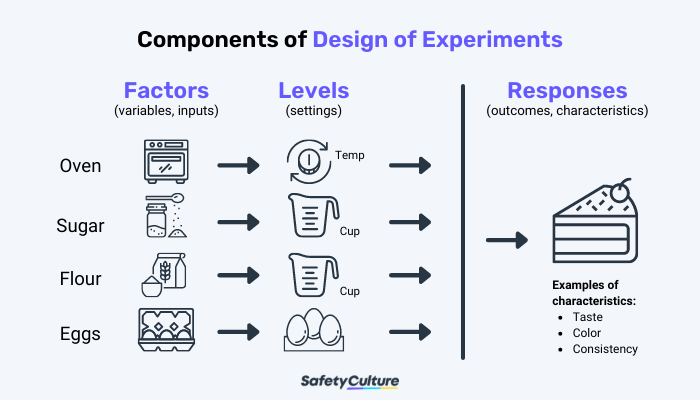

```{r setup, include=FALSE,warning=FALSE}
library(knitr)
library(rmarkdown)
options(htmltools.dir.version = FALSE)
knitr::opts_chunk$set(
  fig.width=9, fig.height=7, fig.retina=3,
  out.width = "100%",
  out.height = "100%",
  fig.showtext = TRUE,
  #fig.path="figures/01-Nature-of-Data/",
  cache = FALSE,
  echo = TRUE,
  message = FALSE, 
  warning = FALSE,
  hiline = TRUE
)
library(xaringanthemer)
library(xaringanExtra)
#library(xaringanBuilder)
library(renderthis)
library(tidyverse)
library(patchwork)
library(emoji)
library(emojifont)
library(anicon)
library(sf)
library(palmerpenguins)


```


```{r xaringan-themer, include=FALSE, warning=FALSE}
library(xaringanthemer)
style_duo_accent(
  primary_color = "#1381B0",
  secondary_color = "#FF961C",
  inverse_header_color = "#FFFFFF"
)
```


```{r xaringanExtra, include=FALSE}
use_tile_view()
use_fit_screen()
use_panelset()
use_scribble()
use_search()
use_freezeframe()
use_tachyons()
use_animate_css()
# https://animate.style/ for animation CSS
#use_slide_tone()
use_extra_styles(hover_code_line = TRUE,mute_unhighlighted_code = FALSE)
xaringanExtra::use_logo(
  image_url = "https://raw.githubusercontent.com/rstudio/hex-stickers/master/PNG/xaringan.png",
  link_url = "http://slides.yihui.name/xaringan",
  position = xaringanExtra::css_position(top = "1em", right = "1em")
)
```


## What makes Human Experience?
```{r,echo=FALSE, out.height="120%"}
knitr::include_graphics("images/Anecdote-spotting-a-business-story.png")
```
### How would we describe this experience?
- Where / When?
- Who?
- How?
- How Big? How small? How frequent? How sudden?
- And....How Surprising ! How Shocking! How sad...How Wonderful !!!


.footnote[ https://www.anecdote.com/2014/09/story-framework/]
---
## What makes for Surprise?
.pull-left[
<blockquote class="twitter-tweet"><p lang="en" dir="ltr">Needs to be celebrated. Spotted in a men&#39;s washroom at <a href="https://twitter.com/BLRAirport?ref_src=twsrc%5Etfw">@BLRAirport</a> - a diaper change station. <br><br>Childcare is not just a woman&#39;s responsibility. <br><br>👏🏻✨ <a href="https://t.co/Za4CG9jZfR">pic.twitter.com/Za4CG9jZfR</a></p>&mdash; Sukhada (@appadappajappa) <a href="https://twitter.com/appadappajappa/status/1541366922545369088?ref_src=twsrc%5Etfw">June 27, 2022</a></blockquote> <script async src="https://platform.twitter.com/widgets.js" charset="utf-8"></script>
]

.pull-right[
```{r,echo=FALSE}
  knitr::include_graphics("images/toilet.jpg")
```
]
---

.pull-left[

```{r,echo=FALSE}
knitr::include_graphics("images/P&P.jpg")
```
]

.pull-right[
## The Element of Surprise?
Jane Austen knew a lot about human information processing as these snippets from **Pride and Prejudice** *(published in 1813 -- over 200 years ago)* show:
- She was a woman of mean understanding, little information, and uncertain temper.  
- Catherine and Lydia had information for them of a different sort.  
- When this information was given, and they had all taken their seats, Mr. Collins was at leisure to look around him and admire,...  
- You could not have met with a person more capable of giving you certain information on that head than myself, for I have been connected with his family in a particular manner from my infancy.  
- This information made Elizabeth smile, as she thought of poor Miss Bingley.  
- This information, however, startled Mrs. Bennet ... 


.footnote[.small[https://www.cs.bham.ac.uk/research/projects/cogaff/misc/austen-info.html]]
]


---
## Claude Shannon and Information

```{r,echo=FALSE, fig.align='center', out.height="50%"}
  knitr::include_graphics("images/InfoSurprise.png")
```


.footnote[https://plus.maths.org/content/information-surprise]

---

## Human Experience is....Data??

<iframe width="960" height="450" src="https://www.youtube.com/embed/sFIDCtRX_-o" title="YouTube video player" frameborder="0" allow="accelerometer; autoplay; clipboard-write; encrypted-media; gyroscope; picture-in-picture" allowfullscreen></iframe>

---

## Experiments and Hypotheses
.right-column[

]
.left-column[
### A Kitchen Experiment
- Inputs are: Ingredients, Recipes, Processes  
- Outputs are: Taste, Texture, Colour, Quantity!!

]
.footnote[Used *without permission* from https://safetyculture.com/topics/design-of-experiments/]
---
## What is the Result of an Experiment?


---
## How Does Data look Like, then?

.center[]

---

## Distributions


```{r, echo = FALSE} 
penguins %>% head() %>% kable(format = "html")

```

---
## Distributions
.pull-left[

```{r density, eval=FALSE, echo=FALSE}
# code chunk here
ggplot(penguins, aes(x = body_mass_g, fill = species, colour = species), alpha = 0.8) + 
  geom_density() + xlab("Mass of Penguins") + ylab("Density of penguins at this weight") + labs(title = "Density") + theme_xaringan() + scale_fill_viridis_d()

```


```{r density-out, ref.label="density", echo=FALSE}
```


```{r histogram, eval=FALSE, echo=FALSE}
# code chunk here
ggplot(penguins, aes(x = body_mass_g, fill = species)) + 
  geom_histogram() + xlab("Mass of Penguins") + ylab("How many penguins at this weight?") + labs(title = "Histogram") + theme_xaringan() + scale_fill_viridis_d()

```
]
.pull-right[
```{r histogram-out, ref.label="histogram", echo=FALSE}
```
]
---

## Nothing here yet
.pull-left[

```{r plot-label-fc, fig.show="hide"}
# code chunk here
ggplot(iris) + 
  aes(Sepal.Length, 
      Sepal.Width, 
      color = Species) + 
  geom_point()
```

From `?knitr::fig_chunk`

> You can generate plots in a code chunk but not show them inside the code chunk by using the chunk option `fig.show = 'hide'`. Then you can use this function if you want to show them elsewhere.

]

.pull-right[
`)
]


---

## Proper knitr?
.pull-left[

```{r plot-label-fc2, fig.show="hide"}
# code chunk here
ggplot(iris) + 
  aes(Sepal.Length, 
      Sepal.Width, 
      color = Species) + 
  geom_point()
```

From `?knitr::fig_chunk`

> You can generate plots in a code chunk but not show them inside the code chunk by using the chunk option `fig.show = 'hide'`. Then you can use this function if you want to show them elsewhere.

]

.pull-right[
```{r echo=FALSE}
knitr::include_graphics(knitr::fig_chunk("plot-label-fc2", "png"))
```
]


---
# Thanks!

Slides created by Arvind Venkatadri via the R packages:

[**xaringan**](https://github.com/yihui/xaringan)<br>

