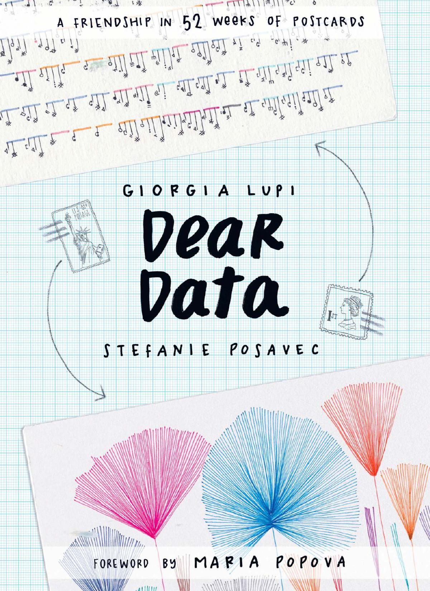

```{r setup, include=FALSE,warning=FALSE}
library(knitr)
library(tidyverse)
library(fontawesome)
library(rmarkdown)
options(
    htmltools.dir.version = FALSE,
    knitr.table.format = "html",
    knitr.kable.NA = ''
)
knitr::opts_chunk$set(
    echo = FALSE,
    warning = FALSE,
    message = FALSE,
    fig.path = "figs/",
    #fig.width = 7.252,
    #fig.height = 4,
    comment = "#>",
    fig.retina = 3) # Better figure resolution
dateWritten <- format(as.Date('2022-07-13'), 
                      format="%B %d %Y")
today <- format(Sys.Date(), 
                format="%B %d %Y")
library(xaringanthemer)
library(xaringanExtra)
library(xaringanBuilder)
library(renderthis)
library(tidyverse)
library(patchwork)
library(emoji)
library(emojifont)
library(anicon)
library(sf)
library(showtext)
# https://www.r-bloggers.com/2014/07/using-showtext-in-knitr/
# https://github.com/yixuan/showtext/blob/master/README.md
library(palmerpenguins)

# Enables the ability to show all slides in a tile overview by pressing "o"
xaringanExtra::use_tile_view()
xaringanExtra::use_panelset()
xaringanExtra::use_clipboard()
xaringanExtra::use_share_again()
xaringanExtra::style_share_again(share_buttons = "all")
xaringanExtra::use_fit_screen()
xaringanExtra::use_scribble()
xaringanExtra::use_search()
xaringanExtra::use_freezeframe()
xaringanExtra::use_tachyons()
xaringanExtra::use_animate_css()
xaringanExtra::use_extra_styles(
  hover_code_line = TRUE,
  mute_unhighlighted_code = FALSE
)

# xaringanExtra::use_logo(
#   image_url = "https://raw.githubusercontent.com/rstudio/hex-stickers/master/PNG/xaringan.png",
#   link_url = "http://slides.yihui.name/xaringan",
#   position = xaringanExtra::css_position(top = "1em", right = "1em")
# )
# Xaringan Lexis theme
# https://jhelvy.github.io/lexis/
```


```{r showtext,include=FALSE}
#library(showtext)
## Loading Google fonts (https://fonts.google.com/)
## # https://www.r-bloggers.com/2014/07/using-showtext-in-knitr/
# https://github.com/yixuan/showtext/blob/master/README.md
# 
font_add_google("Gochi Hand", "gochi")
font_add_google("Schoolbell", "bell")
font_add_google("Covered By Your Grace", "grace")
font_add_google("Rock Salt", "rock")

## Automatically use showtext to render text for future devices
showtext_auto()

```


name: title-slide
class: title-slide, center, middle, inverse

# `r rmarkdown::metadata$title`
#.fancy[`r rmarkdown::metadata$subtitle`]

<br>

.large[by `r rmarkdown::metadata$author`]

Written: `r dateWritten`

Updated: `r today`

.footer-large[.right[.fira[
<br><br><br><br><br>[The Foundation Series](https://the-foundation-series.netlify.app/courses/7-data-visualization-with-no-code/)
]]]

---

## What makes Human Experience?

```{r,echo=FALSE, fig.align='center', out.width="120%"}


```

### How would we begin to describe this experience?
.small[
- Where / When?
- Who?
- How?
- How Big? How small? How frequent? How sudden?
- And....How Surprising ! How Shocking! How sad...How Wonderful !!!  
So: Our .orange[Questions], and our .orange[*Surprise*] lead us to creating Human Experiences.
]


.footnote[ https://www.anecdote.com/2014/09/story-framework/]

---

## Is This a Surprise?
.pull-left[
<blockquote class="twitter-tweet"><p lang="en" dir="ltr">Needs to be celebrated. Spotted in a men&#39;s washroom at <a href="https://twitter.com/BLRAirport?ref_src=twsrc%5Etfw">@BLRAirport</a> - a diaper change station. <br><br>Childcare is not just a woman&#39;s responsibility. <br><br>👏🏻✨ <a href="https://t.co/Za4CG9jZfR">pic.twitter.com/Za4CG9jZfR</a></p>&mdash; Sukhada (@appadappajappa) <a href="https://twitter.com/appadappajappa/status/1541366922545369088?ref_src=twsrc%5Etfw">June 27, 2022</a></blockquote> <script async src="https://platform.twitter.com/widgets.js" charset="utf-8"></script>
]

.pull-right[
```{r,echo=FALSE, fig.align='center'}
  
```
]

---

.pull-left[

```{r,echo=FALSE}
knitr::include_graphics("images/P&P.jpg")
```
]

.pull-right[
## The Element of Surprise?
Jane Austen knew a lot about human information processing as these snippets from **Pride and Prejudice** *(published in 1813 -- over 200 years ago)* show:
.small[
- She was a woman of mean understanding, little .orange[*information*], and uncertain temper.  
- Catherine and Lydia had .orange[*information*] for them of a different sort.  
- When this .orange[*information*] was given, and they had all taken their seats, Mr. Collins was at leisure to look around him and admire,...  
- You could not have met with a person more capable of giving you certain .orange[*information*] on that head than myself, for I have been connected with his family in a particular manner from my infancy.  
- This .orange[*information*] made Elizabeth smile, as she thought of poor Miss Bingley.  
- This .orange[*information*], however, startled Mrs. Bennet ...
]


.footnote[.small[https://www.cs.bham.ac.uk/research/projects/cogaff/misc/austen-info.html]]
]


---
## Claude Shannon and Information

```{r,echo=FALSE, fig.align='center', out.width="750px", out.height="450px"}
  knitr::include_graphics("images/InfoSurprise.png")
```


.footnote[https://plus.maths.org/content/information-surprise]

---

## Human Experience is....Data??

.pull-left[
<iframe width="860" height="500" src="https://www.youtube.com/embed/sFIDCtRX_-o" title="YouTube video player" frameborder="0" allow="accelerometer; autoplay; clipboard-write; encrypted-media; gyroscope; picture-in-picture" allowfullscreen></iframe>
]
.pull-right[
```{r echo=FALSE, out.height="450px", out.width="300px", fig.align='center'}

```

]

---

## Experiments and Hypotheses
.right-column[

]
.left-column[
### A Kitchen Experiment
- Inputs are: Ingredients, Recipes, Processes  
- Outputs are: Taste, Texture, Colour, Quantity!!

]
.footnote[Used *without permission* from https://safetyculture.com/topics/design-of-experiments/]

---

## What is the Result of an Experiment?
.pull-left[
### All experiments give us data about phenomena
- We obtain data about the things that happen: **Outputs**
- What makes things happen?: **Inputs**
- How?: **Process**
- When? **Factors**
- How much "output" is caused by how much "input"? **Effect Size**
]


.pull-right[

> All Experiments stem from Human Curiosity, a Hypothesis, and a Desire to Find out and Talk about Something
]

---

## A Famous Lady and her Famous Experiment

.pull-left[
```{r, echo=FALSE}

```
.small[In 1853, Turkey declared war on Russia. After the Russian Navy destroyed a Turkish squadron in the Black Sea, Great Britain and France joined with Turkey. In September of the following year, the British landed on the Crimean Peninsula and set out, with the French and Turks, to take the Russian naval base at Sevastopol.

What followed was a tragicomedy of errors -- failure of supply, failed communications, international rivalries. Conditions in the armies were terrible, and disease ate through their ranks. They finally did take Sevastopol a year later, after a ghastly assault. It was ugly business all around. Well over half a million soldiers lost their lives during the Crimean War.]
]

.pull-right[
```{r, echo=FALSE, out.height="450px", out.width="450px"}
knitr::include_graphics( "images/rose.jpg")
```
]

---
## Florence Nightingale's Data


```{r echo = FALSE, message=FALSE}
library(HistData)
library(patchwork)
data("Nightingale")
knitr::kable(head(Nightingale[, c(2,3,8:10)], 10))

```


---

## How Does Data look Like, then?

```{r, echo=FALSE, fig.align='center', out.height="500px", out.width="750px"}

knitr::include_graphics("images/Ratio Interval Ordinal Nominal.PNG")

```

## Types of Variables: 

.pull-left[
### Using Interrogative Pronouns
- Nominal: What? Who? Where? (Factors, *Dimensions*)
- Ordinal: Which Types? What Sizes? How Big? (Factors, Dimensions)
- Interval: How Often? (Numbers, *Facts*)
- Ratio: How many? How much? How heavy? (Numbers, *Facts*)

]

.pull-right[
```{r, echo=FALSE, fig.align='center', out.height="450px", out.width="600px"}

knitr::include_graphics("images/Ratio Interval Ordinal Nominal.PNG")

```
]

---

## Types of Variables in Nightingale Data

.leftcol30[
.small[
### Using Interrogative Pronouns:
- Nominal: None
- Ordinal: (Factors, Dimensions)
  - .orange[HOW?] `War, Disease, Other`
- Interval: (Numbers, *Facts*)
  - .orange[WHEN?] `Year, Month`
- Ratio: (Numbers, *Facts*)
  - .orange[HOW MANY?] `Rate of Deaths` (War, Disease, Other) 
]
]

.rightcol70[
```{r, echo=FALSE, fig.align='center', out.height="100px", out.width="100px"}
knitr::kable(head(Nightingale[, c(2,3,8:10)], 3))
```
```{r, echo=FALSE, fig.align='center', out.height="300px", out.width="400px"}
knitr::include_graphics("images/Ratio Interval Ordinal Nominal.PNG")

```
]

.footnote[Nightingale's data table had *dimensions* coded into column names. This is not considered **tidy** in the modern age]


---
## Nightingale's Rose
.pull-left[
.small[Nightingale created a remarkable and original graphical display to show us just what hadd really gone on in the War. It was a .orange[Polar-Area Diagram] that showed how people had died during the period from July, 1854, through the end of the following year. 

Nightingale's graph is like a pie chart, cut into twelve equal angles. These slices advance in a clockwise direction, one each month. The radius shows how many deaths occurred in that month. We see little short slices in April, May and June of 1854. After the troops land in the Crimea, the slices begin reaching far outward in the radial direction.

There's more: Each slice has three sections, one for deaths from wounds in battle, one for "other causes", and one for disease.

Once you see Nightingale's graph, the terrible picture is clear. The Russians were a minor enemy. **The real enemies were cholera, typhus, and dysentery**. Once the military looked at that eloquent graph, the modern army hospital system was inevitable.
]
]

.pull-right[
```{r, echo=FALSE, out.height="450px", out.width="450px"}
knitr::include_graphics( "images/rose.jpg")
```
]

---

## So, Did the Sanitation Commission succeed?

```{r nightingale, echo=FALSE,message=FALSE}
require(reshape)
Night<- Nightingale[,c(1,8:10)]
melted <- melt(Night, "Date")
names(melted) <- c("Date", "Cause", "Deaths")
melted$Cause <- sub("\\.rate", "", melted$Cause)
melted$Regime <- ordered( rep(c(rep('Before', 12), rep('After', 12)), 3), levels=c('Before', 'After'))
Night <- melted

Night1 <- subset(Night, Date < as.Date("1855-04-01"))
Night2 <- subset(Night, Date >= as.Date("1855-04-01"))

# sort according to Deaths in decreasing order, so counts are not obscured [thx: Monique Graf]
Night1 <- Night1[order(Night1$Deaths, decreasing=TRUE),]
Night2 <- Night2[order(Night2$Deaths, decreasing=TRUE),]

# merge the two sorted files
Night <- rbind(Night1, Night2)

```


```{r echo=FALSE, out.height="500px", out.width="850px", fig.align='center'}
colors <- c("blue", "red", "black")
ggplot(Night, aes(x = Date, y = Deaths, colour = Cause)) +
  geom_rect(data = subset(Night, Regime == "Before"),
    aes(xmin = min(Date),ymin = 0,
      xmax = max(Date),
      ymax = max(Deaths)
    ),fill = "lightgrey", colour = "lightgrey") +
  geom_label(
    data = Night,
    aes(x = min(Date) + 150, y = 900),
    label = "Before Sanitary \n Commission",
    colour = "Black",
    nudge_x = -20,
    nudge_y = 20
  ) +
  geom_label(
    data = Night,
    aes(x = max(Date) - 150, y = 900),
    label = "After Sanitary \n Commission",
    colour = "Black",
    nudge_x = -20,
    nudge_y = 20
  ) +
  geom_line() +
  geom_point() +
  scale_color_manual(values = colors, aesthetics = "colour") +
  scale_x_date(date_labels = "%b %Y", date_breaks = "3 month") +
  labs(title = "Did Florence Nightingale's Interventions Work?", 
       subtitle = "Deaths over Time during the Crimean War") +  
  theme_minimal() +
  theme(plot.title = element_text(family = "bell",size = 16,face = "bold", colour = "tomato"),axis.text = element_text(size = 6))

  
```

---

## Nightingale's famous Coxcomb or Rose Plot
```{r, echo=FALSE, out.height="450px", out.width="850px", fig.align='center'}
ggplot(Night, aes(x = factor(Date), y = Deaths, fill = Cause)) +
    # do it as a stacked bar chart first
    geom_bar(
        width = 1,
        position = "identity",
        stat = "identity",
        color = "black"
    ) +
    # set scale so area ~ Deaths
    scale_y_sqrt() +
    # A coxcomb plot = bar chart + polar coordinates
    coord_polar(start = 3 * pi / 2) + 
    ggtitle("Causes of Mortality in the Army in the East") +
    xlab("") + facet_grid(~ Regime) + theme_minimal() + theme(axis.text = element_text(size = 3), 
      axis.title = element_text(size = 8),                          legend.text = element_text(size = 6))
```


.footnote[.small["Engines of Our Ingenuity", <https://www.uh.edu/engines/epi1712.htm>]]

---
### From Data -> Geometry

- How did we arrive at shapes, colours, lines, points...from data? 
- All Statistical Graphs do a Kalidasa:
  - Transform a variable with a .orange[`stat`(`count`,`bin`,`sort`)]
  - they use metaphors to map .orange[data variables] and .orange[computed stats] to .orange[geometrical aspects] aka .orange[aesthetics]
  
.pull-left[
```{r, echo=FALSE, fig.align='center'}
knitr::include_graphics("images/common-aesthetics-1.png")
```
]

.pull-right[

- Commonly used aesthetics in data visualization: position, shape, size, color, line width, line type. 
- Some of these aesthetics can represent both continuous and discrete data (position, size, line width, color) 
- While others can usually only represent discrete data (shape, line type).
]

---

.leftcol70[
```{r,echo=FALSE, fig.align='center', out.height="600px", out.width="550px"}
knitr::include_graphics("images/perceptual-ranking.png")
```
]

.rightcol30[
### Each of the geometries works differently
]


---
## The Need for Answers: Questions to Visuals

```{r, echo=FALSE, fig.align='center', out.width="650px"}

```


---

## Variables and Graphs: Qualitative Variables
.pull-left[
```{r, echo=FALSE, out.height="125px",out.width="300px"}
knitr::include_graphics("https://clauswilke.com/dataviz/directory_of_visualizations_files/figure-html/amounts_multi-1.png")
```

### Amounts and Counts
- Variable: Ordinal / Nominal
- Stat: `count`
- Geometry: height and colour
- Questions: 
  - .orange[How many] of each type of #Var1?
  - .orange[How many] of each type of #Var2 broken up by #Var2?
]

.pull-right[

```{r, echo=FALSE, out.height="450px"}
p1 <- ggplot(diamonds, aes(x = cut)) +
  geom_bar() + theme_void() + ggtitle("Bars")+ scale_fill_brewer(palette = "Spectral") + theme(plot.background = element_rect(color = "black", fill = NA, size = 1),plot.title = element_text(hjust = 0.5))
p2 <- ggplot(diamonds, aes(x = cut)) +
  geom_bar(aes(fill = clarity)) +
  scale_fill_brewer(palette = "Spectral") +
  theme_void() + ggtitle("Stacked Bars") +
  theme(plot.background = element_rect(color = "black", fill = NA, size = 1),plot.title = element_text(hjust = 0.5))
p3 <- ggplot(diamonds, aes(x = cut)) +
  geom_bar(aes(fill = clarity),position = "dodge") +
  scale_fill_brewer(palette = "Spectral") +
  theme_void() + ggtitle("Grouped Bars") +
  theme(plot.background = element_rect(color = "black", fill = NA, size = 1),plot.title = element_text(hjust = 0.5))

(p1 + p2)/p3 


```

]

---
## Variables and Graphs : Quantitative Variables
.pull-left[

```{r,echo=FALSE, fig.align='center'}
knitr::include_graphics("https://clauswilke.com/dataviz/directory_of_visualizations_files/figure-html/single-distributions-1.png")
```
### Distributions
- Variable: Interval / Ratio
- Stat: `bin` and `count`
- Geometry: x = bins, y = count, and colour
- Questions: Range and frequency of Interval/Ratio variable
]

.pull-right[
```{r, echo=FALSE, out.height="450px"}
p1 <- ggplot(diamonds, aes(x = price)) +
  geom_histogram() + theme_void() + ggtitle("Histogram") + scale_fill_brewer(palette = "Spectral") + theme(plot.background = element_rect(color = "black", fill = NA, size = 1),plot.title = element_text(hjust = 0.5))
p2 <- ggplot(diamonds, aes(x = cut)) +
  geom_density(aes(x = price),fill = "grey") +
  scale_fill_brewer(palette = "Spectral") +
  theme_void() + ggtitle("Density") +
  theme(plot.background = element_rect(color = "black", fill = NA, size = 1),plot.title = element_text(hjust = 0.5))
# p3 <- ggplot(diamonds, aes(x = cut)) +
#   geom_bar(aes(fill = clarity),position = "dodge") +
#   scale_fill_brewer(palette = "Spectral") +
#   theme_void() + ggtitle("Grouped Bars") +
#   theme(plot.background = element_rect(color = "black", fill = NA, size = 1),plot.title = element_text(hjust = 0.5))

(p1 + p2) 


```
]

---

## Variables and Graphs : Quantitative Variable
.pull-left[

```{r,echo=FALSE, fig.align='center'}
knitr::include_graphics("https://clauswilke.com/dataviz/directory_of_visualizations_files/figure-html/multiple-distributions-1.png")
```
.small[### Distributions (Many of them at once)
- Variable: Interval/Ratio + Nominal/Ordinal 
- Stat: `sort`(boxplot), `bin`(violin)
- Geometry: x = Nom/Ord, y = Int/Ratio, and colour = Nom/ord
]
]

.pull-right[

```{r, echo=FALSE, out.height="450px"}
p1 <- ggplot(diamonds, aes(x = cut, y = price)) +
  geom_boxplot(aes(fill = cut)) + theme_void() + ggtitle("Boxplot")+ scale_fill_brewer(palette = "Spectral") + theme(plot.background = element_rect(color = "black", fill = NA, size = 1),plot.title = element_text(hjust = 0.5))
p2 <- ggplot(diamonds, aes(x = cut, y = price)) +
  geom_violin(aes(fill = cut)) +
  scale_fill_brewer(palette = "Spectral") +
  theme_void() + ggtitle("Violin Plot") +
  theme(plot.background = element_rect(color = "black", fill = NA, size = 1),plot.title = element_text(hjust = 0.5))
p3 <- ggplot(diamonds, aes(x = cut, y = price)) +
  geom_jitter(aes(colour = cut),alpha = 0.05,width = 0.15, height = 0.15) +
  scale_fill_brewer(palette = "Spectral") +
  theme_void() + ggtitle("Strip Plot") +
  theme(plot.background = element_rect(color = "black", fill = NA, size = 1),plot.title = element_text(hjust = 0.5))

(p1 + p2)/p3 


```
]


---

## Variables and Graphs : Quantitative Variables
.pull-left[

```{r,echo=FALSE, fig.align='center'}
knitr::include_graphics("https://clauswilke.com/dataviz/directory_of_visualizations_files/figure-html/basic-scatter-1.png")
```
### X-Y Relationships
- Variable: Interval/Ratio + Nominal/Ordinal 
- Stat: none
- Geometry: x = Int/Ratio, y = Int/Ratio, and colour = Nom/ord
]
.pull-right[

```{r, echo=FALSE, out.height="450px"}
p1 <- ggplot(penguins, aes(x = flipper_length_mm, y = body_mass_g)) +
  geom_point(aes(fill = species)) + theme_void() + ggtitle("Scatter") + scale_fill_brewer(palette = "Spectral") + theme(plot.background = element_rect(color = "black", fill = NA, size = 1),plot.title = element_text(hjust = 0.5))
p2 <- ggplot(penguins, aes(x = flipper_length_mm, y = body_mass_g)) +
  geom_point(aes(size = species, fill = species),shape = 21, alpha = 0.5) + theme_void() + ggtitle("Bubble") + scale_fill_viridis_d() + theme(plot.background = element_rect(color = "black", fill = NA, size = 1),plot.title = element_text(hjust = 0.5))
# p3 <- ggplot(diamonds, aes(x = cut, y = price)) +
#   geom_jitter(aes(colour = cut),alpha = 0.05,width = 0.15, height = 0.15) +
#   scale_fill_brewer(palette = "Spectral") +
#   theme_void() + ggtitle("Strip Plot") +
#   theme(plot.background = element_rect(color = "black", fill = NA, size = 1),plot.title = element_text(hjust = 0.5))

p1 + p2 


```
]

---

## Conclusion
### - We question the world and form *Hypothesis* out of surprise
### - Hypotheses leads us to define *Questions*
### - Questions lead to *Variables*
### - Questions *with* Variables lead to *Graphs*
### - With Graphs, we can write *Stories* that can create Business!

---
class: hidden
## Variables and Graphs
.pull-left[
- Quantitative Variables
>Proportions can be visualized as pie charts, side-by-side bars, or stacked bars (Chapter 10), and as in the case for amounts, bars can be arranged either vertically or horizontally. 
]

.pull-right[
`r knitr::include_graphics("https://clauswilke.com/dataviz/directory_of_visualizations_files/figure-html/proportions-comp-1.png")`
]

---
class: hidden
## Variables and Graphs
.pull-left[
- Quantitative Variables
>When proportions are specified according to multiple grouping variables, then mosaic plots, treemaps, or parallel sets are useful visualization approaches 
]

.pull-right[
`r knitr::include_graphics("https://clauswilke.com/dataviz/directory_of_visualizations_files/figure-html/proportions-multi-1.png")`
]


---
class:hidden
## Variables and Graphs
.pull-left[
- More than on Quantitative Variables
>Scatterplots represent the archetypical visualization when we want to show one quantitative variable relative to another. If we have three quantitative variables, we can map one onto the dot size, creating a variant of the scatterplot called bubble chart. 
For paired data, where the variables along the x and the y axes are measured in the same units, it is generally helpful to add a line indicating x = y
]

.pull-right[
`r knitr::include_graphics("https://clauswilke.com/dataviz/directory_of_visualizations_files/figure-html/basic-scatter-1.png")`
]


---
class: hidden
## Variables and Graphs
.pull-left[
- More than on Quantitative Variables
>For large numbers of points, regular scatterplots can become uninformative due to overplotting. In this case, contour lines, 2D bins, or hex bins may provide an alternative. When we want to visualize more than two quantities, on the other hand, we may choose to plot correlation coefficients in the form of a correlogram instead of the underlying raw data
]

.pull-right[
`r knitr::include_graphics("https://clauswilke.com/dataviz/directory_of_visualizations_files/figure-html/xy-binning-1.png")`
]


---
class:hidden
## Variables and Graphs
.pull-left[
- More than on Quantitative Variables
>When the x axis represents time or a strictly increasing quantity such as a treatment dose, we commonly draw line graphs. If we have a temporal sequence of two response variables, we can draw a connected scatterplot where we first plot the two response variables in a scatterplot and then connect dots corresponding to adjacent time points. We can use smooth lines to represent trends in a larger dataset.
]

.pull-right[
`r knitr::include_graphics("https://clauswilke.com/dataviz/directory_of_visualizations_files/figure-html/xy-lines-1.png")`
]


---
class:hidden
## Variables and Graphs
.pull-left[
- Geospatial Data
>The primary mode of showing geospatial data is in the form of a map.
In addition, we can show data values in different regions by coloring those regions in the map according to the data.(Choropleth).
 In some cases, it may be helpful to distort the different regions according to some other quantity (e.g., population number) or simplify each region into a square. Such visualizations are called cartograms.

]

.pull-right[
`r knitr::include_graphics("https://clauswilke.com/dataviz/directory_of_visualizations_files/figure-html/geospatial-1.png")`
]


---
class: middle, center
# Thanks!

## Slides created via the R packages:

### with  `r anicon::faa("r-project",animate="vertical")` 
### via the R packages:<br>

&#x2694;&#xFE0F; [**xaringan**](https://github.com/yihui/xaringan)<br> +<br/>&#x1F60E; 
&#x2718;[**gadenbuie/xaringanExtra**](https://github.com/gadenbuie/xaringanExtra)
<br> +<br/>
&#x2694;&#xFE0F;[**the tidyverse**](https://tidyverse.tidyverse.org/)

