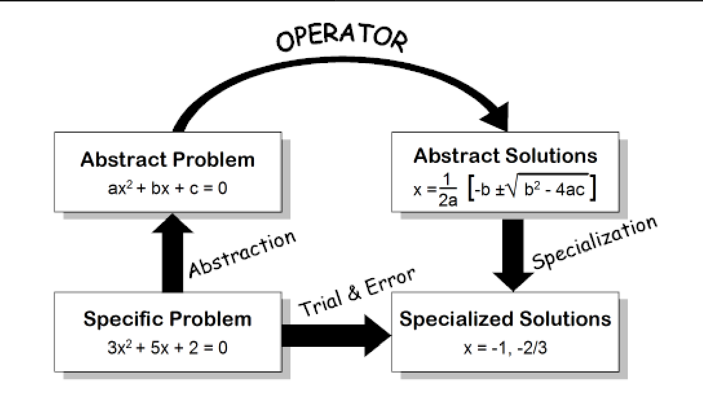
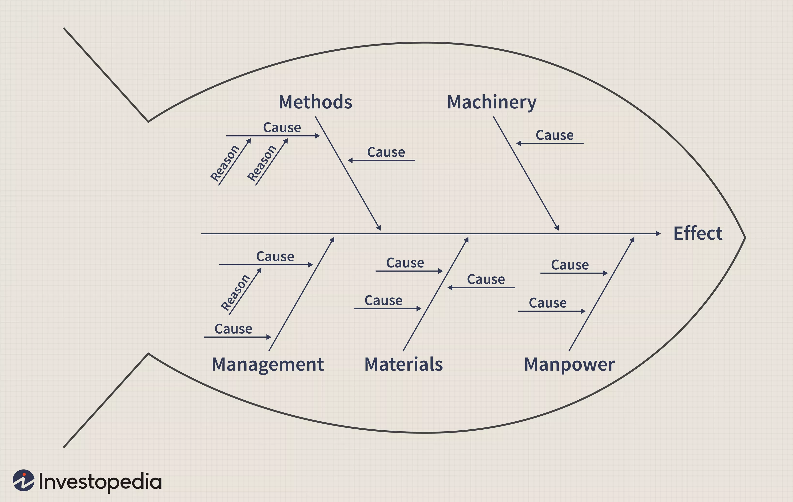

```{r setup, include=FALSE}
options(htmltools.dir.version = FALSE)
knitr::opts_chunk$set(
  fig.width=9, fig.height=3.5, fig.retina=3,
  out.width = "100%",
  cache = FALSE,
  echo = TRUE,
  message = FALSE, 
  warning = FALSE,
  hiline = TRUE
)
```

```{r xaringan-themer, include=FALSE, warning=FALSE}
library(xaringanthemer)
xaringanthemer:::style_solarized_light()
library(tidyverse)
library(anicon)
library(emojifont)
library(emoji)
library(icons)
```


```{r xaringan-extra, include=FALSE, warning=FALSE}
library(xaringanExtra)
use_extra_styles(hover_code_line = TRUE,mute_unhighlighted_code = FALSE)
use_xaringan_extra()

```


## Classical TRIZ 

.pull-left[
- ***Big Idea:*** Generalized Problem: "Your Problem has been solved somewhere else"

- ***Modelling/Applying:*** "Metaphorize" your Problem using 39 TRIZ Parameters

- ***Taxonomy:***
 - The 8 TRIZ Laws of Evolution of a Product; 
 - TRIZ Contradictions Matrix; 
 - TRIZ 40 Inventive Principles
]

.pull-right[
.pull-left[
]

.pull-right[
]
]

---


## A Well Known TRIZ example !!
.pull-left[

]

.pull-right[

]

---

.footnote[Stan Kaplan, "An Introduction to TRIZ - The Russian System of Inventive Problem Solving", Ideation International Inc]

---

## Even Quadratic Equations are Still Researched!!
<iframe width="931" height="524" src="https://www.youtube.com/embed/ZBalWWHYFQc?list=PLqv4sKOD1bsUoSs-SbzlA2BE1tML4A33u" title="YouTube video player" frameborder="0" allow="accelerometer; autoplay; clipboard-write; encrypted-media; gyroscope; picture-in-picture" allowfullscreen></iframe>

---

## TRIZ: A Quick Workflow

 - Formulate a **CONTRADICTION** (a trade-off or a compromise)
 
 - Specify an **IDEAL FINAL RESULT**
 
 - Convert/metaphorize the **CONTRADICTION** into **TRIZ PARAMETER**s
 
 - Look up the **CONTRADICTION MATRIX**
 
 - Discover the **INVENTIVE PRINCIPLES** you might apply
 
 - *Un-metaphorize* the **INVENTIVE PRINCIPLES** to apply them in a specific way in your problem and solve it
 
 Now let us look at these steps in pictorial detail 🖼


---
## TRIZ Workflow: Formulate a Contradiction
.pull-left[
- Use your [**CULTURAL CAPITAL**](https://culturallearningalliance.org.uk/what-is-cultural-capital/) and your **DOMAINs** to write a PROBLEM in simple English
- Ask:
    - **5W+H**
          - **What** does the problem seem to be?
          - **Who** has the problem?  
          - **When** does the problem occur? All the time? Under certain circumstances? 
          - **Where** does the problem occur? 
          - **Why** does the problem occur? "Ask why 5 times" -- W. Edwards Deming 
          - **How** does the problem occur?
]

.pull-right[

]

.footnote[
- Ellen Domb, "How to help TRIZ Beginners Succeed", TRIZ Journal, April 1997,https://www.metodolog.ru/triz-journal/archives/1997/04/a/index.html
- Adobe Workfront Blog, "The 5 Ws (and 1 H) that should be asked of every project!", https://www.workfront.com/blog/project-management-101-the-5-ws-and-1-h-that-should-be-asked-of-every-project 
- "What is Cultural Capital?", https://culturallearningalliance.org.uk/what-is-cultural-capital/
- "Platform Creativity: Domain, Field, and Person", https://medium.com/call4/domain-8a22b6b486f4
]


---

## TRIZ Workflow: Formulate a Contradiction
.pull-left[


.footnote[- "Platform Creativity: Domain, Field, and Person", https://medium.com/call4/domain-8a22b6b486f4
- "What is cultural capital?", https://culturallearningalliance.org.uk/what-is-cultural-capital/]
]

.pull-right[
**AC**: **Administrative Contradiction** ( Ah, those Russians...)
- Almost ***Trivial to Create***
    - I like Tea in the Mornings..and Afternoons and Evenings..and...
    
- Comes forth from your...**Cultural Capital** and **Domains**
- Thanks to [Pierre Bourdieu](https://culturallearningalliance.org.uk/what-is-cultural-capital/) and [Mihaly Csikszentmihalyi](https://medium.com/call4/domain-8a22b6b486f4) for giving us those two Words!!


- **AC**: 
    - **Milk Boils Over**
    - **I am Bored Watching the Milk boil**
    
]

---

# TRIZ Workflow: Look the "Resources"

.pull-left[
Before we further clarify our **CONTRADICTION**, what Resources do we have?
- One Good way to do this is using the **Ishikawa Diagram**

  - Man, Material, Method, Management, Machinery (Ishikawa)
  - This diagram is used **primarily** to assign **CAUSES**
  - But it conveniently lists all the **Resources**
  - We should understand that word, **Resources** in its most startling "TRIZ" sense !!
  - We can use this diagram to develop our **CONTRADICTIONS** more clearly
  - What things create the compromise/tradeoff?
]

.pull-right[


]
.footnote[https://www.investopedia.com/terms/i/ishikawa-diagram.asp]


---


## TRIZ Workflow: Formulate a Contradiction
.left-column[

]

.right-column[
.pull-left[
**TC**: **Technical Contradiction**
- Use the **AC** to describe Trade-off(s) or a Compromise(s)
- Again use your **Cultural Capital** and **Domains**
- **Watching the Milk is a Bore!!Can I do something else in the meantime?**
- **But: the Milk will boil over...**

- **TC**: 
    - I can either boil Milk, OR do something else, NOT both.
]
.pull-right[

- Use the Ishikawa Diagram:
    - Man: Me?
    - Method : 
      - Operating the Stove
      - Wanting/Doing Two Things at the Same Time
    - Material: Milk, Vessel, Stove, Gas, Time, Heat
        - Milk boils over when it is heated
]
]

---

## TRIZ Workflow: Specify the Ideal Final Result (IFR)

.pull-left[
- State an **Ideal Final Result**

- A basic principle of TRIZ is that systems evolve towards increased **ideality**, where ideality is defined as

$$Ideality = (Benefits - Harm) / Costs$$
- **Evolution** is in the direction of

 - ⬆ Increasing benefits
 - ⬇ Decreasing costs
 - ⬇ Decreasing harm

]

.pull-right[

The ***extreme result*** of this evolution is the Ideal Final Result:
 - It has all the benefits,  
 
 - none of the harm, and
 
 - none of the costs of the original problem.
 
 - The Ideal Final Result describes the solution to a technical problem, **independent of the mechanism or constraints of the original problem**. 
 - It occupies no space, has no weight, requires no labour, requires no maintenance. 
 
]

**IFR: The Milk must "boil itself" and wait for me.**
Any other way of saying this?


    
---

## TRIZ Workflow: Use the Contradiction Matrix
.pull-left[

]
.pull-right[
- TRIZ offers 39 Metaphors to symbolize CONTRADICTIONs
- PAIRS of these parameters metaphorically represent our CONTRADICTION
  - One Worsening Parameter: **17: Energy Usage by Stationary Object** (Stove is ON !!)
  - One Parameter to Improve: **21: Stability** ( Milk must NOT boil over !!)
  
- **INVENTIVE PRINCIPLES** from the Matrix: 
    - 35: Parameter Change, 
    - 18: Mechanical Vibration, 
    - 24: Intermediary, 
    - 9: Prior Counteraction, 
    - 3: The Other Way Around


.footnote[The TRIZ Contradiction Matrix, 2003, http://www.systematic-innovation.com/assets/matrix2003.pdf]
]

---

## TRIZ Workflow: IP-24: **INTERMEDIARY**
.pull-left[

]
.pull-right[


]

Also we can use two vessels, one inside the other. The inner one with milk and the other one with water!
---

## TRIZ Workflow: IP-18: **Mechanical Vibration**
.pull-left[


]

.pull-right[
**A Milk Watcher Device**
- This is dropped into the vessel before pouring the milk
- It vibrates when the milk is boiling and prevents spillage
- And of course, there is a patent. Yes , in Russia, where else !!

[Milk Saver Patent Web Page!!](https://findpatent.ru/patent/1/10362.html)
]

---

## TRIZ Workflow: IP-35: Parameter Change
.pull-left[

- What "Parameter" can we change?  
    - Temperature?
    
    - Rate of Gas?
    
    - Kind of metal used in Vessel?
    
    - Smoothness of the Vessel finish?
]

.pull-right[
Here are some solutions using Parameter Change
- Sprinkle Water on the Froth...Umm

- **Apply butter to the rim of the vessel beforehand !!**
- This is also a solution derivable from **IP-9: Prior Counter Action**

]


.footnote[https://www.herzindagi.com/recipe-tips/how-to-prevent-milk-from-boiling-over-article-161289#]

---

## TRIZ Workflow: IP - 13: The Other Way Around
What do you think?

- Cold Milk poured into an already hot vessel? Wild...

- How about the Two Vessel Trick, from earlier: one inside the other. The inner one with milk and the other one with water! Can the Water be hot before hand?

- Not all IPs may strike you as applicable! 

- Try and leverage somebody's else's **Cultural Capital** !!
---

## TRIZ Workflow: Example #2: Problem Statement
.pull-left[
**PROBLEM**: 
- ** Maintaining the Lawn**

Consider the **power lawnmower** as a tool and the lawn as the object to be cut. 
- The lawnmower is noisy, 
- uses fuel, `r emoji("fuelpump")`
- requires human time `r emoji("hourglass")` and energy, `r emoji("muscle")`
- produces air pollution, `r emoji("cloud")`
- throws out debris that can endanger children or pets (or the legs of the person pushing it), 
- and is difficult to maintain.🧰

]

.pull-right[
.pull-left[
]
.pull-right[
]

If our job is "improve the lawnmower" instead, we could immediately set up and prioritize solutions for a number of TRIZ problems to improve fuel usage, reduce noise, improve safety, etc.   
***But, if we define the Ideal Final Result***, we can get a much better perspective on the future of the lawnmower, and the lawn care industry.

]
.footnote[Ellen Domb,"The IFR Tutorial", TRIZ Journal, Feb 1997, https://www.metodolog.ru/triz-journal/archives/1997/02/a/index.html]


---

## TRIZ Workflow: Example #2: IFR, Resources,and Contradictions

.pull-left[
**IFR**:
- **Nice looking grass** with no problems !!`r emoji("laugh")`

**RESOURCES:**
- Grass
- Human
- Lawnmower
- Fuel
- Soil, Air, Wind
]

.pull-right[
**CONTRADICTIONs**
- 

]

---

.pull-left[


Maurice Leloir (1851-1940)
]

.pull-right[

# Thanks!

## Slides made 
###with 
## `r anicon::faa("r-project", animate="vertical")` 
### via the R packages:<br>

&#x2694;&#xFE0F; [**xaringan**](https://github.com/yihui/xaringan)<br> +<br/>&#x1F60E; 
&#x2718;[**gadenbuie/xaringanExtra**](https://github.com/gadenbuie/xaringanExtra)<br><br/>
]
