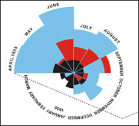

```{r setup, include=FALSE,warning=FALSE}
library(knitr)
library(tidyverse)
library(ggformula)
library(fontawesome)
library(rmarkdown)
options(
    htmltools.dir.version = FALSE,
    knitr.table.format = "html",
    knitr.kable.NA = ''
)
knitr::opts_chunk$set(
    echo = FALSE,
    warning = FALSE,
    message = FALSE,
    fig.path = "figs/",
    #fig.width = 7.252,
    #fig.height = 4,
    comment = "#>",
    fig.retina = 3) # Better figure resolution
dateWritten <- format(as.Date('2022-07-13'), 
                      format="%B %d %Y")
today <- format(Sys.Date(), 
                format="%B %d %Y")
library(xaringanthemer)
library(xaringanExtra)
#library(xaringanBuilder)
library(renderthis)
library(tidyverse)
library(patchwork)
library(emoji)
library(emojifont)
library(anicon)
library(sf)
library(showtext)
# https://www.r-bloggers.com/2014/07/using-showtext-in-knitr/
# https://github.com/yixuan/showtext/blob/master/README.md
library(palmerpenguins)
library(HistData)
library(kableExtra)

# Enables the ability to show all slides in a tile overview by pressing "o"
xaringanExtra::use_tile_view()
xaringanExtra::use_panelset()
xaringanExtra::use_clipboard()
xaringanExtra::use_share_again()
xaringanExtra::style_share_again(share_buttons = "all")
xaringanExtra::use_fit_screen()
xaringanExtra::use_scribble()
xaringanExtra::use_search()
xaringanExtra::use_freezeframe()
xaringanExtra::use_tachyons()
xaringanExtra::use_animate_css()
xaringanExtra::use_extra_styles(
  hover_code_line = TRUE,
  mute_unhighlighted_code = FALSE
)
#xaringanExtra::use_animate_all("slide_left")


# xaringanExtra::use_logo(
#   image_url = "https://raw.githubusercontent.com/rstudio/hex-stickers/master/PNG/xaringan.png",
#   link_url = "http://slides.yihui.name/xaringan",
#   position = xaringanExtra::css_position(top = "1em", right = "1em")
# )
# Xaringan Lexis theme
# https://jhelvy.github.io/lexis/
```


```{r showtext,include=FALSE}
#library(showtext)
## Loading Google fonts (https://fonts.google.com/)
## # https://www.r-bloggers.com/2014/07/using-showtext-in-knitr/
# https://github.com/yixuan/showtext/blob/master/README.md
# 
font_add_google("Gochi Hand", "gochi")
font_add_google("Schoolbell", "bell")
font_add_google("Covered By Your Grace", "grace")
font_add_google("Rock Salt", "rock")

## Automatically use showtext to render text for future devices
showtext_auto()

```


name: title-slide
class: title-slide, center, middle, inverse

# `r rmarkdown::metadata$title`
#.fancy[`r rmarkdown::metadata$subtitle`]

.large[by <br> `r rmarkdown::metadata$author`]
<arvind.venkatadri@gmail.com>
<br><br>

Written: `r dateWritten`
<br>
Updated: `r today`

.footer-large[.right[.fira[
<br><br><br><br><br>[The Foundation Series](https://arvindvenkatadri.com/teaching/)
]]]


---

## What makes Human Experience?

```{r,echo=FALSE, fig.align='center', out.width="120%"}
knitr::include_graphics("images/Anecdote-spotting-a-business-story.png")

```

### How would we begin to describe this experience?
.small[
- Where / When?
- Who?
- How?
- How Big? How small? How frequent? How sudden?
- And....How Surprising ! How Shocking! How sad...How Wonderful !!!  
So: Our .orange[Questions], and our .orange[*Surprise*] lead us to creating Human Experiences.
]


.footnote[ https://www.anecdote.com/2014/09/story-framework/]

---

## Is This a Surprise?

.pull-left[
```{r,echo=FALSE, fig.align='center', out.height="480px", out.width="440px"}
  
```
]

.pull-right[
- Do Emotions lead to Data?
- How do I measure/quantify my emotions?
]

---
## <u>[The Element of Surprise?](https://www.cs.bham.ac.uk/research/projects/cogaff/misc/austen-info.html)</u>

.pull-left[

```{r,echo=FALSE, out.height="480px", out.width="400px"}

```
]

.pull-right[

Jane Austen knew a lot about human information processing as these snippets from **Pride and Prejudice** *(published in 1813 -- over 200 years ago)* show:
.small[
- She was a woman of mean understanding, little .orange[*information*], and uncertain temper.  
- Catherine and Lydia had .orange[*information*] for them of a different sort.  
- When this .orange[*information*] was given, and they had all taken their seats, Mr. Collins was at leisure to look around him and admire,...  
- You could not have met with a person more capable of giving you certain .orange[*information*] on that head than myself, for I have been connected with his family in a particular manner from my infancy.  
- This .orange[*information*] made Elizabeth smile, as she thought of poor Miss Bingley.  
- This .orange[*information*], however, startled Mrs. Bennet ...
]
]


---
## Claude Shannon and Information

.pull-left[
```{r,echo=FALSE, fig.align='center', out.width="750px", out.height="440px"}
  
```
]
.pull-right[
Clause Shannon, the father of modern telecom
- **Defined** information/data as *"quantified surprise"*

$$info = - \sum{p * log(p)}$$

- "There was traffic in Bangalore today"(meh)
- "There was hail in Bangalore today"(`r emoji::emoji("surprise")`)
- "There was snow in Bangalore today"(`r emoji::emoji("scream")`)

]

.footnote[https://plus.maths.org/content/information-surprise]

---

## Human Experience is....Data??

.pull-left[
<iframe width="860" height="500" src="https://www.youtube.com/embed/sFIDCtRX_-o" title="YouTube video player" frameborder="0" allow="accelerometer; autoplay; clipboard-write; encrypted-media; gyroscope; picture-in-picture" allowfullscreen></iframe>
]
.pull-right[
```{r echo=FALSE, out.height="440px", out.width="300px", fig.align='center'}
knitr::include_graphics("images/dear-data.jpg")
```

]

---

## But Can't We "Generate" Data Ourselves? Sure we can!

.right-column[
```{r echo=FALSE, out.height="420px", out.width="680px", fig.align='center'}
knitr::include_graphics("images/DoE.png")
```

]

.left-column[
- We create **Hypotheses**, and then **Experiments**
- A Kitchen Experiment
- Inputs are: *Ingredients, Recipes, Processes*  
- Outputs are: *Taste, Texture, Colour, Quantity*!!

]
.footnote[Used *without permission* from https://safetyculture.com/topics/design-of-experiments/]

---

## What is the Result of an Experiment?
.pull-left[
### All experiments give us data about some phenomena of interest
- We obtain data about the things that happen: **Outputs**
- What makes things happen?: **Inputs**
- How?: **Factors**
- When? **Factors**
- How much "output" is caused by how much "input"? **Effect Size**
]


.pull-right[

> All Experiments stem from Human Curiosity, a Hypothesis, and a Desire to Find out and Talk about Something

> "Factors" and "Effect Size" are statistics tech terms!
]

---

## A Famous Lady and her Famous Experiment

.pull-left[
```{r, echo=FALSE}
knitr::include_graphics("images/nightingale.jpeg")
```
.small[In 1853, Turkey declared war on Russia. After the Russian Navy destroyed a Turkish squadron in the Black Sea, Great Britain and France joined with Turkey. In September of the following year, the British landed on the Crimean Peninsula and set out, with the French and Turks, to take the Russian naval base at Sevastopol.

What followed was a tragicomedy of errors -- failure of supply, failed communications, international rivalries. Conditions in the armies were terrible, and disease ate through their ranks. They finally did take Sevastopol a year later, after a ghastly assault. It was ugly business all around. Well over half a million soldiers lost their lives during the Crimean War.]
]

.pull-right[
```{r echo = FALSE, message=FALSE}
data("Nightingale")
knitr::kable(head(Nightingale[, c(2,3,8:10)], 10),
             caption = "Deaths in Crimea") %>% 
   kable_classic_2(full_width = F)

```

```{r, echo=FALSE, eval = FALSE, out.height="450px", out.width="450px", fig.cap="Nightingale's Rose"}

```
]

---


## What Makes a Good ~~Vegetable~~ Variable, then?
.pull-left[


Each kind of variable answers to a different Interrogative Pronoun
]

.pull-right[
- ''Whose was it?''
''His who is gone.''
- ''Who shall have it?''
''He who will come.''
- ''Where was the sun?''
''Over the oak.''
- ''Where was the shadow?''
''Under the elm.''
- ''How was it stepped?''
''North by ten and by ten, east by five and by five, south by two and by two, west by one and by one, and so under.''
- ''What shall we give for it?''
''All that is ours.''
- ''Why should we give it?''
''For the sake of the trust.''

]

.footnote[[The Return of Sherlock Holmes: The Musgrave Ritual](https://sherlock-holm.es/stories/pdf/a4/1-sided/musg.pdf)]
---

## Types of Variables

.pull-left[
### Using Interrogative Pronouns
- Nominal: **What? Who? Where?** (Just names)

- Ordinal: **Which Types? What Sizes? How Big?** (Factors, Dimensions)

- Interval: **How Often?** (Numbers, *Facts*)

- Ratio: **How many? How much? How heavy?** (Numbers, *Facts*)

]

.pull-right[

```{r, echo=FALSE, fig.align='center', out.height="450px", out.width="640px"}

knitr::include_graphics("images/Ratio Interval Ordinal Nominal.PNG")

```
]

---

## Another Way of Looking at Variables

.pull-left[
```{r, echo=FALSE, fig.align='center', out.height="450px", out.width="600px"}

knitr::include_graphics("images/fig-variables-1.png")

```


]


.pull-right[

```{r, echo=FALSE, fig.align='center', out.height="450px", out.width="600px"}

knitr::include_graphics("images/Ratio Interval Ordinal Nominal.PNG")

```
]

---
## <u>[Var! What is it is good for?](https://youtu.be/ztZI2aLQ9Sw)</u>

.pull-left[
<iframe width="560" height="415" src="https://www.youtube.com/embed/dwFsRZv4oHA?si=9lTbRSOUDj-zz8b-" title="YouTube video player" frameborder="0" allow="accelerometer; autoplay; clipboard-write; encrypted-media; gyroscope; picture-in-picture; web-share" referrerpolicy="strict-origin-when-cross-origin" allowfullscreen></iframe>
]

.pull-right[
<iframe width="560" height="415" src="https://www.youtube.com/embed/hZxnzfnt5v8?si=Gyf0UOZMon0fHW3U" title="YouTube video player" frameborder="0" allow="accelerometer; autoplay; clipboard-write; encrypted-media; gyroscope; picture-in-picture; web-share" referrerpolicy="strict-origin-when-cross-origin" allowfullscreen></iframe>

]

---

## Types of Variables in Nightingale Data

.leftcol30[

- Nominal: None
- Ordinal: (Factors, Dimensions)
  - .orange[HOW?] `War, Disease, Other`!!
- Interval: (Numbers, *Facts*)
  - .orange[WHEN?] `Year, Month`
- Ratio: (Numbers, *Facts*)
  - .orange[HOW MANY?] `Rates of Deaths` (War, Disease, Other) 

]

.rightcol70[
```{r, echo=FALSE, fig.align='center', out.height="100px", out.width="100px"}
knitr::kable(head(Nightingale[, c(2,3,8:10)], 3))
```

```{r, echo=FALSE, fig.align='center', out.height="300px", out.width="400px"}
knitr::include_graphics("images/Ratio Interval Ordinal Nominal.PNG")

```
]

---

## Tidy Data

```{r, echo=FALSE, fig.align='center', out.height="440px", out.width="860px"}
knitr::include_graphics("images/tidydata.jpg")

```

.footnote[Nightingale's data table had *dimensions* (i.e. types of deaths) coded into column names. This is not considered **tidy**, though some software packages use this *wide form* data.]


---

class: title-slide, center, middle, inverse
# And Visualization?

---

## Nightingale's Rose

```{r, echo=FALSE, fig.align='center', out.height="450px", out.width="450px"}

```

???
.small[Nightingale created a remarkable and original graphical display to show us just what hadd really gone on in the War. It was a .orange[Polar-Area Diagram] that showed how people had died during the period from July, 1854, through the end of the following year. 

Nightingale's graph is like a pie chart, cut into twelve equal angles. These slices advance in a clockwise direction, one each month. The radius shows how many deaths occurred in that month. We see little short slices in April, May and June of 1854. After the troops land in the Crimea, the slices begin reaching far outward in the radial direction.

There's more: Each slice has three sections, one for deaths from wounds in battle, one for "other causes", and one for disease.

Once you see Nightingale's graph, the terrible picture is clear. The Russians were a minor enemy. **The real enemies were cholera, typhus, and dysentery**. Once the military looked at that eloquent graph, the modern army hospital system was inevitable.
]

.footnote[.small["Engines of Our Ingenuity", <https://www.uh.edu/engines/epi1712.htm>]]
---

## Yes, But Why? Shapes and Data Viz Culture

.pull-left[
- Each Data Vis answers a **Question**
- We can digest information more easily when it is pictorial
- Our Working Memories are both short-term and limited in capacity. 
- So a picture abstracts the details and presents us with an overall summary, an insight, or a story that is both easy to recall and easy on retention.
- Data Viz includes shapes that carry strong cultural memories; and impressions for us. 
- These cultural memories help us to use data viz in a universal way to appeal to a wide variety of audiences.
]

.pull-right[

```{r, echo=FALSE, fig.align='center', out.height="440px"}

```

]

---
### Visualization: A Metaphor from Data -> Geometry
.pull-left[
- How did we arrive at shapes, colours, lines, points...from data?

- All Statistical Graphs do a Kalidasa

- They use metaphors to map .orange[data variables] and .orange[computed stats] to .orange[geometrical aspects] aka .orange[aesthetics]

- They may also compute stuff with data *before* plotting, as we shall see

- Shapes have Cultural Significance

- We may all have a [Gene for Geometry](https://www.xcode.in/genes-and-personality/how-genes-influence-your-math-ability︎)
]

.pull-right[
```{r, out.height="440px"}

penguins %>% 
  gf_density_ridges(species ~ body_mass_g, fill = ~ species, 
                    alpha = 0.3,scale = 0.8) %>% 
  gf_labs(title = "Penguins and their Weights: No Problems!",
          x = "Body Mass", y = "Species / Weight Category") %>% 
  gf_theme(theme = theme_classic) %>% 
  gf_theme(plot.title = element_text(             #title
                   #family = "Noto",            #set font family
                   #size = 20,               #set font size
                   face = 'bold',            #bold typeface
                   hjust = 0,                #left align
                   #vjust = 2                #raise slightly
                   margin=margin(0,0,10,0)
)) %>% 
  gf_refine(scale_fill_viridis_d())


```

]


---

## Shapes in Data Viz

.pull-left[
```{r, echo=FALSE, fig.align='center',out.height="440px", out.width="520px", fig.cap= "Geometric Aesthetics in Data Viz"}
knitr::include_graphics("images/common-aesthetics-1.png")
```
]

.pull-right[

- Commonly used aesthetics in data visualization: **position, shape, size, color, line width, line type**... 

- Some of these aesthetics can represent both *continuous and discrete data* (**position, size, line width, color**) 

- While others can usually only represent *discrete data* (**shape, line type**).
]

???
What's missing?
- Area?
- Angle?/Direction?Slope?
- Transparency? ( Alpha )
And further?
- Surface Texture? Soft/Hard/Rough/Smooth?
- Density of Material?
- Can it evaporate? Or Vanish?
- Taste?
- Smell?
---

.leftcol70[
```{r,echo=FALSE, fig.align='center', out.height="600px", out.width="780px"}

```
]

.rightcol30[
### Each of the geometries works differently
]

---

class: title-slide, center, middle, inverse
# So Let us see some Data Visualizations

---

## Amounts and Counts

.pull-left[
.pull-left[
<svg xmlns="http://www.w3.org/2000/svg" width="192" height="192" viewBox="0 0 48 48">
	<rect width="48" height="48" fill="none" />
	<path fill="currentColor" fill-rule="evenodd" d="M7 42a1 1 0 0 1-1-1V7h2v33h3V25a1 1 0 0 1 1-1h6a1 1 0 0 1 1 1v15h2V21a1 1 0 0 1 1-1h6a1 1 0 0 1 1 1v19h2V13a1 1 0 0 1 1-1h6a1 1 0 0 1 1 1v27h2v2zm30-18V14h-4v10zm-14 4h4v-6h-4zm-6 4v-6h-4v6z" clip-rule="evenodd" />
</svg>
]
.pull-right[

```{r, echo=FALSE, out.height="192px"}
knitr::include_graphics("https://clauswilke.com/dataviz/directory_of_visualizations_files/figure-html/amounts_multi-1.png")

```
]
- Variable: Ordinal / Nominal
- Stat: `count`
- Geometry: **height and colour**
- Questions: 
  - .orange[How many] of each type of #Var1?
  - .orange[How many] of each type of #Var1 broken up by #Var2?
]

.pull-right[
```{r, out.height="480px"}
knitr::include_graphics("https://av-quarto.netlify.app/content/courses/analytics/descriptive/modules/20-barplots/capitals-vs-rest.jpeg")
```
]


---
## Distributions
.pull-left[
.pull-left[
<svg xmlns="http://www.w3.org/2000/svg" width="192" height="192" viewBox="0 0 24 24">
	<rect width="24" height="24" fill="none" />
	<path fill="currentColor" d="M3 4h1v9h3V7h5v4h4v4h4v6H3zm13 12v4h3v-4zm-4-4v8h3v-8zM8 8v12h3V8zm-4 6v6h3v-6z" />
</svg>
]
.pull-right[
```{r,echo=FALSE, fig.align='center',out.height="128px"}
knitr::include_graphics("https://clauswilke.com/dataviz/directory_of_visualizations_files/figure-html/single-distributions-1.png")
```
]

- Variable: Interval / Ratio
- Stat: `bin` and `count`
- Geometry: x = bins, y = count, and colour
- Questions: 
  - What is the Range and frequency of Interval/Ratio variable?
]

.pull-right[

```{r,echo=FALSE, fig.align='center', out.height="224px"}
knitr::include_graphics("https://av-quarto.netlify.app/content/materials/images/Golf-Drive-Distance-1983.png")
```

```{r,echo=FALSE, fig.align='center', out.height="224px"}
knitr::include_graphics("https://av-quarto.netlify.app/content/materials/images/Golf-Drive-distance-2017.png")
```

]

---

## Grouped Distributions
.pull-left[

.pull-left[
<svg xmlns="http://www.w3.org/2000/svg" width="128" height="128" viewBox="0 0 15 15">
	<rect width="15" height="15" fill="none" />
	<path fill="none" stroke="black" d="M.5 0v14.5H15M8.5 0v3.5m-5 6V12m0-8v1.5m10-1.5v2.5m0 4V13m-11-7.5h2v4h-2zm5-2h2v4h-2zm5 3h2v4h-2z" />
</svg>

]

.pull-right[
```{r,echo=FALSE, fig.align='center', out.height="148px"}
knitr::include_graphics("https://clauswilke.com/dataviz/directory_of_visualizations_files/figure-html/multiple-distributions-1.png")
```

]

- Variable: Interval/Ratio + Nominal/Ordinal 
- Stat: `sort`(boxplot), `bin`(violin)
- Geometry: 
  - x = Int/Ratio,
  - y = Nom/Ord, and 
  - colour = Nom/Ord
- Question: What is the distribution of the Interval/Ratio variable grouped by an Ord/Nom variable?
]

.pull-right[

```{r, echo=FALSE, out.height="450px", fig.cap="I say what I mean, and I mean what I say"}
knitr::include_graphics("https://av-quarto.netlify.app/content/courses/analytics/descriptive/modules/24-boxplots/what-we-mean-when-we-say.jpeg")

```
]


---

## Relationships
.pull-left[
.pull-left[
<svg xmlns="http://www.w3.org/2000/svg" width="192" height="192" viewBox="0 0 32 32">
	<rect width="32" height="32" fill="none" />
	<circle cx="20" cy="4" r="2" fill="black" />
	<circle cx="8" cy="16" r="2" fill="black" />
	<circle cx="28" cy="12" r="2" fill="black" />
	<circle cx="11" cy="7" r="2" fill="black" />
	<circle cx="16" cy="24" r="2" fill="black" />
	<path fill="black" d="M30 3.413L28.586 2L4 26.585V2H2v26a2 2 0 0 0 2 2h26v-2H5.413Z" />
</svg>
]
.pull-right[
```{r,echo=FALSE, fig.align='center', out.height="124px"}
knitr::include_graphics("https://clauswilke.com/dataviz/directory_of_visualizations_files/figure-html/basic-scatter-1.png")
```
]

- Variable: Interval/Ratio + Nominal/Ordinal 
- Stat: none
- Geometry: 
  - x = Int/Ratio, 
  - y = Int/Ratio, and 
  - colour = Nom/ord
- Question: How does one Interval/Ratio variable vary with respect to another?
]
.pull-right[

```{r,echo=FALSE, fig.align='center', out.height="440px"}
knitr::include_graphics("https://av-quarto.netlify.app/content/courses/analytics/descriptive/modules/30-correlations/Evolution-belief-vs-GDP.jpeg")
```
]

---
## Change, Evolution, and Flow
.pull-left[
.pull-left[
<svg xmlns="http://www.w3.org/2000/svg" width="192" height="192" viewBox="0 0 32 32">
	<rect width="32" height="32" fill="none" />
	<path fill="black" d="M30 2H2v14h6.111a7 7 0 0 1 3.13.74L15.764 19l-4.522 2.26a7 7 0 0 1-3.13.74H2v8h7.223a9.05 9.05 0 0 0 4.025-.95l8.622-4.31A7 7 0 0 1 25 24h5V14h-5a7 7 0 0 1-3.13-.74L15.348 10H30ZM8 4h16v4H8ZM4 4h2v10H4Zm0 20h2v4H4Zm16.975-1.05l-8.622 4.31a7 7 0 0 1-3.13.74H8v-4h.111a9.05 9.05 0 0 0 4.025-.95L18 20.118l1.864.932a9.05 9.05 0 0 0 4.025.95H24v.058a9 9 0 0 0-3.025.892M28 22h-2v-6h2ZM12.354 10.74l8.621 4.31a9 9 0 0 0 3.025.89V20h-.111a7 7 0 0 1-3.13-.74l-8.622-4.31A9.05 9.05 0 0 0 8.11 14H8v-4h1.223a7 7 0 0 1 3.13.74M28 8h-2V4h2Z" />
</svg>
]

.pull-right[
```{r,echo=FALSE, fig.align='center', out.height="148px"}
knitr::include_graphics("https://clauswilke.com/dataviz/directory_of_visualizations_files/figure-html/proportions-multi-1.png")
```
]

- Variables: Nominal/Ordinal 
- Stat: none
- Geometry: 
  - x = Nom/Ord 
  - y = Count (computed)
  - colour = Nom/Ord
  - width = Count (computed)
- Question: How do counts vary over (combinations of) Ord/Nom variables?
]

.pull-right[

```{r,echo=FALSE, fig.align='center', out.height="440px"}
knitr::include_graphics("https://av-quarto.netlify.app/content/courses/analytics/descriptive/modules/70-evolutionflow/index_files/figure-html/unnamed-chunk-8-1.png")
```
]


---
## Networks

.pull-left[
.pull-left[
<svg xmlns="http://www.w3.org/2000/svg" width="192" height="192" viewBox="0 0 32 32">
	<rect width="32" height="32" fill="none" />
	<circle cx="21" cy="26" r="2" fill="black" />
	<circle cx="21" cy="6" r="2" fill="black" />
	<circle cx="4" cy="16" r="2" fill="black" />
	<path fill="black" d="M28 12a3.996 3.996 0 0 0-3.858 3h-4.284a3.966 3.966 0 0 0-5.491-2.643l-3.177-3.97A3.96 3.96 0 0 0 12 6a4 4 0 1 0-4 4a4 4 0 0 0 1.634-.357l3.176 3.97a3.924 3.924 0 0 0 0 4.774l-3.176 3.97A4 4 0 0 0 8 22a4 4 0 1 0 4 4a3.96 3.96 0 0 0-.81-2.387l3.176-3.97A3.966 3.966 0 0 0 19.858 17h4.284A3.993 3.993 0 1 0 28 12M6 6a2 2 0 1 1 2 2a2 2 0 0 1-2-2m2 22a2 2 0 1 1 2-2a2 2 0 0 1-2 2m8-10a2 2 0 1 1 2-2a2 2 0 0 1-2 2m12 0a2 2 0 1 1 2-2a2 2 0 0 1-2 2" />
</svg>
]


.pull-right[
```{r,echo=FALSE, fig.align='center', out.height="148px"}
knitr::include_graphics("https://mr.schochastics.net/material/netVizR/index_files/figure-html/network_grps_sol-1.png")
```
]

- Variables: Nominal/Ordinal 
- Stat: none
- Geometry: 
  - Node (shape) = Nom
  - Colour = Ord
  - Edge Line width = Count (computed) or Quant
- Question: How much does on Qual variable connect with another? 
]

.pull-right[

```{r,echo=FALSE, fig.align='center', out.height="440px"}
knitr::include_graphics("https://av-quarto.netlify.app/content/courses/analytics/descriptive/modules/100-networks/index_files/figure-html/Using-Centrality-1.png")
```
]


---
## Hierarchies

.pull-left[
.pull-left[
<svg xmlns="http://www.w3.org/2000/svg" width="192" height="192" viewBox="0 0 24 24">
	<rect width="24" height="24" fill="none" />
	<path fill="none" stroke="black" stroke-linecap="round" stroke-linejoin="round" stroke-width="2" d="M10 5a2 2 0 1 0 4 0a2 2 0 1 0-4 0m-4 7a2 2 0 1 0 4 0a2 2 0 1 0-4 0m4 7a2 2 0 1 0 4 0a2 2 0 1 0-4 0m8 0a2 2 0 1 0 4 0a2 2 0 1 0-4 0M2 19a2 2 0 1 0 4 0a2 2 0 1 0-4 0m12-7a2 2 0 1 0 4 0a2 2 0 1 0-4 0m-9 5l2-3m2-4l2-3m2 0l2 3m2 4l2 3m-4-3l-2 3m-4-3l2 3" />
</svg>
]

.pull-right[
```{r,echo=FALSE, fig.align='center', out.height="148px"}
knitr::include_graphics("images/dendro.png")
```
]

- Variables: Nominal/Ordinal 
- Stat: none
- Geometry: 
  - x = Nom/Ord 
  - y = Count (computed)
  - colour = Nom/Ord
- Question: How much does on Qual variable connect with another? 
]

.pull-right[

```{r,echo=FALSE, fig.align='center', out.height="440px"}
knitr::include_graphics("https://ggraph.data-imaginist.com/articles/Layouts_files/figure-html/unnamed-chunk-22-1.png")
```
]


---
## Maps
.pull-left[
.pull-left[
<svg xmlns="http://www.w3.org/2000/svg" width="192" height="192" viewBox="0 0 48 48">
	<rect width="48" height="48" fill="none" />
	<path fill="none" stroke="black" stroke-linecap="round" stroke-linejoin="round" d="M9.65 16.462c-.976 1.022-3.199.384-3.47 2.16c.218 1.486 1.663 3.07 3.208 2c1.85-.539 1.907-3.426.262-4.16m3.447-3.085c1.885-.365 2.913 1.914 2.775 3.5c.111 1.786 3.316 2.414 1.986 4.342c-1.585.446-3.325.495-4.804 1.298c-2.02-.4 2.042-1.861.143-2.932c-1.132-1.312 1.982-2.724-.017-4.083c-.415-.526-1.517-1.578-.324-1.984m13.166 22.628c-2.093-.148-.833 4.231.43 1.811c.15-.559.115-1.509-.43-1.811m4.859 4.791c1.794.718-.072 2.337-1.229 1.128c-1.759-1.221.025-2.181 1.229-1.128M29.214 5.663c-1.56 2.366-4.685 2.563-6.755 4.248c-.825 1.303-.629 3.198.568 4.16c1.63 1.536 4.011-2.234 4.928-.069c1.543.876 1.717 4.822 3.857 2.95c1.21-1.317 1.564-3.173 2.602-4.63c-.573-1.822.417-3.25 2.035-4.164c1.212-.898 2.416-4.22 3.843-1.778c1.38 2.137-.043 4.58-.948 6.594c-1.333 1.695-2.418 3.578-3.02 5.623c-1.587.856-3.584.249-5.265 1.018c-1.591-.307-3.75.482-4.855-.916c-.77-1.18 2.175-3.505-.37-3.26c-1.5 1.028-1.452 2.513-1.024 3.987c-1.352 1.439-4.028 1.306-4.64 3.635c-1.66.71-2.542 3.026-4.615 2.265c-.554 1.6-3.602.041-3.516 1.87c1.79.06 3.363 1.194 3.135 3.199c.466 1.781-.846 3.975-2.605 2.157c-1.12-1.18-2.676.63-4.194.073c-2.303-.208-1.252 2.844-1.795 4.17c-.853 1.474-.522 4.428 1.72 4.031c1.15.392 1.38 2.806 2.638.99c1.814-.902 4.627-.732 5.567-3.148c-.03-2.066 1.78-2.787 2.835-4.132c.416-2.397 2.975-1.223 4.437-1.853c.13-1.383 3.37-1.97 3.229.167c.955 2.167 3.4 2.894 5.01 4.345c.762.95-.44 3.571 1.54 2.244c.78-.7.38-1.902 1.483-2.264c-1.36-1.831-4.369-2.419-5.217-4.77c-1.403-1.375 1.083-3.203 1.882-1.243c1.356 1.476 3.797 1.908 4.608 3.88c.018 1.62 1.649 2.6 2.097 4.107c.886 1.866.908 2.415 3.443 2.83M27.855 24.065a2.175 2.175 0 0 0-2.175-2.175h0a2.175 2.175 0 0 0-2.175 2.175v2.216c0 1.201.974 2.175 2.175 2.175h0a2.175 2.175 0 0 0 2.175-2.175H25.68m11.211-4.39a2.17 2.17 0 0 1 2.175 2.174v2.216c0 1.205-.97 2.175-2.175 2.175s-2.175-.97-2.175-2.175v-2.216a2.17 2.17 0 0 1 2.175-2.175m-3.66 6.565h-3.283V21.89h3.283m-3.283 3.283h2.14" />
</svg>
]

.pull-right[
```{r,echo=FALSE, fig.align='center', out.height="124px"}
knitr::include_graphics("https://clauswilke.com/dataviz/directory_of_visualizations_files/figure-html/geospatial-1.png")
```
]

- Variables: Nominal/Ordinal 
- Stat: none
- Geometry: 
  - x = Nom/Ord 
  - y = Count (computed)
  - colour = Nom/Ord
  - width = Count (computed)
]

.pull-right[

```{r,echo=FALSE, fig.align='center', out.height="440px"}
knitr::include_graphics("https://av-quarto.netlify.app/content/materials/images/Works-most-europe_Site.jpg")

```
]


---
## What Else Could We have Discussed?
- Coordinates: Cartesian or Polar?
    - A Bar Chart in Polar is... a Pie!!!
- Small Multiples: Making multiple smaller graphs
- Charts for : 
  - Survey Data (Likert Plots)
  - Multiple Qual variables (Mosaic Plots)
  - Ranks (Bump Charts / Dumbbell Charts)
  - Ratings (Radar Plots)
- Scales: Matching Axes to the Units of the variables (percentage, currency..)
- Colour Palettes
- Annotations on Charts

---
## Conclusion
- We question the world and form *Hypotheses* out of surprise
- Hypotheses leads us to define *Questions*
- Questions lead to *Variables* and *Data*
- Questions *with* Variables lead to *Graphs*
- With Graphs, we can write *Stories* that can drive Decisions, Designs, Policies, and...Art!!


---
class: middle, center
# Thanks!

## Questions? Comments?

### Slides created 

#### with  `r anicon::faa("r-project",animate="vertical")` 
#### via the R packages

&#x2694;&#xFE0F; [**xaringan**](https://github.com/yihui/xaringan)<br> +<br/>&#x1F60E; 
&#x2718;[**gadenbuie/xaringanExtra**](https://github.com/gadenbuie/xaringanExtra)
<br> +<br/>
&#x2694;&#xFE0F;[**the tidyverse**](https://tidyverse.tidyverse.org/)


