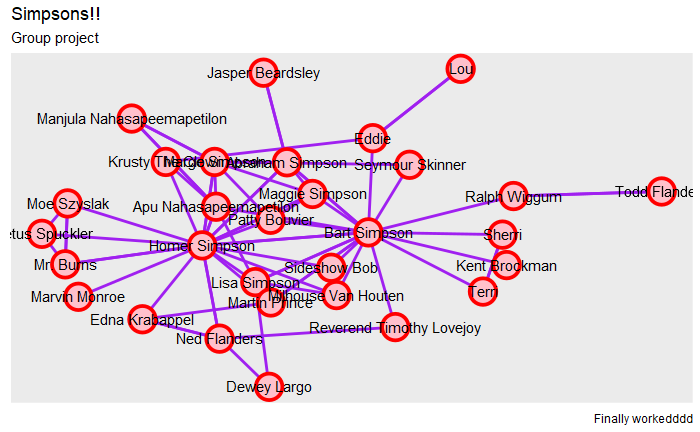
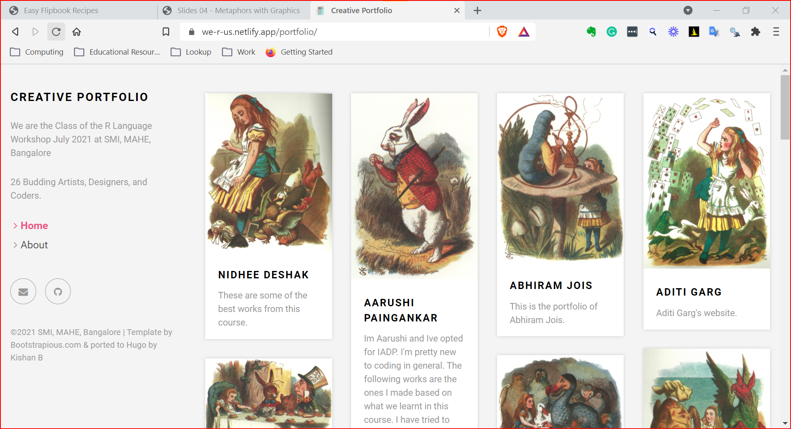

```{r setup, include=FALSE}
options(htmltools.dir.version = FALSE)
library(xaringan)
library(xaringanExtra)
library(anicon)
library(emoji)
library(flipbookr)
library(spData)
library(tmap)
data("lnd", package = "spData") # Boroughs of London
data("cycle_hire_osm", package = "spData") # Cycle Hire locations
```


class: bg-main1 split-50 hide-slide-number with-thick-border

.column.bg-white[
<br>
<br>
<br>
<br>

]]

.column.bg-main1[.content.vmiddle.center[
.font4[Teaching in this Pandemic Year 2020-2021]<br>
.font2[A Portfolio of Student Outcomes and Teaching Experiences]<br><br>
.font2[Arvind Venkatadri]<br><br>
`r anicon::faa("wifi")` https://we-r-us.netlify.app <br>
`r anicon::faa("wifi")` https://r-for-artists.netlify.app <br>
`r anicon::faa("wifi")` https://arvindvenkatadri.netlify.app

]]


---

class: split-three

.column.bg-main3[.content[
# Course-1 : Order and Chaos

.row[.content.nopadding[
.img-fill[]
]]

.bottom_abs.content[.white[
## Emergence, Spatial Patterns, Game Theory, and Fractals]
]
]]


.column.bg-main2[.content[
# Course-2 : Play and Invent
.row[.content.nopadding[
.img-fill[
]]
]]
.bottom_abs.content[
## Metaphors, <br> Analogic Thinking,<br>Creative Problem Solving, de Bono Methods, <br>and TRIZ
]
]]

.column.bg-main1[.content[
# Course-3 : Digital Thinking Tools
.row[.content.nopadding[
.img-fill[]
]]

.bottom_abs.content[
## Data Viz, Maps, and Networks in `r anicon::faa("r-project", animate="vertical")`
]
]]


---

class: bg-main1 split-30 hide-slide-number

.column.bg-main3[
.content.vmiddle.center[
## FSP : Order and Chaos
### Designing with Fractals
.row[.content.nopadding[
.fig90[
]]
]
]
]


.column.bg-main1[.row[
.content.nopadding[.img-fill[]
]
]

.row[.content[
## Mandelbrot and Julia Jewellery
### Made using `XaOS` software
### Programmable Complex Seed (`z = z^2 + c`)
]]
]


---

class: bg-main1 split-30 hide-slide-number

.column.bg-main3[
.content.vmiddle.center[
# FSP : Order and Chaos
### Designing with Proximity
]
]


.column.bg-white[
.row[
.content.nopadding[
.img-fill[


]
]
]

.row[.content.black[
## Delaunay / Voronoi Spatial Pattern
### Made using `Geogebra` software
]]
]


---

class: bg-main1 split-30 hide-slide-number

.column.bg-main3[
.content.vmiddle.center[
# FSP : Order and Chaos
## Game Theory - The Stag Hunt Model
The **Stag Hunt** is a Game Theoretic Model of Public Behaviour
]
]


.column.bg-white[
.row[
.content.nopadding[
.img-fill[

]
]
]
]


---

class: bg-red split-30 hide-slide-number

.column.bg-red[
.content.vmiddle.center[
# FSP : Play and Invent

### `TRIZ` Interpretation of ***Home Alone***
`TRIZ` is a .yellow[System] for .blue[Innovative Problem Solving] that orginated in Soviet Russia

Based on .yellow[Innovative Patterns] mined from over .blue[3 million Patents]
]
]


.column.bg-white[
<center>

]


---

class: bg-red split-30 hide-slide-number

class: bg-red split-30 hide-slide-number

.column.bg-red[
.content.vmiddle.center[
# FSP : Play and Invent

### `TRIZ` Interpretation of ***Home Alone***
`TRIZ` is a System for Innovative Problem Solving invented by .yellow[Genrikh Altshuller]

It is now used by many of the Fortune 500 Companies ( e.g. Samsung )
]
]


.column.bg-white[
<center>

]


---
class: bg-blue split-30 hide-slide-number

.column.bg-blue[
.content.vmiddle.center[
# FSP : Digital Thinking Tools
## .yellow[Data Viz] in R
]
]

.column.bg-white[
.img-fill[

]

.row[.content.black[
## Data Visualization of Weather Patterns ( Points and Regression Models)
### Made using `r anicon::faa("r-project", animate="vertical")` with packages `dplyr`and `ggplot`
]]
]
---


class: bg-blue split-30 hide-slide-number

.column.bg-blue[
.content.vmiddle.center[
# FSP : Digital Thinking Tools
## .yellow[Map Making] in R
]
]

.column.bg-white[
.img-fill[

]

.row[.content.black[
## Map of Restaurants in Rajajinagar, Bangalore
### Made using `r anicon::faa("r-project", animate="vertical")` with packages `osmdata`, `sf` and `ggplot`
]]
]

---

class: bg-blue split-30 hide-slide-number

.column.bg-blue[
.content.vmiddle.center[
# FSP : Digital Thinking Tools
## .yellow[Network Graphs] in R
### Which is your Favourite TV Show?
]
]


.column.bg-white[
.img-fill[

]

.row[.content.black[
## The society in `The Simpsons`
### Made using `r anicon::faa("r-project", animate="vertical")` with packages `tidygraph`, and `ggraph`
]]
]


---
class: bg-blue split-30 hide-slide-number

.column.bg-blue[
.content.vmiddle.center[
# FSP : Digital Thinking Tools
## Making .yellow[Sequence Diagrams] in R
]
]


.column.bg-white[
.img-fill[

]

.row[.content.black[
## A Spanish Language Tutorial
### Made using `r anicon::faa("r-project", animate="vertical")` with packages `plantUML` and `DiagrammeR`
]]
]


---

class: split-two white with-thick-border

.column.bg-green[.content.vmiddle.center[
# And Teaching?
#⚔
#忍者

### Trying to be a ninja
]]

.column.bg-green[.content.vmiddle.center[

]
]


---

class: split-two white with-thick-border


.column.bg-green[.content.vmiddle.center[
## Creating Personal Webpage .yellow[in R] for all Content
<center>

- .yellow[Theme:] Alice in Wonderland
]]

.column.bg-green[.content.vmiddle.center[
## Code-Labs and Classwork : Show, then Make
<center>

- .yellow[Metaphors] from Alice for Data Viz
]]


---

class: middle center bg-green

## Using "Code-Movies"

### .yellow[Highlighting] and .purple[Incremental Execution] in .red[***Slides***]

---
 # Code Movies
.pull-left[
```{r tm1, warning=FALSE, fig.show='hide', message=FALSE}
tm_shape(lnd) + #<<
  tm_borders(col = "black", lwd = 1) + #<<
  tm_fill("NAME", legend.show = FALSE) #<<
```
]
.pull-right[
```{r, echo=FALSE}
knitr::include_graphics(
  knitr::fig_chunk("tm1", "png")
)
```
]

---
# Code Movies

.pull-left[
```{r tm1a, warning=FALSE, fig.show='hide', message=FALSE}
# Group 1 #<<
tm_shape(lnd) +
  tm_borders(col = "black",lwd = 1) + 
  tm_fill("NAME", legend.show = FALSE) +

# Group 2 = Layer 2 #<<
  tm_shape(cycle_hire_osm) + #<<
  tm_symbols(size = 0.2, col = "red") #<<

```
]
.pull-right[
```{r, echo=FALSE}
knitr::include_graphics(
  knitr::fig_chunk("tm1a", "png")
)
```
]

---

# Code Movies

.pull-left[
```{r tm2, warning=FALSE, fig.show='hide', message=FALSE}
# Group 1
tm_shape(lnd) +
  tm_borders(col = "black",lwd = 1) + 
  tm_fill("NAME", legend.show = FALSE) +
# Group 2 = Layer 2
  tm_shape(cycle_hire_osm) + 
  tm_symbols(size = 0.2, col = "red") +
  
  tm_graticules() + #<<
  tm_add_legend(type = "symbol", col = "red", #<<
                title = "Hire Cycles Here") #<<
```
]
.pull-right[
```{r, echo=FALSE}
knitr::include_graphics(
  knitr::fig_chunk("tm2", "png")
)
```
]

---

# Code Movies

.pull-left[


```{r tm1b, warning=FALSE, fig.show='hide', message=FALSE}
# Group 1
tm_shape(lnd) +
  tm_borders(col = "black",lwd = 1) + 
  tm_fill("NAME", legend.show = FALSE) +
# Group 2 = Layer 2
  tm_shape(cycle_hire_osm) + 
  tm_symbols(size = 0.2, col = "red") +
  tm_graticules() +
  tm_add_legend(type = "symbol", col = "red",
                title = "Hire Cycles Here") +

  tm_scale_bar(position=c("left", "bottom"),#<<
               text.size = 1) + #<<
  tm_compass(position = c("right", "top"), #<<
             type = "rose", #<<
             size = 2)  #<<
```
]

.pull-right[
```{r, echo=FALSE}
knitr::include_graphics(
  knitr::fig_chunk("tm1b", "png")
)
```
]

---

# Code Movies

.pull-left[

```{r tm1c, warning=FALSE, fig.show='hide', message=FALSE}
mymap <- 
# Group 1
tm_shape(lnd) +
  tm_borders(col = "black", lwd = 1) + 
  tm_fill("NAME", legend.show = FALSE) +
# Group 2 = Layer 2
  tm_shape(cycle_hire_osm) + 
  tm_symbols(size = 0.2, col = "red") +
  tm_graticules() +
  tm_add_legend(type = "symbol", col = "red",
                title = "Hire Cycles Here") +
  tm_scale_bar(position=c("left", "bottom"),text.size = 1) + 
  tm_compass(position = c("right", "top"), type = "rose",
             size = 2) +
  
  tm_credits(text = "Arvind V, 2021", #<<
             position = c("left", "bottom")) + #<<
  tm_layout(main.title = "London Bike Share", #<<
            bg.color = "lightblue", #<<
            inner.margins = c(0, 0, 0, 0)) #<<
mymap
```
]
.pull-right[
```{r, echo=FALSE}
knitr::include_graphics(
  knitr::fig_chunk("tm1c", "png")
)
```
]


---

class: bg-yellow

## Using Teams for ***Assignments***

<center>


---

class: bg-yellow

## Using Teams for ***Grading***

<center>

 Rubric can be attached to each Assignment in Teams and scores downloaded in Excel ( student-wise )

---

class: bg-yellow

## Student Portfolio Website : Digital Thinking Tools

<center>

we-r-us.netlify.app


---


class: bg-main1 

# Lessons
.font2[
* .yellow[Teaching Together] was hard at first
* .yellow[Naming a course as] .red["CE"], and then .yellow[merging] .green[GS] and .blue[GSK] into it was hard too
* Coherence and Structure of the Course was at times iffy
]
.font2[
* .yellow[Teaching Together] made sense later....when we got tired
* .yellow[Merging] .green[GS] and .blue[GSK] into .red[CE] made us think deeper about curriculum and practice
* Some .yellow[Through-Lines] emerged as we thought about and worked the Content. 
- E.g .blue[Pointillism] and .red[Emergence] ( after Stephen Johnson )
- E.g. .blue[Alice in Wonderland] and .red[Schelling Points]
* Assignment were more nuanced perhaps, with three areas for assignments?
]

---


layout: false
class: shuriken-reverse-100 white with-thick-border border-double


.blade1.bg-red.content[
# Thank you !!
]]
.blade2.bg-green[.content.vertical-rl[

]]
.blade3.bg-deep-purple[.content.center[
`r anicon::faa("wifi")` https://we-r-us.netlify.app <br>
`r anicon::faa("wifi")` https://r-for-artists.netlify.app <br>
`r anicon::faa("wifi")` https://arvindvenkatadri.netlify.app

]]
.blade4.bg-orange[.content.sideways-rl[.center[

]]]
.hole.bg-black[.content.center.vmiddle[
# Slides made by Arvind Venkatadri
###with 
## `r anicon::faa("r-project", animate="vertical")` 
### via the R packages:<br>

&#x2694;&#xFE0F; [**xaringan**](https://github.com/yihui/xaringan)<br> +<br/>&#x1F60E; 
&#x2718;[**gadenbuie/xaringanExtra**](https://github.com/gadenbuie/xaringanExtra)<br><br/>
### and with
&#x2694;&#xFE0F;[**the tidyverse**](https://tidyverse.tidyverse.org/)

]]

