```{r setup, include=FALSE}
options(htmltools.dir.version = FALSE)
library(xaringan)
library(xaringanExtra)
library(anicon)
library(emoji)
library(flipbookr)
library(cowsay)

```


class: bg-main1 split-50 hide-slide-number with-thick-border

.column.bg-white[
<br>
<br>
<br>
<br>
```{r echo=FALSE,warning=FALSE}
cowsay::say("Hi FSP folks! I taught O&C and P&I this year!\nOr so I think...", by = "owl")
```

]]

.column.bg-main1[
.content.vmiddle.center[
.font4[Teaching in this post?-Pandemic Year 2021-2022]<br>
.font2[A Portfolio of Student Outcomes and Teaching Experiences]<br><br>
.font2[Arvind Venkatadri]<br><br>
`r anicon::faa("wifi")` https://the-foundation-series.netlify.app <br>
`r anicon::faa("wifi")` https://r-for-artists.netlify.app <br>
]
]

---


class: split-two


.column.bg-red[
.content[
# Course-1 : Play and Invent
.row[.content.nopadding[
.img-fill[
]]
]]

.bottom_abs.content[.white[
## Flow and Play
## Creative Problem Solving 
## de Bono Methods
## TRIZ .yellow[ New Classroom Games, TRIZ related Experiences, Industrial Visits!!]
]
]
]


.column.bg-main3[.content[
# Course-2 : Order and Chaos


.row[.content.nopadding[
```{r echo=FALSE, out.height="480px"}
knitr::include_graphics(path = "images/Stag.jpg")
```
]]

.bottom_abs.content[.white[
## Complexity (Spatial Patterns)
## Complexity (Game Theory)
## Randomness, .yellow[Hypothesis Testing, Stats]
## .yellow[Machine Learning]
]
]
]]


---

class: split-60 hide-slide-number with-thick-border

.column.bg-main4[
.content[
.split-40[
.row[.content[
# How I Teach in CE

### **Understandings** Approach: Big Understandings 
### **Dispositions** Approach: Modelling and Applying 
### **Skills** Approach: Taxonomy of Ideas, Structures and Tools 
]
]
 
.row[.content[
### Example: Classical TRIZ in ***FSP: Play and Invent***
### -Big Understanding  
The Generalized Problem: "Your Problem has been solved somewhere else"

### -Modelling/Applying 
"Metaphorize" your Problem using 39 TRIZ Parameters

### -Taxonomy/Structures/Tools  
The 8 TRIZ Laws of Evolution of a Product; TRIZ Contradictions Matrix; TRIZ 40 Inventive Principles
]
]
]
]
]


.column.bg-main1[.content[
.split-two[
.column[.content.center.nopadding[
.img-fill.nopadding[
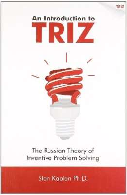
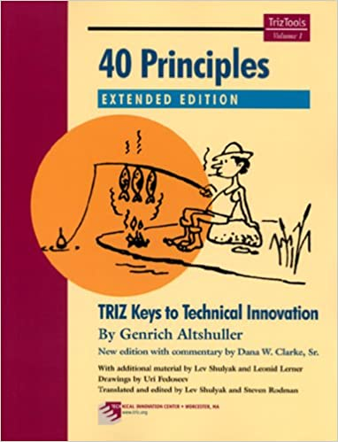
]
]
]

.column[.content.center.nopadding[
.img-fill[
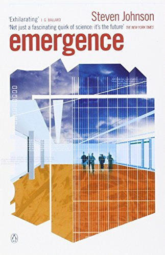
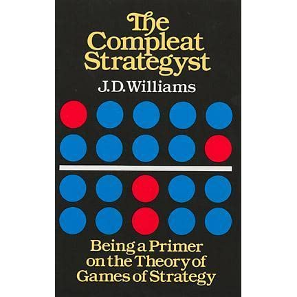]
]
]
]
]
]


---

class: split-two


.column.bg-red[
.content[
# Course-1 : Play and Invent
.row[.content.nopadding[
.img-fill[
]]
]]

.bottom_abs.content[.white[
## Flow and Play
## Creative Problem Solving 
## de Bono Methods
## TRIZ .yellow[ New Classroom Games, TRIZ related Experiences]
]
]
]


.column.bg-main3[.content[
# Course Modules
### Idea of Flow, Zone of Play, Boredom and Creative Problem Solving
### Pierre Bourdieu "Cultural Capital"
### Six Hats Method of de Bono
### JP Guilford, Seymour Papert and Constructionism / Metaphor Making
### Metaphors as a gateway to TRIZ
### Problems as Contradictions (Technical and Physical Contradictions)
### Resource Mentality: Titanic Game / Candle Game 
### Ideal Final Result
### Contradiction Matrix
### 39 TRIZ Metaphors, 40 TRIZ Inventive Principles, 6 TRIZ Separation Principles
]]

---


class: bg-red split-30 hide-slide-number

.column.bg-red[
.content.vmiddle.center[
# FSP : Play and Invent
# TRIZ
## `TRIZ` is a .yellow[System] for .blue[Innovative Problem Solving] that orginated in Soviet Russia
## Based on .yellow[Innovative Patterns] mined from over .blue[3 million Patents]
]
]

.column.bg-white[
```{r echo=FALSE, out.height="600px"}
knitr::include_graphics(path = "images/CMatrix.jpg")
```
]
]
]


---

class: bg-red split-30 hide-slide-number

.column.bg-red[
.content.vmiddle.center[
# FSP : Play and Invent
# TRIZ
### Using the Contradiction Matrix-1
### Inventive Principles
### Segmentation, Merging, Phase transitions, Self service
]
]


.column.bg-white[
```{r echo=FALSE,fig.align='center',out.height="500px", fig.cap="School Bag Design - Rianna Chattopadhyay"}
knitr::include_graphics(path = "images/Rianna-flexbag.png")
```
]
]


---

class: bg-red split-30 hide-slide-number

.column.bg-red[
.content.vmiddle.center[
# FSP : Play and Invent
# TRIZ
### Using the Contradiction Matrix-2
### Inventive Principles: Segmentation, Local Quality, Merging, Phase transitions, Self service
]
]

.column.bg-white[
.split-two[
.column[
.content.vmiddle.center[
```{r echo=FALSE}
knitr::include_graphics("images/Ananya-Design-1.png")
```

```{r echo=FALSE, fig.cap="Dustpan Design - Ananya Sarangi"}
knitr::include_graphics("images/Ananya-Design-2.png")
```

]
]

.column[
.content.vmiddle.center[
```{r echo=FALSE, out.height="600px"}
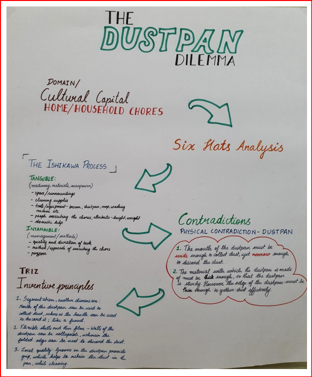

```
]
]
]
]
]
]

---

class: bg-red split-30 hide-slide-number

.column.bg-red[
.content.vmiddle.center[
# FSP : Play and Invent
# TRIZ
### Using the Contradiction Matrix-3
### Inventive Principles:Blessing in Disguise, Composite Materials, Local Quality, Equipotentiality, Preliminary Anti-Action
]
]

.column.bg-white[
.content.vmiddle.center[
```{r echo=FALSE, out.height="600px", fig.cap="TRIZ Solutions for the Joint Family - Mahi Agarwal"}
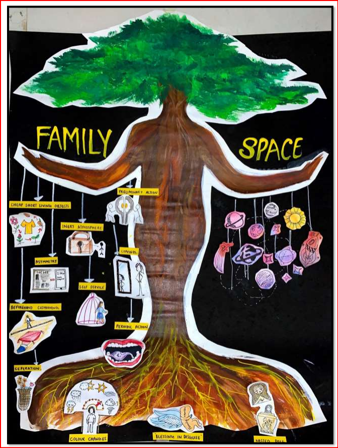

```
]
]
]

---

class: split-two

.column.bg-main3[.content[
# Course-2 : Order and Chaos
.row[.content.nopadding[
```{r echo=FALSE, out.height="600px"}
knitr::include_graphics(path = "images/Stag.jpg")
```
]]

.bottom_abs.content[.white[
## Complexity (Spatial Patterns)
## Complexity (Game Theory)
## Randomness, .yellow[Hypothesis Testing, Stats]
## .yellow[Machine Learning]
]
]
]]

.column.bg-main3[
.content[
## Big Ideas
### 4As of Complexity: Agents, Actions, Again, Aggregation
### Game Theory: Prisoners' Dilemma, Stag Hunt, Chicken
### Segregation, Schelling Focus Points, Hotelling's Phenomenon
### Spatial Organization: Proximity Models, Voronoi/Delaunay Models
### Randomness, Probability and Belief
### Hypothesis Testing (Short Term Memory: Factors, Effect Sizes, p-values)
### Permutation Tests in Excel
### Proximity in Data: Machine Learning with zero-coding
### Classification (Random Forests)
### Linear Regression
]]

---

class: bg-main1 split-30 with-thick-border hide-slide-number


.column.bg-main3[
.content.vmiddle.center[
# FSP : Order and Chaos
### Complexity: Game Theory
### and Proximity
]
]

.column.bg-main1[.content[
.split-two[

.column[.content.vmiddle.center.nopadding[
```{r echo=FALSE,out.height="640px"}
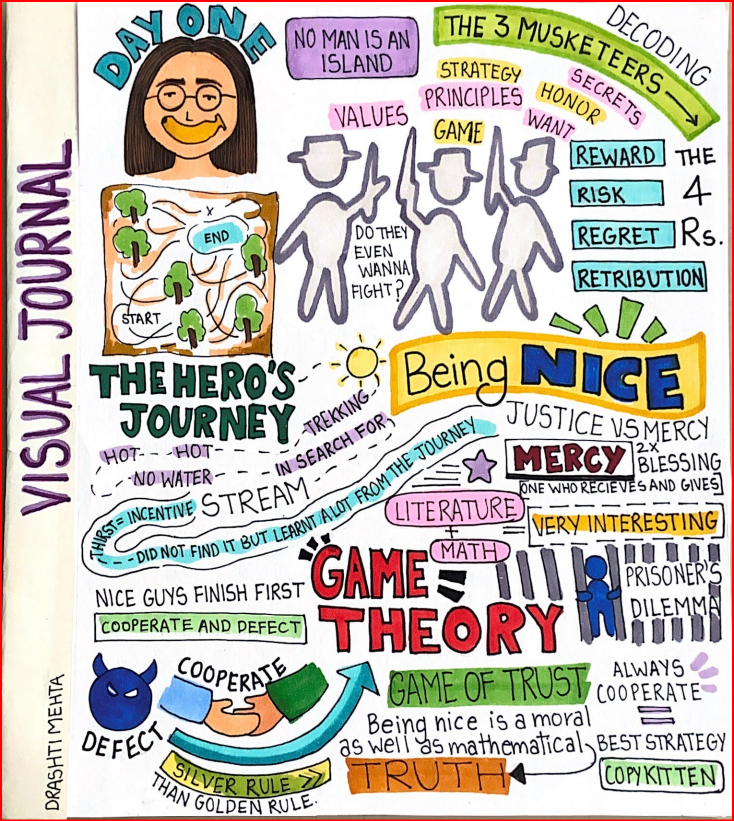

```
]
]


.column[.content.vmiddle.center.nopadding[
```{r echo=FALSE, out.height="640px"}
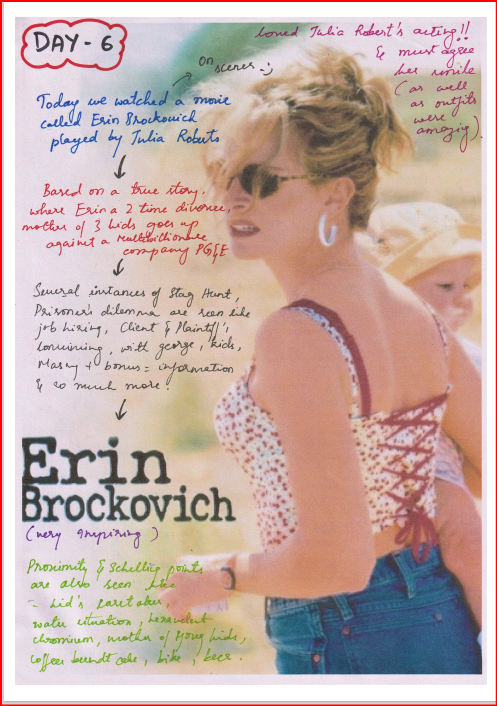

```
]
]

]
]
]
]


---

class: bg-main1 split-30 hide-slide-number

.column.bg-main3[
.content.vmiddle.center[
# FSP : Order and Chaos
### Hypothesis Testing and Permutation Tests 
### with Comics
### What Affects our Short Term Memory?
### Comics made using: https://gramener.com/comicgen
]
]


.column.bg-main1[.content[
.split-two[
.column[.content.vmiddle.center.nopadding[
```{r echo=FALSE,out.height="640px"}
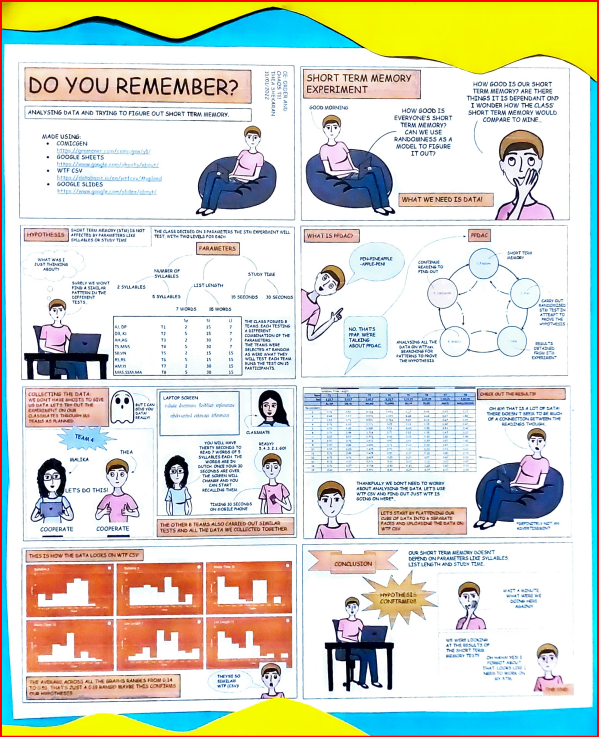

```
]
]

.column[.content.vmiddle.center.nopadding[
```{r echo=FALSE, out.height="400px"}
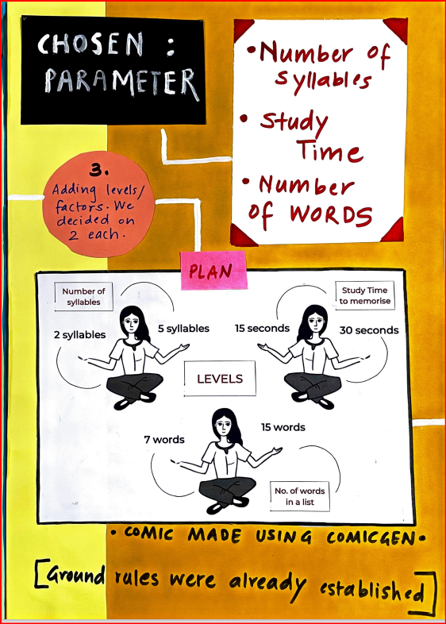

```

```{r echo=FALSE, out.height="240px"}

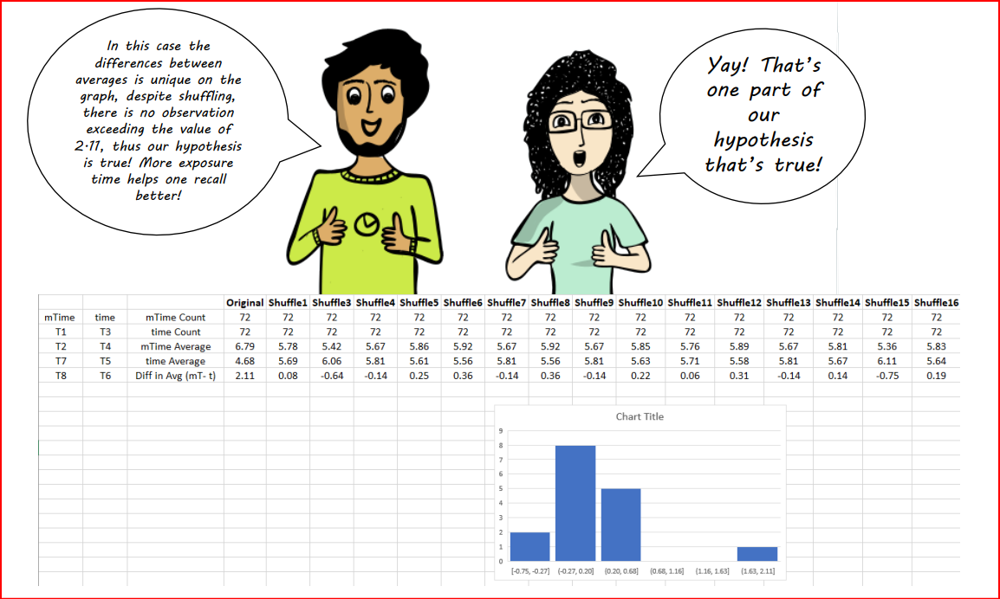

```
]
]
]
]
]


---

class: bg-main1 split-30 hide-slide-number

.column.bg-main3[
.content.vmiddle.center[
# FSP : Order and Chaos
## Machine Learning
### Classification using Random Forests with<br> .orange[Orange Data Mining]
A visual ML tool from Univ of Ljubljana, Slovenia

]
]


.column.bg-white[
.split[
.row[
.content.nopadding[
### .black[Classification of Flowers]
### .black[Classification of Heart Attacks!!]
]
.row[
.content.nopadding[]
.img-fill[

]
]
]
]
]


---

class: bg-main1 split-30 hide-slide-number

.column.bg-main3[
.content.vmiddle.center[
# FSP : Order and Chaos
## Machine Learning
### Linear Regression with<br> .orange[Orange Data Mining]
A visual ML tool from Univ of Ljubljana, Slovenia

]
]


.column.bg-white[

## .black[Prediction of Penguin Weight based on `flipper_length` and `bill_length`]

```{r echo=FALSE, out.height="520px"}
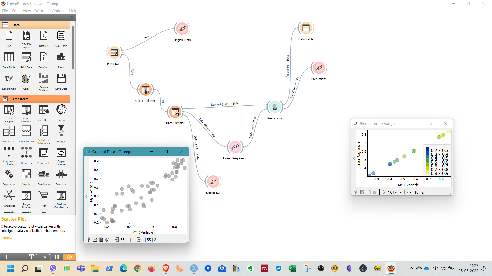

```
]

]
]
]
]


---

class: bg-red split-30 hide-slide-number

.column.bg-red[
.content.vmiddle.center[
# Some Student Journals and Statements

]
]


.column.bg-white[
.split-30[

.row[
.content.vmiddle[
## Rishika Saboo
http://u.pc.cd/60ArtalK

## Mridula Gopal
http://u.pc.cd/8JzctalK
]
]

.row[
## Shireen Saudamini Mubayi (O&C)
Main ek aakhri cheez bolna chahungi. Main chahti hun ki Arvind jiss bhi kaksha ko aage 
jaa kar padhaein, voh yantra-dwaara baaton par nirbhar na ho. Kabhi kabhi Arvind 
humko boltein the ki “aaj tum logon ka FOMO ho raha hai”. FOMO ka matlab ‘fear of 
missing out’. Who humko bataate the ki agar hum sachi mein kaksha mein baithe hote 
toh hum kya mazey kar rahe hote. 
Mujhe sach mein iss CE mein bohot maza aaya.
Shukriya Arvind, phir milenge chalte chalte!
Shireen :)

## Aditi Jain(P&I)
Then we solved the titanic problem which reminded us to look for a matchbox, taught 
us to look for an iceberg, to look for an already existing resource to solve our problems. 
Instillation of the concept of ideality? check. It also helped in understanding the concept of 
the Ishikawa fishbone structure. Then finally came the makey-makeys, which was so much 
fun!! We made a game we couldn’t explain well to Arvind. I was wondering if we have to 
document that and post it somewhere? Honestly I hope we don’t have to, we have exams from 
tomorrow :’) 
Then came the final week!!!! 
Turmoil. 
But it came out well. 
It put everything into perspective and I could see the reason to everything that I’d done 
so far. It was almost like it was magic. 
BOOM! Everything makes sense now.

]

]
]


---


# And Finally...

```{r echo=FALSE, out.height="520px",out.width= "800px", fig.align='center', out.extra= "angle=60"}
knitr::include_graphics(path = "images/Rianna-HomeAlone.png")
```


---

layout: false
class: shuriken-reverse-100 white with-thick-border border-double


.blade1.bg-red.content[
# Thank you !!
]]
.blade2.bg-green[.content.vertical-rl[

]]
.blade3.bg-deep-purple[.content.center[
`r anicon::faa("wifi")` https://the-foundation-series.netlify.app <br>
`r anicon::faa("wifi")` https://r-for-artists.netlify.app <br>

]]
.blade4.bg-orange[.content.sideways-rl[.center[

]]]
.hole.bg-black[.content.center.vmiddle[
# Slides made by Arvind Venkatadri
### with 
## `r anicon::faa("r-project", animate="vertical")` 
### via the R packages:<br>

&#x2694;&#xFE0F; [**xaringan**](https://github.com/yihui/xaringan)<br> +<br/>&#x1F60E; 
&#x2718;[**gadenbuie/xaringanExtra**](https://github.com/gadenbuie/xaringanExtra)<br><br/>
### and with
&#x2694;&#xFE0F;[**the tidyverse**](https://tidyverse.tidyverse.org/)

]]


